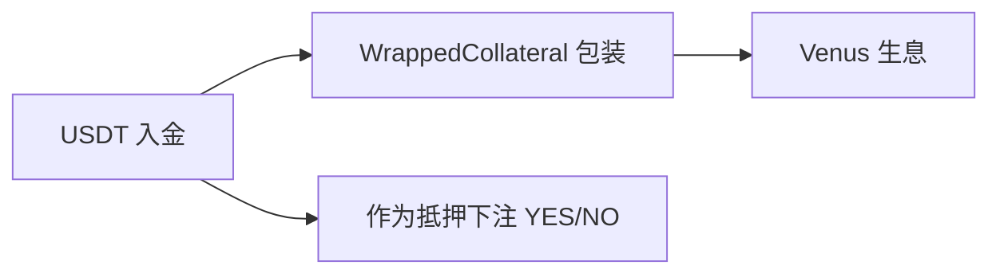

# 基础设施 — USDT 抵押资产

> Predict.fun 的交易抵押品与结算货币

---

## 核心事实

| 属性 | 值 |
|------|------|
| 资产 | USDT（BNB Chain ERC-20） |
| 角色 | 交易抵押品 + 结算货币 |
| 入金最低 | 约 10 USDT/USDC 激活交易 |
| 结算 | 赢家份额兑付 $1 USDT，输家归零 |

---

## 与生息的关系

存入的 USDT 经 `YieldBearingWrappedCollateral` 包装后供给 **Venus Protocol** 生息——这是与 Polymarket（USDC.e 闲置）的关键差异。

---

## 入金来源

- BNB Chain 直接转入 USDT/USDC
- 从 Binance 交易所提币
- 经 Rhino Bridge 跨链

---

> 截至 2026 年 6 月。
