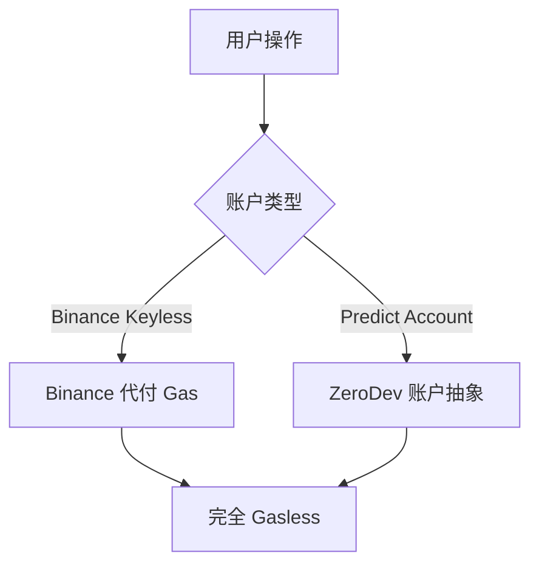

# 基础设施 — Gasless 交易

> 用户无需持有 BNB：Binance 代付 + 账户抽象

---

## 两条 Gasless 路径

| 路径 | 机制 |
|------|------|
| **Binance Wallet 集成** | Binance 作为聚合器代付 BNB Chain Gas，交易与兑付完全免 Gas |
| **predict.fun Web/App** | 通过 ZeroDev 账户抽象处理（`ZeroDevWithdrawalHelper` 支撑 Gasless 提现） |

---

## 价值

- 消灭「持有 Gas 代币」这一 Web3 摩擦点。
- 配合 Keyless 钱包，把开户/交易门槛降到接近零，是触达 200M+ Binance 用户的前提。

---

> ⚠️ Web 入口是否同样全免 Gas 需登录实测确认。截至 2026 年 6 月。
