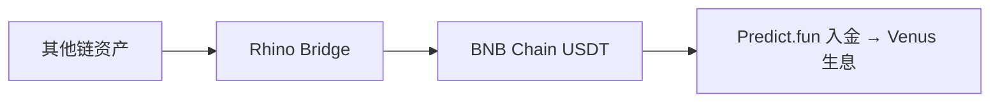

# 基础设施 — Rhino Bridge 跨链

> 资产如何从其他链进入 BNB Chain

---

## 用途

用户若资金在其他网络，官方建议通过 **Rhino Bridge** 跨链桥接到 BNB Chain，再入金 Predict.fun。

---

## 入金路径汇总

| 来源 | 方式 |
|------|------|
| 已在 BNB Chain | 直接转入 USDT/USDC |
| 在 Binance 交易所 | 提币到 BNB Chain |
| 在其他链 | Rhino Bridge 跨链 |

---

> 截至 2026 年 6 月。
