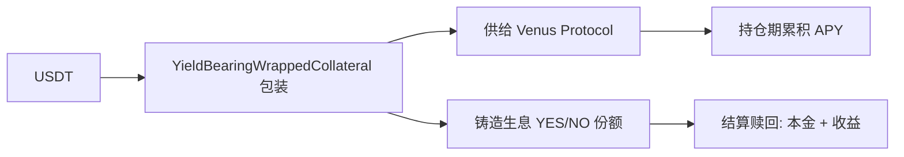

# 结果代币 — 生息条件代币（核心差异化）

> YieldBearingConditionalTokens：Predict.fun 区别于 Polymarket 的关键创新

---

## 是什么

Predict.fun 部署了 **生息版** 条件代币合约族，使抵押品在持仓期间通过 Venus 生息：

| 合约 | 地址 | 作用 |
|------|------|------|
| YieldBearingConditionalTokens | `0x9400F8Ad57e9e0F352345935d6D3175975eb1d9F` | 生息版 YES/NO 代币 |
| YieldBearingWrappedCollateral | `0xCfb9beF5F7B748aC72311F057f3a888BC73334D9` | 将 USDT 包装为生息抵押品 |
| YieldBearingNegRiskAdapter | `0x41dCe1A4B8FB5e6327701750aF6231B7CD0B2A40` | 生息版多结果适配 |

---

## 工作原理

---

## 双轨设计

Predict.fun 同时维护 **生息** 与 **非生息** 两套合约，链上可验证。生息版是其资本效率叙事的技术基础。

> ⚠️ 收益分配（用户/平台）、默认使用哪套合约，官方未完全公开。

---

> 链上合约经 dev.predict.fun 核验，Venus 路由经 CMC Research 确认。截至 2026 年 6 月。
