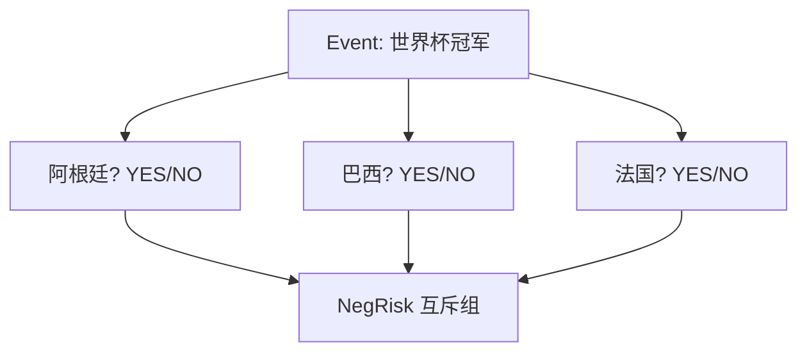

# 结果代币 — NegRisk 多结果市场

> 把「多选一」互斥事件组织为一组二元市场

---

## 解决什么

如「2026 世界杯谁夺冠」有多个候选，只有一个为真。NegRisk 将多个二元 Market 组织为互斥组，保证概率合理、可套利收敛。

---

## Predict.fun 的实现

生息与非生息各有一套 NegRisk 适配器：

| 合约 | 说明 |
|------|------|
| NegRiskAdapter（非生息） | `0xc3Cf7c252f65E0d8D88537dF96569AE94a7F1A6E` |
| YieldBearingNegRiskAdapter（生息） | `0x41dCe1A4B8FB5e6327701750aF6231B7CD0B2A40` |
| NegRiskCtfExchange | 多结果市场交易所 |

---

> 与 Polymarket NegRisk 同源。截至 2026 年 6 月。
