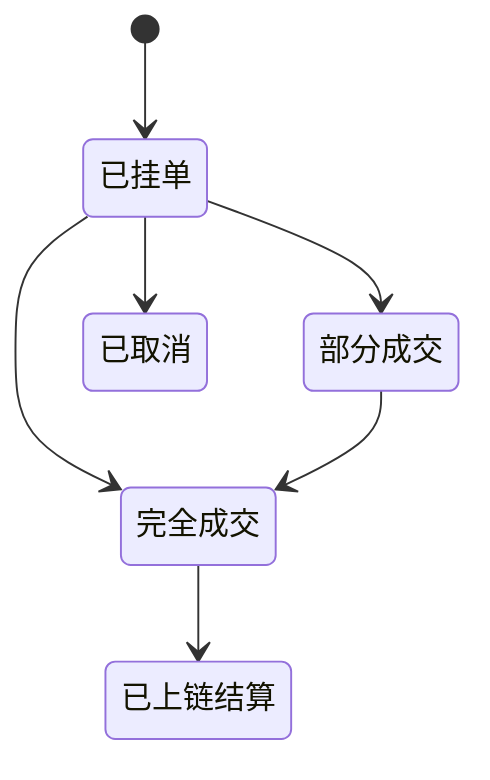

# 交易 — 订单类型

> 市价单与限价单

---

| 类型 | 说明 | 适用 |
|------|------|------|
| **市价单 (Market)** | 以当前最优价即时成交 | 快速进出 |
| **限价单 (Limit)** | 指定价格挂单等待撮合 | 控价 / 做市 |

- 限价单未成交期间：资金冻结、可随时取消、并参与每分钟订单簿快照累积做市 Predict Points。
- 订单经 EIP-712 离线签名后提交，挂单/撤单不消耗 Gas。

> ⚠️ 更细的时效类型（GTC/GTD/FOK/FAK）是否全部支持，以官方 API 为准。

---

> 截至 2026 年 6 月。
