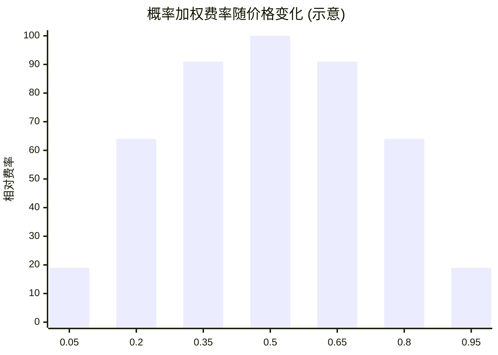

# 交易 — 概率加权费率

> 约 2% 基础费，随价格偏离 50% 而递减

---

## 机制

```text
fee ≈ baseRate × c × p × (1 − p) × 4
c = 交易名义金额, p = 成交价格(隐含概率), baseRate ≈ 2% 为 p=0.5 时峰值
```



- 50/50（不确定性最高）处费率最高 ~2%；价格越极端越低。
- 设计意图：在最难判断的交易上多收费，不惩罚接近确定的低风险交易。

---

## 与竞品对比

| 平台 | 交易费 |
|------|--------|
| Predict.fun | 概率加权 ~2% 峰值 |
| Polymarket | 长期 $0 |
| Kalshi | 概率加权 |

> 取舍：Predict.fun 用「生息收益」抵消相对更高的名义费率——综合持仓成本仍可能低于零费但闲置的平台。
> ⚠️ 精确费率公式、maker/taker 差异以官方为准。

---

> 费率口径来自第三方媒体（PANews 等），截至 2026 年 6 月。
