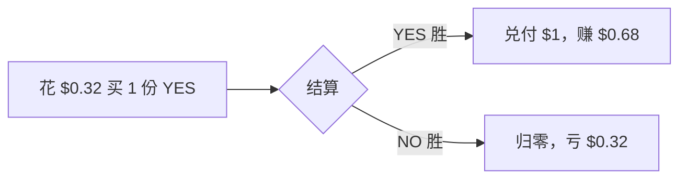

# 交易 — 价格 = 概率

> 份额价格即市场对事件发生概率的共识

---

| 字段 | 值 | 含义 |
|------|------|------|
| YES 价格 | $0.32 | 32% 概率发生 |
| NO 价格 | $0.68 | 68% 概率不发生 |
| 恒等式 | YES + NO = $1 | 永远成立 |

- 买入价越低 → 赔率越高（赢则每份兑付 $1）。
- 价格随交易实时变动，反映新信息与共识。
- 结算时赢家份额 = $1，输家 = $0。

---

> 截至 2026 年 6 月。
