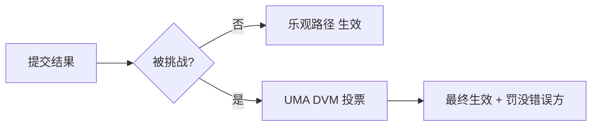

# 结算 — UMA 兼容乐观预言机

> UmaCompatibleOptimisticOracle：去信任的事件结果裁定

---

## 机制

| 阶段 | 说明 |
|------|------|
| 提议 | 提议者质押保证金，乐观提交结果 |
| 争议窗口 | 任何人可质押挑战 |
| 乐观路径 | 无挑战 → 结果生效（约 95% 市场） |
| 争议升级 | 有挑战 → UMA DVM 投票裁决 |

---

## 链上合约

| 合约 | 地址 |
|------|------|
| UmaCompatibleOptimisticOracle | `0x76F42e5520E62AD88f8fE583cBb4BfF27eeC2531` |
| UmaCompatibleCtfAdapter（生息） | `0x947cc06D38d3cB0a2BB5AdFB668b99B4FF53d7B4` |
| UmaCompatibleCtfAdapter（非生息） | `0x242E1Ba24f6fC524bfb410062Ca5689A9622613d` |

> 与 Polymarket 的 UMA 方案同源（UMA-compatible）。截至 2026 年 6 月。
