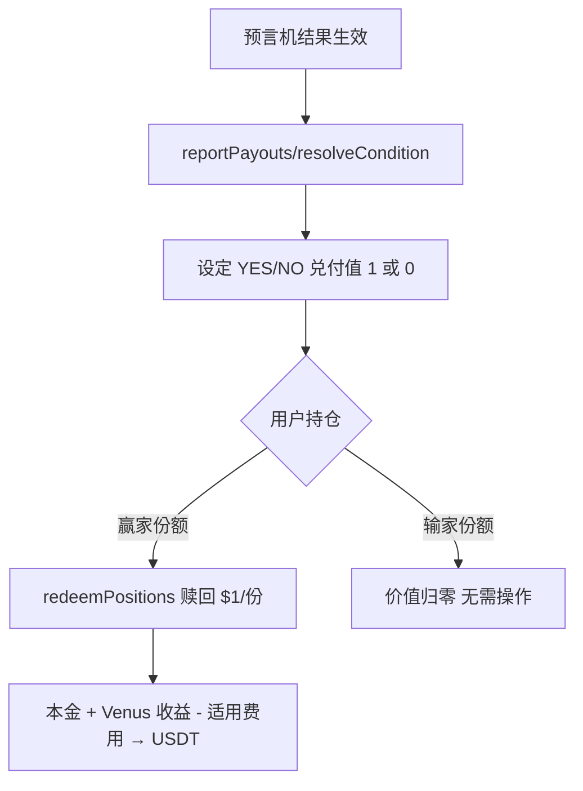

# 结算 — 结果上链与赎回

> reportPayouts / resolveCondition / redeemPositions

---

## 流程

---

## 生息市场的赎回差异

普通市场赎回仅返还兑付本金；Predict.fun 生息市场赎回时一并返还 **本金 + 持仓期 Venus 收益**。

> ⚠️ 收益分配比例（用户/平台）官方未公开。

---

> 截至 2026 年 6 月。
