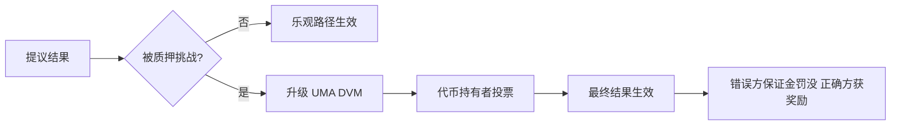

# 结算 — 争议机制

> 经济激励保证提议诚实，UMA DVM 作为最终后盾

---

## 流程

```mermaid
flowchart LR
    A[提议结果] --> B{被质押挑战?}
    B -->|否| C[乐观路径生效]
    B -->|是| D[升级 UMA DVM]
    D --> E[代币持有者投票]
    E --> F[最终结果生效]
    F --> G[错误方保证金罚没 正确方获奖励]
```

---

## 要点

- 乐观路径下结算快（多数市场）。
- 争议升级可能耗时数小时到数天。
- 质押/罚没机制使「提交虚假结果」无利可图。

---

> 与 Polymarket UMA 争议机制同源。截至 2026 年 6 月。
