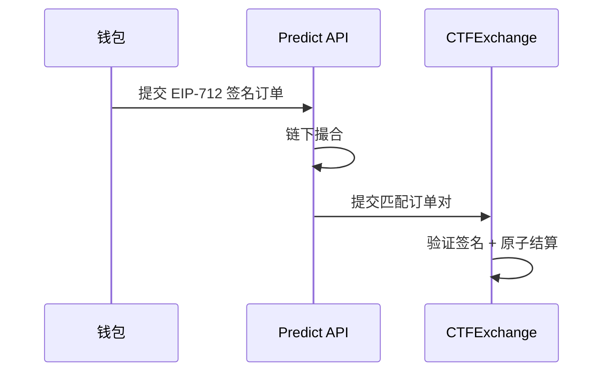

# 钱包身份 — 非托管交易 + EIP-712 签名

> 订单离线签名，资产始终在用户钱包

---

## 机制

- 用户对订单结构体做 **EIP-712 离线签名**，不需为挂单/撤单支付 Gas。
- 撮合成功后由链上 CTFExchange 验证签名并原子结算。
- 资产（USDT、ERC-1155 份额）始终在用户自己的钱包，平台不托管。

---

## 首次授权（一次性）

| 授权 | 作用 |
|------|------|
| `USDT.approve(CTFExchange)` | 允许划转抵押品 |
| `setApprovalForAll(CTFExchange)` | 允许转移 ERC-1155 份额 |

授权后所有交易仅需离线签名。

---

> 截至 2026 年 6 月。
