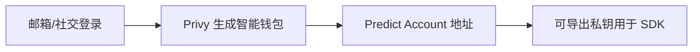

# 钱包身份 — Predict Account（Privy 智能钱包）

> Web/App 用户的默认钱包：邮箱/社交登录即用

---

## 核心

- 基于 **Privy**，用户邮箱/社交登录即自动创建 BNB Chain 智能钱包（Predict Account）。
- 可在 `predict.fun/account/settings` 导出 Privy 私钥，用于 SDK 编程交互。
- 配合 ZeroDev 账户抽象实现 Gasless。

---

## 与 EOA / Keyless 的关系

| 账户 | 私钥 | 适用 |
|------|------|------|
| Predict Account (Privy) | 托管可导出 | Web/App 主流用户 |
| EOA | 自管 | 开发者/高级 |
| Binance Keyless | 无私钥 | Binance 用户 |

---

> 截至 2026 年 6 月。
