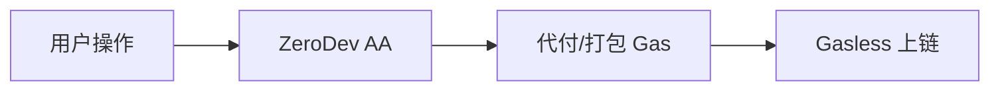

# 钱包身份 — ZeroDev 账户抽象

> 支撑 Gasless 交易与提现

---

## 作用

Predict.fun 使用 **ZeroDev** 账户抽象（AA）能力：

- Gasless 交易与提现（用户无需持有 BNB）。
- 链上部署 `ZeroDevWithdrawalHelper`（`0xf4aa30b537882eca7e69defb68d6f631cda77b00`）支撑账户抽象提现。

---

## 与 Binance 代付的关系

| 场景 | Gas 处理 |
|------|---------|
| Binance Wallet 集成 | Binance 代付 |
| predict.fun Web/App | ZeroDev 账户抽象 |

> 开发者也可用 ZeroDev SDK 等 AA 工具与智能钱包编程交互。

---

> 截至 2026 年 6 月。
