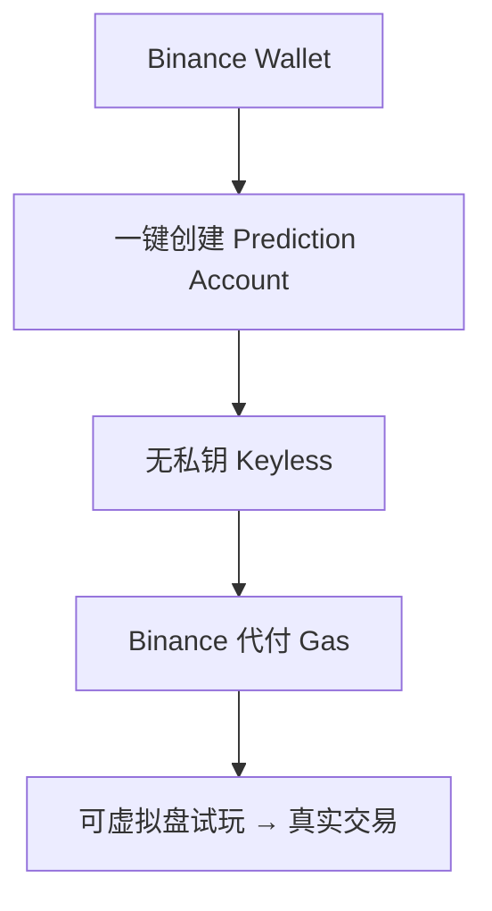

# 钱包身份 — Binance Keyless Wallet

> Binance Wallet 集成下的无私钥一键开户

---

## 核心

- Binance Wallet 用户一键创建 **Prediction Account**，由 Binance Keyless Wallet 驱动。
- **无私钥 / 无助记词**，Binance 代付 Gas（完全 Gasless），无需桥接，统一账户。
- 是触达 200M+ Binance 用户的关键。

---

## 与自托管的权衡

| | Keyless | Privy/EOA |
|---|---|---|
| 门槛 | 极低 | 低 |
| 私钥 | 无（Binance 体系托管） | 可导出/自管 |
| 适用 | 主流大众 | 加密原生/开发者 |

---

> 基于 Binance Wallet 公告与 CMC Research，截至 2026 年 6 月。
