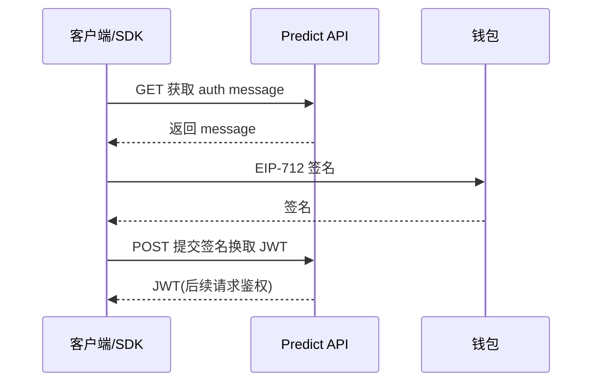

# 钱包身份 — API 认证

> auth message → EIP-712 签名 → JWT

---

## 流程

---

## 要点

| 项目 | 说明 |
|------|------|
| API Key | 主网需申请（Discord 开工单）；测试网无需 |
| 速率限制 | 默认 240 请求/分钟 |
| 账户 | 支持 EOA 与 Smart Wallet（Predict Account） |

---

> 基于 dev.predict.fun 鉴权指南，截至 2026 年 6 月。
