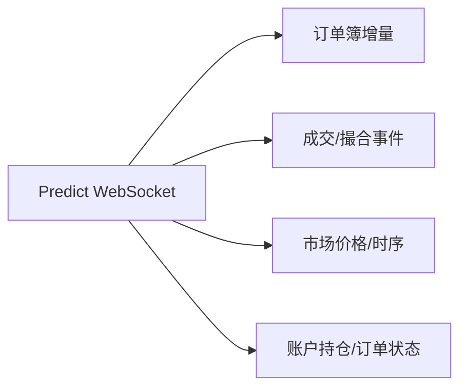

# API 与数据 — WebSocket

> 实时订单簿与成交推送

---

## 用途

```mermaid
graph LR
    WS[Predict WebSocket] --> A[订单簿增量]
    WS --> B[成交/撮合事件]
    WS --> C[市场价格/时序]
    WS --> D[账户持仓/订单状态]
```

- 低延迟推送，支撑做市/高频场景。
- REST 端点（timeseries/orderbook/statistics）作补充。

## 注意

- 需实现心跳保活；客户端不活跃时挂单可能被自动清理。

---

> 截至 2026 年 6 月。
