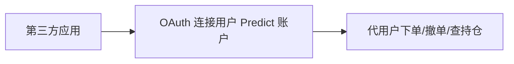

# API 与数据 — OAuth 第三方集成

> 允许第三方应用代用户下单/查持仓

---

## 能力

| 端点 | 作用 |
|------|------|
| Finalize OAuth connection | 完成第三方连接授权 |
| Get orders for connection | 查询该连接的订单 |
| Create order for connection | 代用户下单 |
| Cancel orders for connection | 代用户撤单 |
| Get positions for connection | 查询持仓 |

> 这是 Predict.fun 面向生态（外部工具/Bot）的扩展接口，类似 Polymarket 的 Operator 模式。

---

> 截至 2026 年 6 月。
