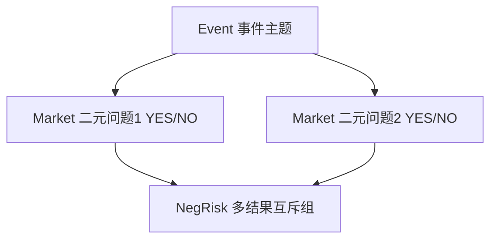

# 市场运营 — Event vs Market

> 一个事件可包含多个可交易市场

---

| 概念 | 说明 |
|------|------|
| Event | 现实事件主题（如「世界杯冠军」），可含多个 Market |
| Market | 具体可交易的二元问题 |
| NegRisk | 将多选一的 Market 组织为互斥组 |

- API 通过 categories / tags / search 组织市场发现。

---

> 截至 2026 年 6 月。
