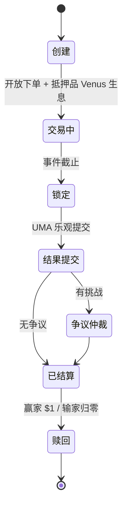

# 市场运营 — 市场生命周期

> 创建 → 交易 → 锁定 → 结果 → 结算 → 赎回

---

| 阶段 | 涉及合约 |
|------|---------|
| 创建 | ConditionalTokens / NegRisk |
| 交易中 | CTFExchange / YieldBearingWrappedCollateral / Venus |
| 结果/争议 | UmaCompatibleCtfAdapter / OptimisticOracle / DVM |
| 赎回 | redeemPositions / Venus |

> 详见 basics/11-event-market-lifecycle。截至 2026 年 6 月。
