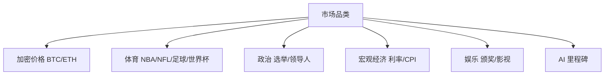

# 市场运营 — 市场分类

> 加密 / 体育 / 政治 / 宏观 / 娱乐 / AI

---

| 品类 | 流动性特征 |
|------|-----------|
| 加密价格 | 与行情联动，加密原生用户活跃 |
| 体育 | 大事件爆发式流量（世界杯重点） |
| 政治 | 长周期高关注 |
| 宏观 | 专业交易者偏好 |
| 娱乐/AI | 拉新破圈、叙事性强 |

> 宽品类 = 多元流量入口、天然分散流动性（CMC Research）。截至 2026 年 6 月。
