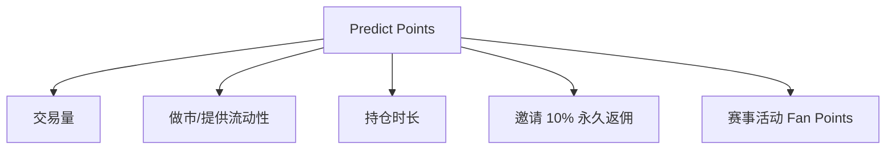

# 市场运营 — Predict Points 与做市奖励

> 积分驱动增长，做市每分钟快照计分

---

## 积分来源

## 做市积分机制（最具特色）

每分钟对订单簿快照，活跃挂单按三因子计分：
1. **距中点距离**：越接近 0.5 指数级越多分（但被成交风险越高）
2. **订单规模**：越大越多分
3. **双边挂单**：同时挂 YES+NO 有加成
- **Boosted 市场**给予显著更多积分。

## 现状

- Predict.fun 是 **少数（被称唯一）在跑积分计划的预测市场**，叠加 YZi/Binance 背书，是清晰的「空投农场」标的。
- 世界杯「$2M Predict Cup」：200 万 USDT + 300 万 Predict Points 奖池。

> ⚠️ 尚未发币；积分→代币映射、TGE 时间均不确定；积分通胀可能稀释预期。

---

> 基于第三方分析（pfanalytics 等）与官方活动，截至 2026 年 6 月。
