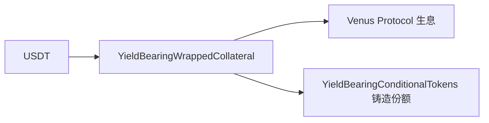

# 链上合约 — 生息合约族

> Predict.fun 的核心差异化资产

---

| 合约 | 地址 | 作用 |
|------|------|------|
| YieldBearingConditionalTokens | `0x9400F8Ad57e9e0F352345935d6D3175975eb1d9F` | 生息版 YES/NO 代币 |
| YieldBearingWrappedCollateral | `0xCfb9beF5F7B748aC72311F057f3a888BC73334D9` | USDT 包装为生息抵押品（路由 Venus） |
| YieldBearingNegRiskAdapter | `0x41dCe1A4B8FB5e6327701750aF6231B7CD0B2A40` | 生息版多结果适配 |

- 与「非生息」合约族（ConditionalTokens / WrappedCollateral / NegRiskAdapter）并行存在。
- 是「资本效率」叙事的链上技术基础。

> Venus 路由经 CMC Research 确认。截至 2026 年 6 月。
