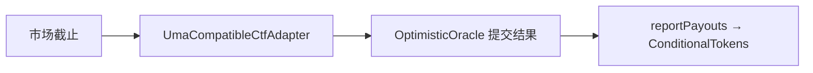

# 链上合约 — UMA Adapter

> 连接条件代币与 UMA 兼容预言机的适配器

---

| 合约 | 地址 |
|------|------|
| UmaCompatibleOptimisticOracle | `0x76F42e5520E62AD88f8fE583cBb4BfF27eeC2531` |
| UmaCompatibleCtfAdapter（生息） | `0x947cc06D38d3cB0a2BB5AdFB668b99B4FF53d7B4` |
| UmaCompatibleCtfAdapter（非生息） | `0x242E1Ba24f6fC524bfb410062Ca5689A9622613d` |
| NegRisk UmaCompatibleCtfAdapter（生息） | `0x26B366Ab634C43BdA6D784fDCe34F24A37DF8172` |

- Adapter 负责把市场结算请求路由到 UMA 兼容乐观预言机，并在结果生效后回写条件代币。
- 与 Polymarket 的 UMA CTF Adapter 同源设计。

> 截至 2026 年 6 月。
