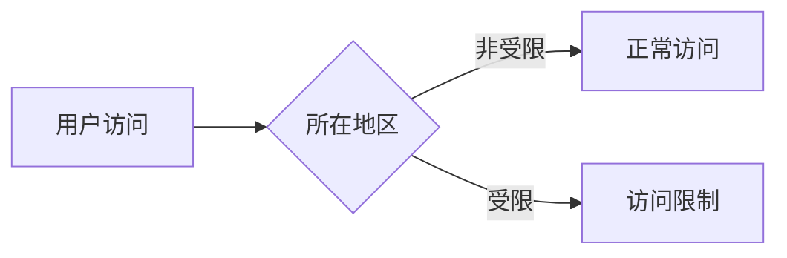

# 合规 — 地区访问限制

> 存在地域限制，具体范围待确认

---

## 线索

- 开发者文档提到主服务器位于 `ap-northeast-1`，并标注 *"Closest Non-Georestricted Region"*——暗示存在 **geo-restriction（地域限制）**。
- 作为离岸 Web3 平台，通常会对部分受限司法辖区做访问限制。

> ⚠️ 具体受限地区清单官方未完整公开，需以官方条款为准。截至 2026 年 6 月。
