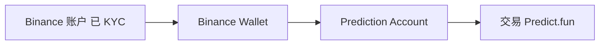

# 合规 — KYC 与 Binance 集成

> 身份验证与渠道合规

---

## 现状

- predict.fun Web/App 走链上非托管模式，开户以钱包为主。
- **Binance Wallet 集成** 场景下，用户经 Binance 体系账户接入，KYC 依托 Binance 既有合规框架。

## 与 Kalshi 的差异

| | Predict.fun | Kalshi |
|---|---|---|
| 监管 | Web3/离岸 | CFTC 合规 |
| KYC | 依地区/渠道 | 强制 KYC |

> ⚠️ predict.fun 自身的 KYC 要求与地区策略官方未完整公开。截至 2026 年 6 月。
