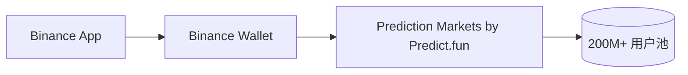

# 生态 — Binance Wallet 集成

> 触达 200M+ 用户的主流入口

---

## 核心

- Binance Wallet 通过与 Predict.fun 合作，将链上预测市场嵌入「Prediction Markets」板块，触达 **200M+ 用户**。
- **Keyless + Gasless + 无桥接 + 虚拟盘**：Binance 作为聚合器代付 Gas，USDT 结算。

## 渠道飞轮

大事件（世界杯 $2M Predict Cup）+ Binance 入口 → 3 天 2 万 DAU、18 万笔/日。

> 这是 Predict.fun 最强且排他的护城河，也是最大依赖（双刃剑）。详见 basics/08。截至 2026 年 6 月。
