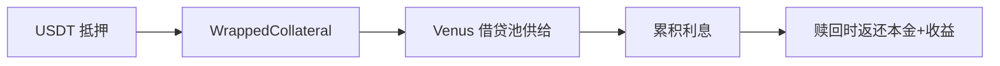

# 生态 — Venus 生息集成

> 抵押品收益的来源：BNB Chain 最大借贷市场

---

## 核心

- 用户抵押品经 `YieldBearingWrappedCollateral` 包装后供给 **Venus Protocol**（BNB Chain 最大借贷市场）。
- 借贷利息构成持仓期收益，理论 5–15% APY。
- 经 CMC Research 确认：Predict.fun 是当前唯一对闲置抵押品提供收益的主要预测市场。

## 协同价值

| 方 | 价值 |
|----|------|
| Predict.fun | 资本效率差异化 + 潜在收益分成 |
| Venus | 稳定 USDT 供给 |
| 用户 | 押注期间资金不闲置 |

> ⚠️ 收益分配比例（用户/平台）未公开。截至 2026 年 6 月。
