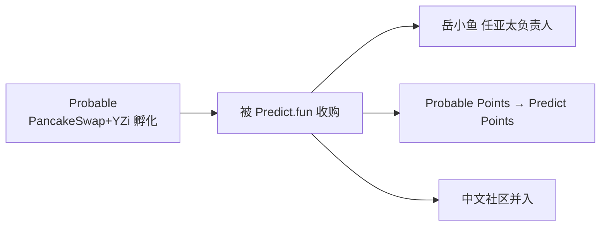

# 生态 — 收购 Probable

> 整合 BNB 链流动性与亚洲（中文）社区

---

## Probable 背景

- 由 **PancakeSwap + YZi Labs 共同孵化**，2025-12 上线，主打零手续费、链上订单簿、预言机结算，含独特区域市场。
- X 账号 2025-10 建立，2026-01 粉丝破 11,100。

## 收购（2026-03）

- 同源资本（YZi）、同链（BNB）、同期上线——本质是 **YZi 体系内部资源整合**，消除内耗。
- 积分迁移：第 1–6 周 1:1，第 7–10 周 10:1（制造迁移紧迫感）。
- 增长负责人 **岳小鱼（@yuexiaoyu）** 出任亚太负责人。

> ⚠️ KOL 多数正面；部分担忧积分稀释引发老用户不满（PANews）。截至 2026 年 6 月。
