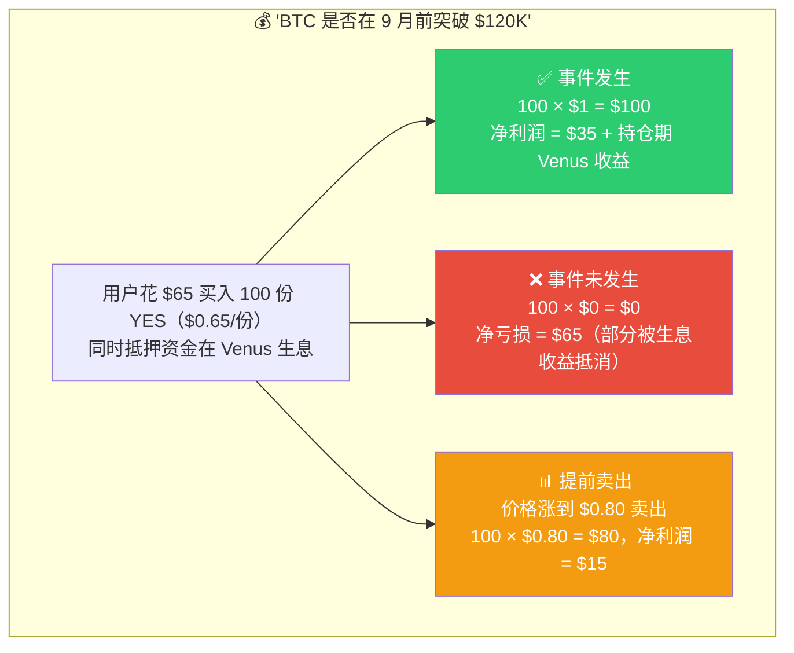
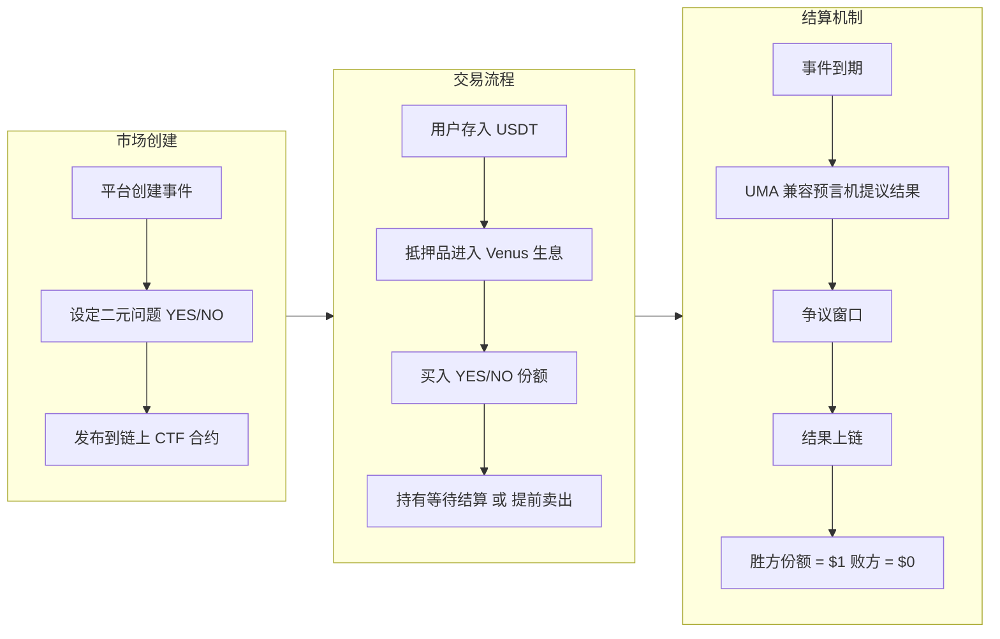
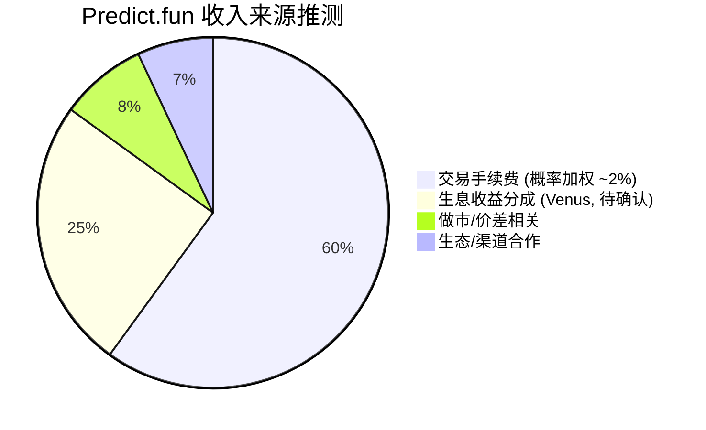
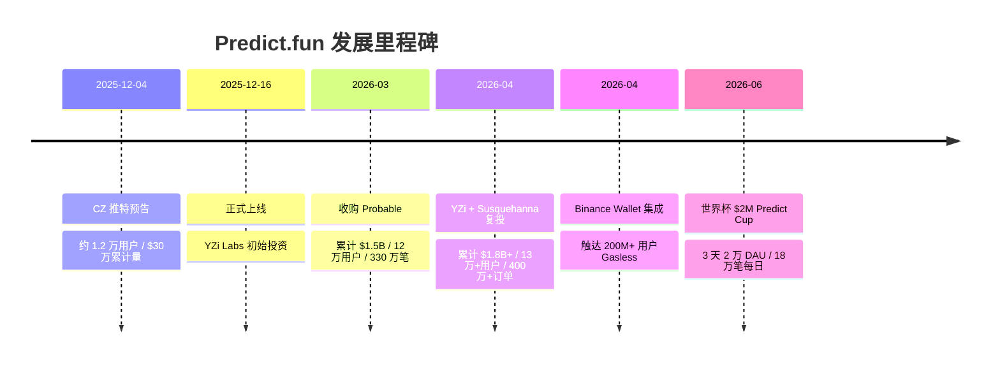
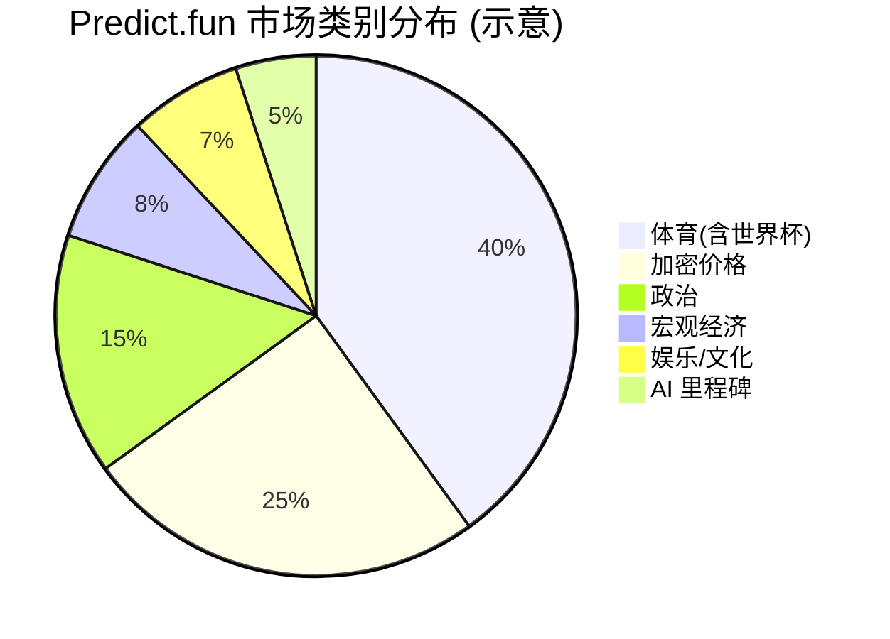
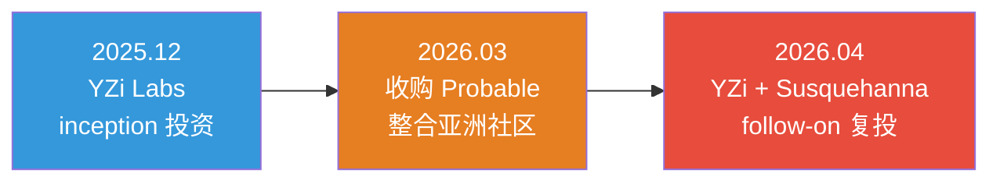

# Predict.fun 平台概览与商业模式

> BNB Chain 原生预测市场 — YZi Labs 支持、CZ 站台、半年累计交易量破 $18 亿

---

## 目录

1. [什么是 Predict.fun](#1-什么是-predictfun)
2. [核心业务模式](#2-核心业务模式)
3. [商业模式与收入](#3-商业模式与收入)
4. [市场数据与增长里程碑](#4-市场数据与增长里程碑)
5. [融资历程与资本背景](#5-融资历程与资本背景)

---

## 1. 什么是 Predict.fun

Predict.fun 是建立在 **BNB Chain** 上的链上预测市场平台，由 **Dingaling（@dingalingts，前 Binance 研究负责人、PancakeSwap 联合创始人）** 创立，**YZi Labs（原 Binance Labs）** 在 inception 阶段投资，**CZ（赵长鹏）** 于 2025 年 12 月公开预告站台。

用户在平台上就现实世界事件的结果进行交易——通过买卖「事件份额（YES/NO Shares）」表达对事件发生概率的判断。

官网口号：*"The BNB-native information market where it pays to be right."*

### 平台定位

- **信息聚合工具**：市场价格反映集体智慧
- **投机交易平台**：交易事件概率获利
- **资本高效**：押注期间抵押品经 **Venus Protocol** 生息（最大差异化）
- **大众入口**：通过 **Binance Wallet** 触达 200M+ 用户，Gasless 一键交易

事件类型覆盖：加密价格、体育（NBA/NFL/足球）、政治、宏观经济、娱乐、AI 里程碑。

> **一句话本质**：Predict.fun ≈「Polymarket 成熟架构」+「BNB 链」+「生息抵押（Venus）」+「Binance 2 亿用户渠道」+「亚洲市场」。

---

## 2. 核心业务模式

### 2.1 事件市场运作原理

每个事件是一个**二元问题**（Yes or No），例如："Will BTC close above $120K by Sep 2026?"

| 要素 | 说明 |
|------|------|
| **YES 份额** | 代表事件会发生，价格 $0 ~ $1 |
| **NO 份额** | 代表事件不会发生，价格 $0 ~ $1 |
| **核心恒等式** | `1 YES + 1 NO = $1`（永远成立） |
| **价格 = 概率** | YES 价格 $0.65 意味市场认为有 65% 概率发生 |
| **结算** | 正确结果份额价值变为 $1，错误的变为 $0 |
| **结算资产** | USDT |

### 2.2 交易盈亏示例

### 2.3 业务流程总览

---

## 3. 商业模式与收入

### 3.1 费用模型

| 费用类型 | 费率 | 说明 |
|---------|------|------|
| **交易手续费** | ~2% 峰值 | 概率加权，随价格偏离 50% 递减 |
| **Gas 费** | 平台/Binance 承担 | Gasless（账户抽象 + Binance 代付） |
| **生息收益分成** | 待确认 | 抵押品 Venus 收益，平台可能抽取部分 |

### 3.2 收入来源

- **交易手续费**：主收入，概率加权（p×(1−p)），中点最高、极端价格趋零。
- **生息收益分成**：$20M+ 用户资金经 Venus 生息，潜在第二曲线。
- **生态/渠道**：API、Binance 合作分润。

### 3.3 与竞品收入模型对比

| 平台 | 收费方式 | 费率 |
|------|---------|------|
| **Predict.fun** | 概率加权交易费 + 生息分成 | ~2% 峰值 |
| Polymarket | 长期免交易费 | $0（变现靠数据/其他） |
| Kalshi | 交易手续费 | 概率加权 |
| 传统博彩 | 赔率差 (Vig) | 5-10% |

---

## 4. 市场数据与增长里程碑

### 4.1 发展时间线

### 4.2 关键市场指标

| 指标 | 数据 | 时间 |
|------|------|------|
| 累计交易量 | **$1.8B+** | 2026-04 |
| 注册用户 | **130,000+** | 2026-04 |
| 撮合订单 | **4,000,000+** | 2026-04 |
| 生息中资金 | **$20M+** | 2026-04 |
| TVL | ~$16.9M | DefiLlama |
| 2025 行业名义交易量 | ~$44B | CMC |
| Kalshi+Polymarket 行业占比 | ~87.6% | 2025 |

### 4.3 市场类别分布（示意）

> ⚠️ 类别占比为基于品类与活动的示意推断，非官方披露。

---

## 5. 融资历程与资本背景

### 5.1 关键投资者与团队

| 项目 | 详情 |
|------|------|
| 领投/复投 | **YZi Labs**（原 Binance Labs 分拆的家族办公室） |
| 跟投 | **Susquehanna Crypto**（SIG 加密部门） |
| 公开站台 | **CZ（赵长鹏）** 推特预告 |
| 创始人 | **Dingaling** — 前 Binance 研究负责人、PancakeSwap 联合创始人 |
| 渠道合作 | **Binance Wallet**（200M+ 用户原生集成） |

### 5.2 战略并购：Probable

| 事件 | 意义 |
|------|------|
| 2026-03 收购 Probable | Probable 由 **PancakeSwap + YZi Labs 共同孵化**，同源资本/同链/同期上线；收购本质是 YZi 体系内部资源整合 |
| 岳小鱼（@yuexiaoyu）任亚太负责人 | 接入中文社区与收入机制 |
| 积分迁移 | Probable Points → Predict Points（第 1–6 周 1:1，第 7–10 周 10:1） |

---

> 数据截至 2026 年 6 月，基于公开信息整理。交易量等数据可能因统计口径不同而有所差异。不构成投资建议。
