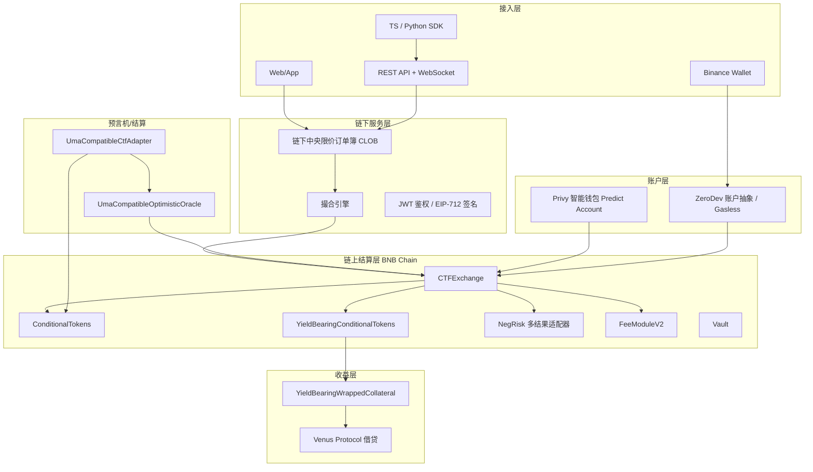
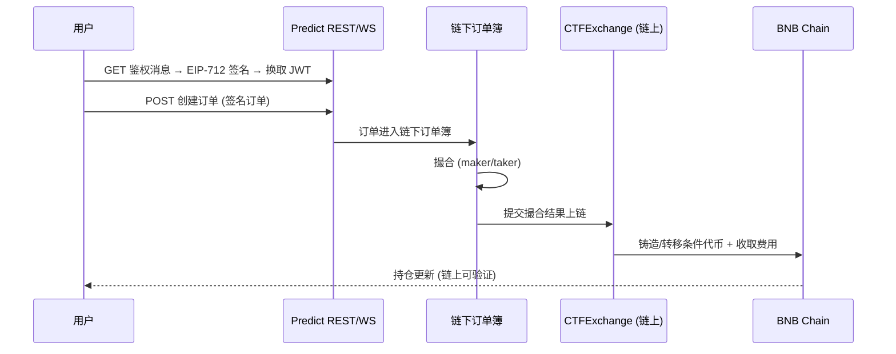
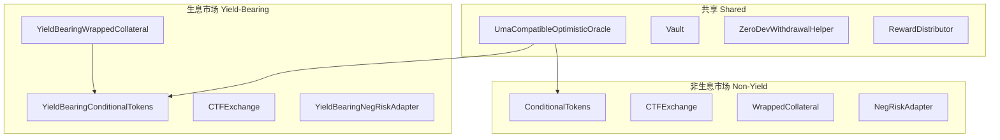

# Predict.fun 技术架构与智能合约

> 混合去中心化架构、BNB Chain 链上合约族（生息/非生息双轨）与核心技术栈

---

## 1. 整体技术架构

Predict.fun 采用与 Polymarket 同源的混合架构：**链下 CLOB 撮合 + 链上原子结算**，并在其上叠加 **生息抵押层** 与 **账户抽象层**。

各层职责：

| 层级 | 职责 | 特点 |
|------|------|------|
| 接入层 | UI、钱包、订单签名、SDK/API | Web + Binance Wallet + 开发者 |
| 链下层 | 订单簿、撮合、API 服务 | 高速、无 Gas |
| 链上层 | 资产转移、份额铸造/销毁、结算 | 不可篡改 |
| 收益层 | 抵押品包装 + Venus 生息 | 资本效率（差异化） |
| 预言机层 | 事件结果裁定 | UMA 兼容乐观验证 |
| 账户层 | 智能钱包 + 账户抽象 | Gasless / Keyless |

---

## 2. 为什么选择 BNB Chain

| 特性 | 说明 |
|------|------|
| 低 Gas 费 | 适合高频小额交易 |
| 高吞吐 / EVM 兼容 | 可复用 Gnosis CTF、UMA 等成熟框架 |
| Binance 生态 | 与 Binance Wallet、Venus 等深度协同 |
| 稳定币与 DeFi | USDT 流动性 + Venus 借贷市场支撑生息 |
| 亚洲用户基数 | 主基础设施部署东京（ap-northeast-1），亚洲优先 |

> 取舍：BNB 链稳定币发行/流动性相对 Polygon-USDC 生态有限，是其需要克服的约束之一。

---

## 3. 混合去中心化 CLOB 架构

| 纯链上 | 纯链下 | Predict.fun 混合架构 |
|--------|--------|-------------------|
| 每笔订单上链，Gas 高 | 中心化风险 | 撮合链下（快），结算链上（安全） |

---

## 4. 智能合约体系（生息 / 非生息双轨）

Predict.fun 最大的架构特色是 **两套并行的预测市场合约**：

| 合约 | 职责 |
|------|------|
| CTFExchange | 交易入口，验证 EIP-712 签名，执行订单匹配 |
| ConditionalTokens | 条件代币（YES/NO）的铸造、合并、赎回 |
| YieldBearingConditionalTokens | 生息版条件代币（核心差异化） |
| YieldBearingWrappedCollateral | 将 USDT 包装为生息抵押品（路由 Venus） |
| NegRiskAdapter | 多结果（多选一）市场适配 |
| UmaCompatibleOptimisticOracle | 事件结果裁定 |
| FeeModuleV2 | 费用模块 |

---

## 5. 核心合约地址（BNB Mainnet）

| 合约 | 地址 |
|------|------|
| UmaCompatibleOptimisticOracle | `0x76F42e5520E62AD88f8fE583cBb4BfF27eeC2531` |
| Vault | `0x09F683d8a144c4ac296D770F839098c3377410c5` |
| ZeroDevWithdrawalHelper | `0xf4aa30b537882eca7e69defb68d6f631cda77b00` |
| RewardDistributor | `0x14e3cB02F48818a8FeF6BC257059767cA9d436Ae` |
| YieldBearingConditionalTokens | `0x9400F8Ad57e9e0F352345935d6D3175975eb1d9F` |
| YieldBearingWrappedCollateral | `0xCfb9beF5F7B748aC72311F057f3a888BC73334D9` |
| CTFExchange（生息） | `0x6bEb5a40C032AFc305961162d8204CDA16DECFa5` |
| ConditionalTokens（非生息） | `0x22DA1810B194ca018378464a58f6Ac2B10C9d244` |
| WrappedCollateral（非生息） | `0x66239b70133773A72A0D589E5564E88a50Cd39e7` |

> 完整清单见 dev.predict.fun → Deployed Contracts。两套合约的存在直接验证「生息 vs 非生息」双轨设计。

---

## 6. 技术栈推断

| 层 | 推断技术 | 依据 |
|----|---------|------|
| 链 | BNB Chain（Chain ID 56） | 官方明确 |
| 合约 | Solidity，Gnosis CTF + UMA Adapter 分叉 | 链上合约命名 |
| 撮合 | 自建链下 CLOB | API/文档 |
| 账户抽象 | Privy（钱包）+ ZeroDev（AA/Gasless） | 文档 + 合约 |
| 结算 | UMA 兼容乐观预言机 | 链上合约 |
| 收益 | Venus Protocol（已确认） | CMC Research |
| 部署区域 | AWS ap-northeast-1（东京） | 文档 |

---

> 技术架构基于 Predict.fun 开发者文档与链上合约整理，截至 2026 年 6 月。
