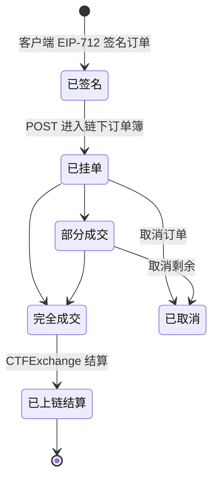
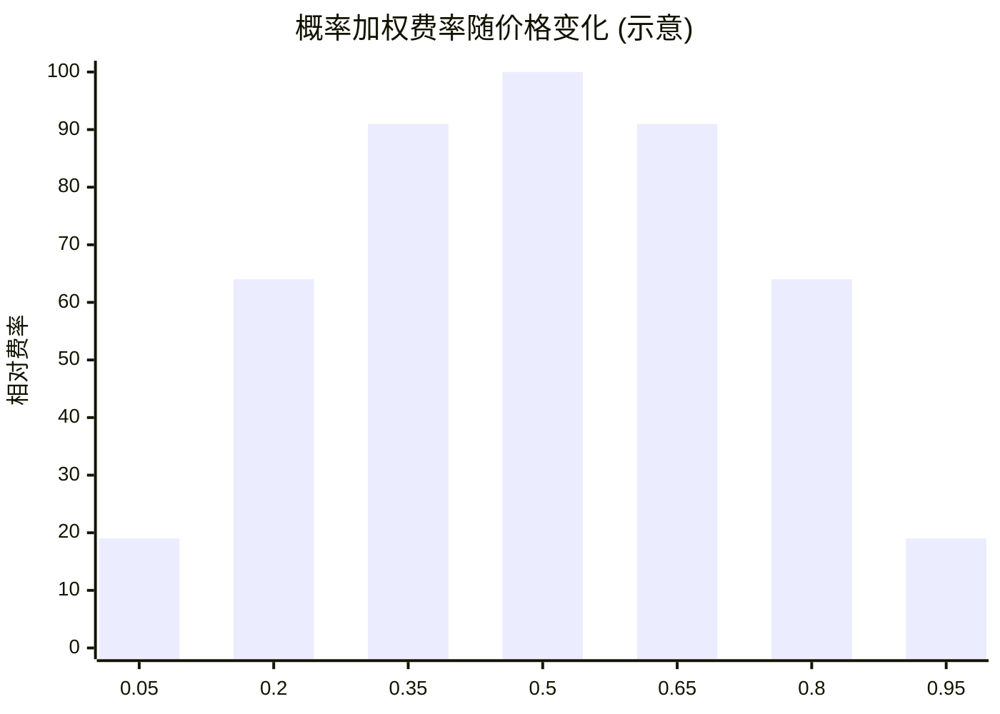

# Predict.fun 交易机制与订单系统

> 链下 CLOB 撮合、订单状态机、概率加权费率

---

## 1. 交易核心：链下 CLOB + 链上结算

Predict.fun 使用中央限价订单簿（CLOB），链下撮合、链上原子结算。

```
用户签名订单 → 链下 CLOB 撮合 → 链上 CTFExchange 原子结算
```

- 用户对订单做 **EIP-712 离线签名**，不需要为挂单/撤单支付 Gas。
- 撮合成功后，匹配的订单对提交到链上 `CTFExchange` 原子执行。

---

## 2. 订单簿结构（YES 侧存储 + NO 取补）

订单簿**只存储 YES 侧价格**，NO 侧由补数计算（`YES + NO = 1`）：

```text
getComplement(price, precision) = (10^precision - round(price * 10^precision)) / 10^precision
NO 最优买价 = getComplement(asks[0][0])   # YES 最低卖价的补数
NO 最优卖价 = getComplement(bids[0][0])   # YES 最高买价的补数
```

示例订单簿（来自官方文档）：

```json
{
  "marketId": 1,
  "asks": [[0.492, 30192.26], [0.493, 20003]],
  "bids": [[0.491, 303518.1], [0.49, 1365.44]]
}
```

- `asks`：YES 卖价深度 `[price, quantity]`（最低卖价在前）
- `bids`：YES 买价深度（最高买价在前）
- 价格恒在 `[0, 1]`，即隐含概率。

---

## 3. 订单状态机



> 做市要点：挂单在「已挂单/部分成交」状态期间参与每分钟订单簿快照，累积做市 Predict Points。

---

## 4. 订单类型

| 类型 | 说明 |
|------|------|
| **市价单 (Market)** | 以当前最优价即时成交，适合快速进出 |
| **限价单 (Limit)** | 指定价格挂单，等待对手方撮合；未成交期间资金冻结、可累积做市积分 |

> ⚠️ 更细的订单时效类型（如 GTC/GTD/FOK/FAK）是否全部支持，需以官方 API 文档为准。

---

## 5. 概率加权费率

Predict.fun 采用 **概率加权费率**：约 **2% 基础费、随价格偏离 50% 而递减**。



```text
fee ≈ baseRate × c × p × (1 − p) × 4
c = 交易名义金额, p = 成交价格(隐含概率), baseRate ≈ 2% 为 p=0.5 时峰值
```

- 在 50/50（不确定性最高）处费率最高（~2%），价格越极端费率越低。
- 设计意图：在最难判断的交易上多收费，不惩罚接近确定的低风险交易。

---

## 6. 价格 = 概率

| 字段 | 值 | 含义 |
|------|------|------|
| YES 价格 | $0.32 | 市场认为事件有 32% 概率发生 |
| NO 价格 | $0.68 | 68% 概率不发生 |
| Spread | $0.02 | 买卖价差（流动性成本） |

赢家份额结算兑付 $1，输家归 $0。

---

## 7. 与 Polymarket 交易机制对比

| 维度 | Predict.fun | Polymarket |
|------|-------------|------------|
| 撮合 | 链下 CLOB | 链下 CLOB |
| 结算 | 链上 CTFExchange | 链上 CTFExchange |
| 交易费 | 概率加权 ~2% 峰值 | 长期 $0 |
| 抵押品 | 生息（Venus） | 闲置 |
| Gas | Gasless（代付） | 用户承担（低） |

---

> 基于 Predict.fun 开发者文档整理，截至 2026 年 6 月。
