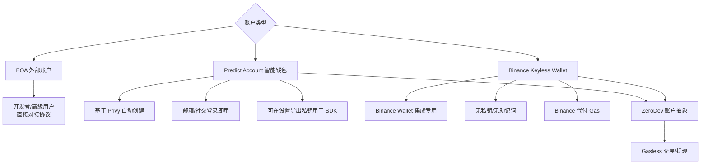
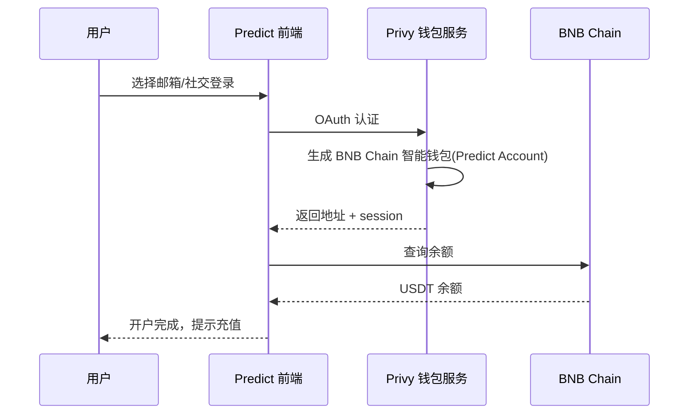
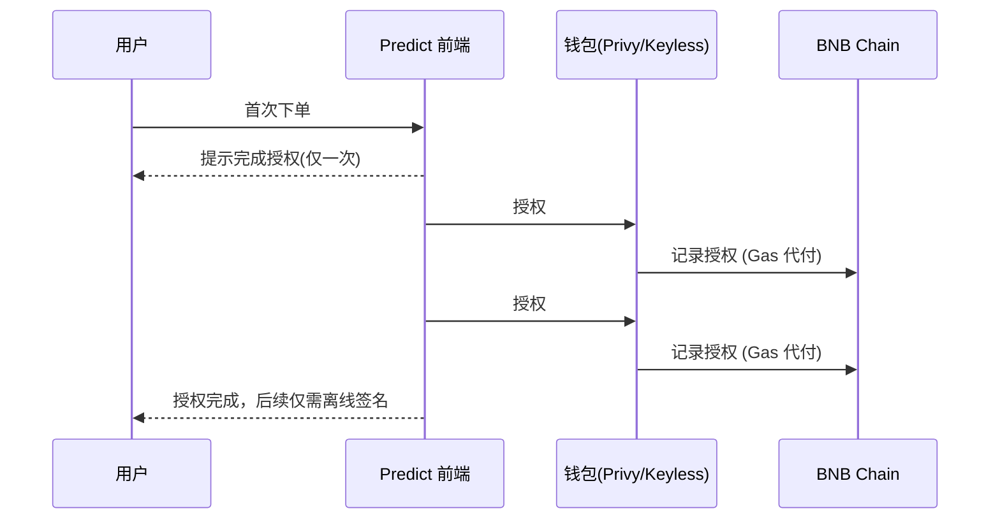

# Predict.fun 钱包体系与资产结构

> 账户分层、Privy/Keyless 钱包、USDT 资产、授权机制

---

## 1. 账户体系总览

Predict.fun 支持三类账户，覆盖从开发者到主流大众的全谱系用户：

| 账户类型 | 适用人群 | 私钥 | Gas |
|---------|---------|------|-----|
| **EOA** | 开发者/高级用户 | 自管 | 自付 |
| **Predict Account (Privy)** | Web/App 主流用户 | Privy 托管，可导出 | 账户抽象处理 |
| **Binance Keyless Wallet** | Binance 存量用户 | 无私钥 | Binance 代付 |

---

## 2. Predict Account（Privy 智能钱包）

- Web App 用户登录（邮箱/社交）即自动创建，基于 **Privy**。
- 可在 `predict.fun/account/settings` 导出 Privy 私钥，用于 SDK 编程交互。
- 配合 **ZeroDev 账户抽象**，支撑 Gasless 体验。

---

## 3. 资产结构

| 资产 | 标准 | 作用 |
|------|------|------|
| **USDT** | ERC-20 (BNB Chain) | 交易抵押品与结算货币 |
| **YES/NO 份额** | ERC-1155（条件代币 CTF） | 事件结果头寸，价值 $0~$1 |
| **生息包装抵押品** | YieldBearingWrappedCollateral | USDT 经包装后供给 Venus 生息 |

核心恒等式：`1 YES + 1 NO = $1`。赢家份额结算兑付 $1，输家归 $0。

---

## 4. 授权机制（Allowance）

与 Polymarket 类似，首次交易需完成链上授权（一次性），之后交易仅需 EIP-712 离线签名：

| 授权 | 作用 |
|------|------|
| `USDT.approve(CTFExchange)` | 允许交易所划转抵押品 |
| `setApprovalForAll(CTFExchange)` | 允许交易所转移 ERC-1155 份额 |

> Gasless：授权与交易的 Gas 由账户抽象 / Binance 代付，用户无需持有 BNB。

---

## 5. 入金与提现

- **入金**：BNB Chain 直接存 USDT/USDC（最低约 10）、从 Binance 提币、或经 **Rhino Bridge** 跨链。入金后资金进入 Venus 生息层。
- **提现**：经 `ZeroDevWithdrawalHelper` 账户抽象 Gasless 提现至 BNB Chain 地址（提现前需先平仓/结算持仓）。

---

> 基于 Predict.fun 开发者文档整理，截至 2026 年 6 月。
