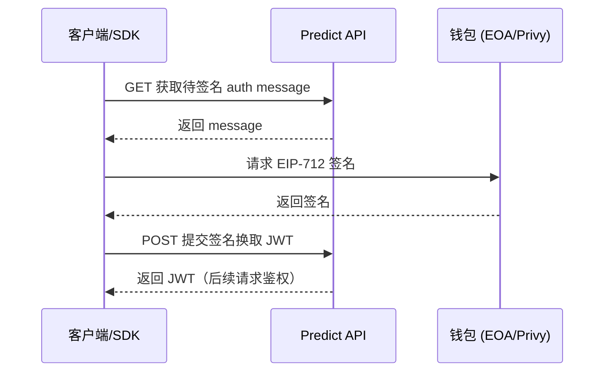
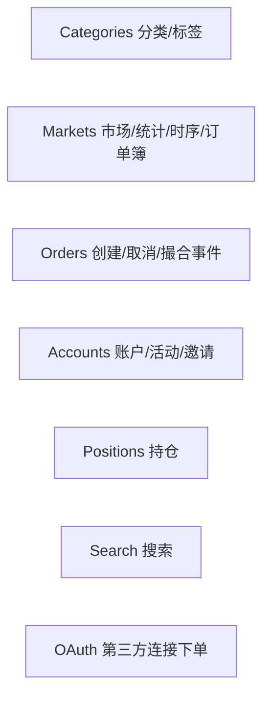

# Predict.fun API 接口与 SDK 参考

> REST/WebSocket 端点、TS/Python SDK、认证流程、代码示例

---

## 1. 接入点与基础信息

| 项目 | 详情 |
|------|------|
| 主网 API | `https://api.predict.fun/`（需 API Key） |
| 测试网 API | `https://api-testnet.predict.fun/`（无需 Key） |
| 备用 API UI | `https://api.predict.fun/docs` |
| 主基础设施区域 | `ap-northeast-1`（东京） |
| 速率限制 | 默认 240 请求/分钟（主网与测试网） |
| 开发者文档 | dev.predict.fun |
| 社区/Key 申请 | discord.gg/predictdotfun（开工单申请 API Key） |

---

## 2. SDK

| 语言 | 包名 | 来源 |
|------|------|------|
| TypeScript | `@predictdotfun/sdk` | npm |
| Python | `predict-sdk` | PyPI |
| 开源仓库 | github.com/PredictDotFun | GitHub |

- SDK 支持 EOA 与 Smart Wallet（Predict Account）两种方式下单。
- 也可借助 ZeroDev 等账户抽象 SDK 与智能钱包交互。

---

## 3. 认证流程（auth message → EIP-712 → JWT）



---

## 4. 主要 REST 端点



| 分组 | 代表端点 |
|------|---------|
| Categories | `GET /categories`、`GET /categories/{slug}`、`GET /tags` |
| Markets | `GET /markets`、`GET /markets/{id}`、`GET market statistics`、`GET market timeseries`、`GET orderbook` |
| Orders | `POST create order`、`POST remove orders`、`GET order by hash`、`GET order match events` |
| Accounts | `GET connected account`、`GET account activity`、`POST set referral` |
| Positions | `GET positions`、`GET positions by address` |
| Search | `GET search categories and markets` |
| OAuth | `finalize / get orders / create order / cancel / get positions`（第三方代用户操作） |

---

## 5. 订单簿读取示例

```text
GET /markets/{id}/orderbook
→ { asks: [[price, qty]...], bids: [[price, qty]...] }   # 仅 YES 侧
NO 价格 = getComplement(YES 价格)   # YES + NO = 1
```

---

## 6. WebSocket

- 用于低延迟推送：订单簿增量、成交/撮合事件、市场价格/时序、账户持仓与订单状态。
- 生产环境需实现心跳保活；客户端不活跃时挂单可能被自动清理。

---

## 7. AI/MCP 友好

官方将 SDK 发布到 **Context7**，可通过 MCP 或网页直接向其询问 SDK/REST API 用法：
- Predict TypeScript SDK、Python SDK、REST API 均有 Context7 入口。

---

> 基于 Predict.fun 开发者文档（dev.predict.fun）整理，截至 2026 年 6 月。API 处于 Beta。
