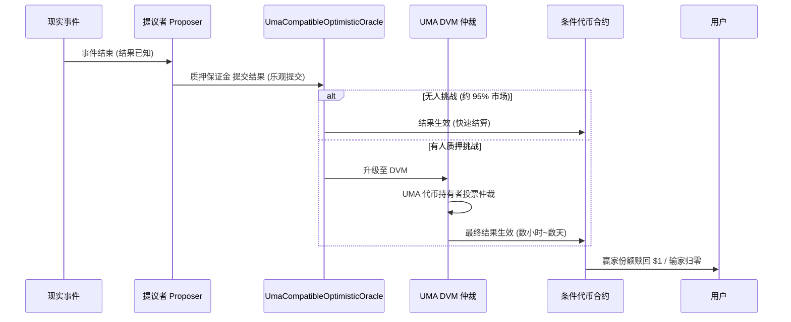
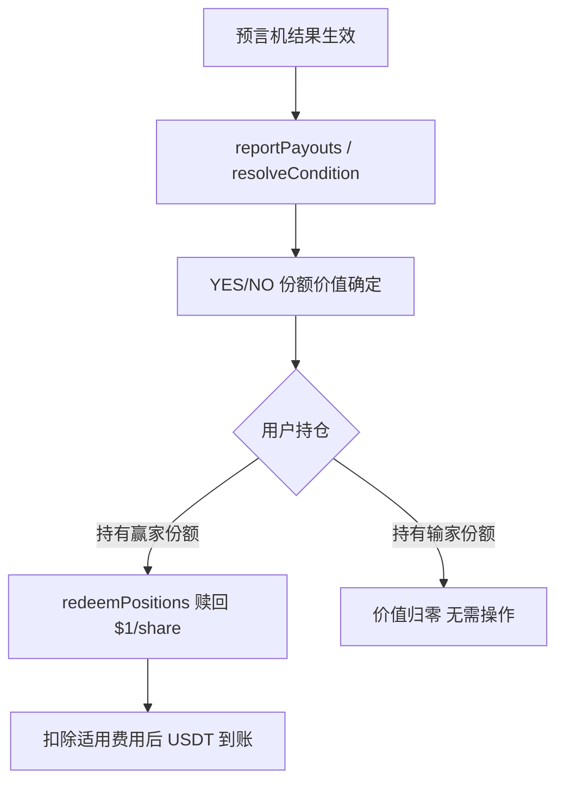
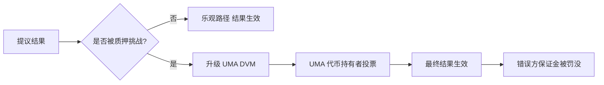

# Predict.fun 结算机制与预言机

> UMA 兼容乐观预言机、结果上链、赎回机制与争议处理

---

## 1. 结算总览

Predict.fun 使用 **UMA 兼容乐观预言机（UmaCompatibleOptimisticOracle）** 裁定事件结果——这是 Polymarket 同源的去信任结算方案。

---

## 2. 乐观预言机原理

| 阶段 | 说明 |
|------|------|
| **提议 (Propose)** | 提议者质押保证金，乐观提交结果 |
| **争议窗口** | 一段时间内任何人可质押挑战 |
| **乐观路径** | 无挑战 → 结果直接生效（多数市场，行业经验约 95%） |
| **争议升级** | 有挑战 → 升级 UMA DVM，由代币持有者投票裁决 |

> 乐观路径下结算快；争议升级则可能耗时数小时到数天。

---

## 3. 结果上链与赎回

- 结果生效后，合约设定 YES/NO 的兑付值（如 YES=1, NO=0）。
- 用户调用赎回（redeem）将赢家份额兑换为 USDT；输家份额自动归零。
- 生息市场下，赎回时本金 + 持仓期 Venus 收益一并返还（收益分配比例待确认）。

---

## 4. 争议机制

- 争议通过经济激励（质押/罚没）保证提议诚实。
- DVM 作为最终仲裁后盾，确保结果尽可能准确。

---

## 5. 与 Polymarket 结算对比

| 维度 | Predict.fun | Polymarket |
|------|-------------|------------|
| 预言机 | UMA 兼容乐观预言机 | UMA 乐观预言机 |
| 适配器 | UmaCompatibleCtfAdapter | UMA CTF Adapter |
| 争议后盾 | UMA DVM | UMA DVM |
| 结算资产 | USDT | USDC.e |
| 生息赎回 | 本金 + Venus 收益 | 仅本金 |

---

> 基于 Predict.fun 链上合约与 UMA 机制整理，截至 2026 年 6 月。
