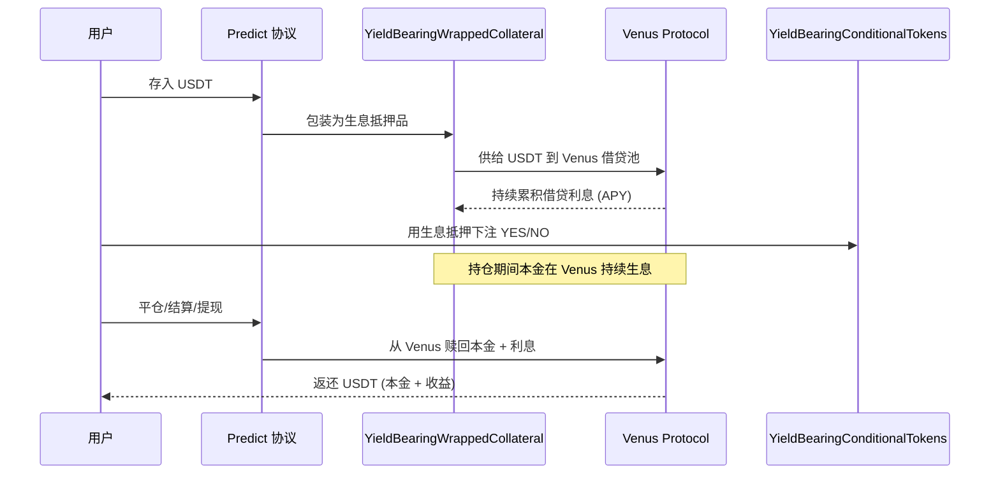
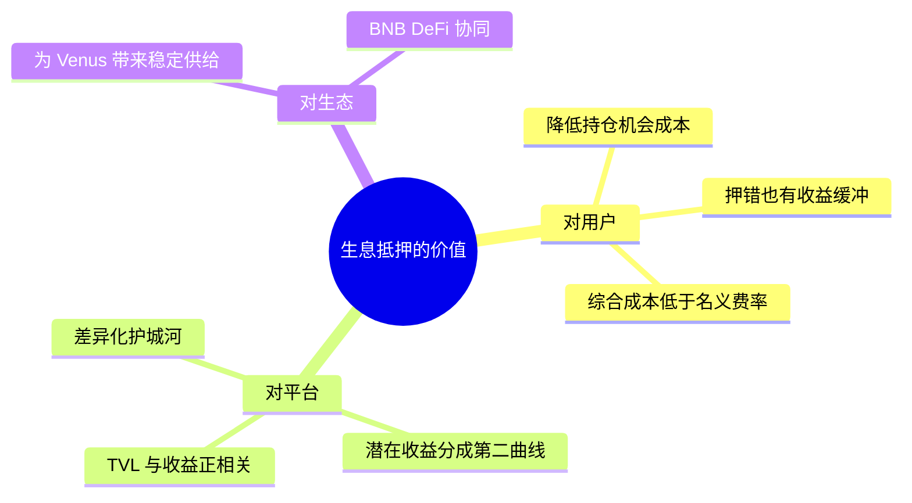
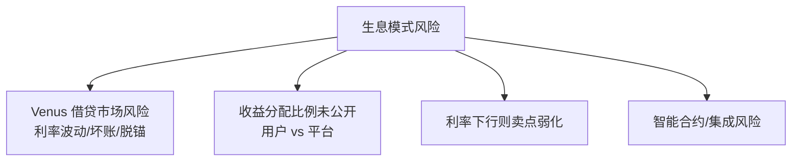

# Predict.fun 生息抵押与资本效率

> 核心差异化：押注期间抵押品经 Venus Protocol 持续生息

---

## 1. 解决什么问题：抵押品的机会成本

传统预测市场（Augur、Polymarket、Kalshi）中，用户押注的抵押资金在事件结算前 **闲置锁定**，产生机会成本。Predict.fun 的核心创新是让这笔资金 **在持仓期间持续赚取 DeFi 收益**。

```mermaid
graph LR
    subgraph 传统：闲置抵押
        A1[存入抵押] --> A2[锁定] --> A3[持仓期 0 收益]
    end
    subgraph Predict.fun：生息抵押
        B1[存入 USDT] --> B2[包装 WrappedCollateral] --> B3[供给 Venus] --> B4[持仓期 5-15% APY]
    end
```

> CMC Research：Predict.fun 是当前 **唯一对闲置抵押品提供收益的主要预测市场平台**。

---

## 2. 收益来源：Venus Protocol

- 抵押品通过 `YieldBearingWrappedCollateral` 包装后，供给到 **Venus Protocol**（BNB Chain 最大借贷市场）。
- 借贷利息构成用户在持仓期间的收益，理论年化 **5–15%**（随市场利率波动）。



---

## 3. 链上实现：双轨合约

Predict.fun 部署了 **生息** 与 **非生息** 两套并行合约，生息版以 `YieldBearing` 前缀命名：

| 合约 | 作用 |
|------|------|
| `YieldBearingConditionalTokens` | 生息版条件代币 |
| `YieldBearingWrappedCollateral` | 将 USDT 包装为生息抵押品（路由 Venus） |
| `YieldBearingNegRiskAdapter` | 生息版多结果市场适配 |

> 两套合约并存，直接在链上验证了「生息」是一等公民设计，而非营销话术。

---

## 4. 对各方的价值



| 视角 | 价值 |
|------|------|
| 用户 | 资金不闲置；即便押错，生息收益部分抵消亏损；综合持仓成本低于 ~2% 名义费率 |
| 平台 | 结构性差异化护城河；潜在收益分成；TVL 增长带动收益规模（$20M+ × 5–15% = $1M–$3M/年） |
| 生态 | 为 Venus 注入稳定 USDT 供给，强化 BNB DeFi 协同 |

---

## 5. 风险与待确认



待确认：
- 收益归属：全部归用户，还是平台抽取分成？比例？
- 除 Venus 外是否还有其他收益策略？
- 「生息/非生息」对用户默认哪套、能否选择？
- Venus 池的清算与脱锚风险隔离机制？

---

> 收益路由协议（Venus）经 CMC Research 确认；收益分配等细节官方未完全公开，部分为推断。截至 2026 年 6 月。
