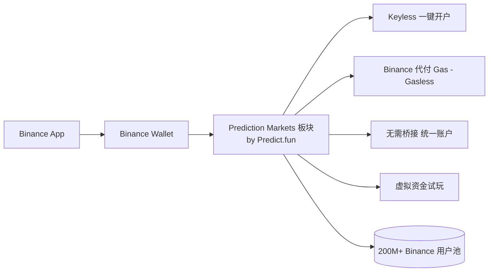
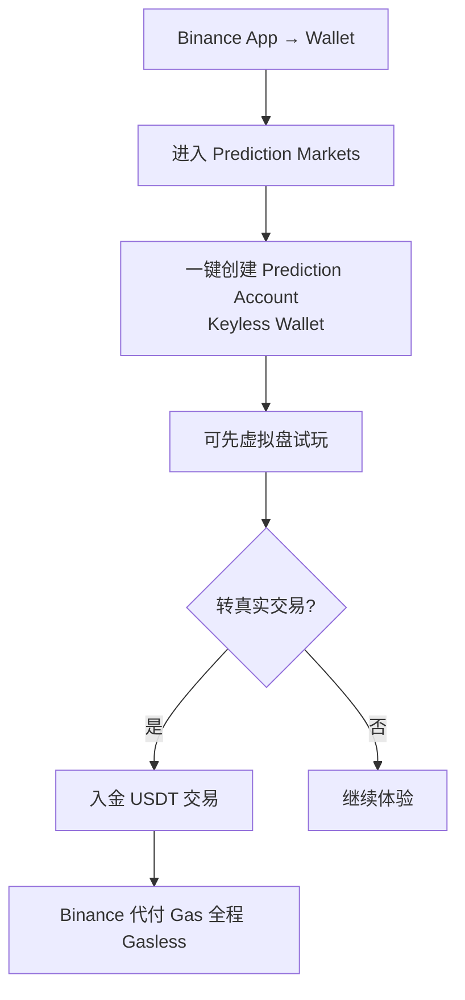
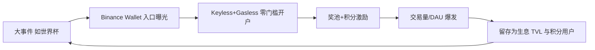
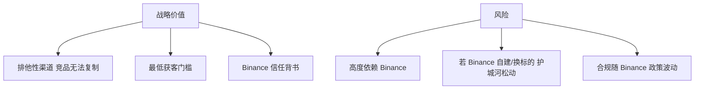

# Predict.fun × Binance Wallet 集成

> 触达 200M+ 用户的主流入口：Keyless、Gasless、无桥接、虚拟盘试玩

---

## 1. 集成意义：跨越「主流分发」鸿沟

预测市场赛道最大的未解难题是 **主流分发**——Polymarket 需要加密钱包/跨链/耐心，Kalshi 仅限美国。Binance 通过与 Predict.fun 合作，把链上预测市场直接嵌入 Binance Wallet，**触达 200M+ 用户**。

---

## 2. 体验关键点

| 特性 | 说明 |
|------|------|
| **Keyless Wallet** | 用 Binance Keyless Wallet 一键创建 Prediction Account，无私钥/无助记词 |
| **Gasless** | Binance 作为聚合器代付 BNB Chain Gas，交易与兑付完全免 Gas |
| **无桥接** | 统一账户，无需跨链操作 |
| **虚拟盘** | 可用虚拟资金零风险体验真实交易场景 |
| **结算资产** | USDT |

---

## 3. 双入口对比

| 维度 | predict.fun Web/App | Binance Wallet 集成 |
|------|--------------------|--------------------|
| 钱包 | Privy 智能钱包 / EOA | Binance Keyless Wallet |
| 私钥 | 可导出（自托管倾向） | 无私钥 |
| Gas | 账户抽象处理 | Binance 代付，完全 Gasless |
| 桥接 | 需自行入金/跨链（Rhino） | 无需桥接 |
| 目标用户 | 加密原生/开发者 | 主流/Binance 存量用户 |
| 门槛 | 低 | 极低（接近零） |

---

## 4. 渠道飞轮：大事件 + Binance 入口

**实例：2026 世界杯「$2M Predict Cup」**
- 经 Binance Wallet 入口 + 200 万 USDT 奖池 + 300 万 Predict Points。
- 启动 3 天内：**2 万 DAU、18 万笔/日交易**。

---

## 5. 战略与风险

- Binance 渠道是 Predict.fun **最强且排他** 的护城河，也是 **最大依赖**。

---

> 基于 Binance Wallet 公告、CMC Research 及媒体报道整理，截至 2026 年 6 月。
