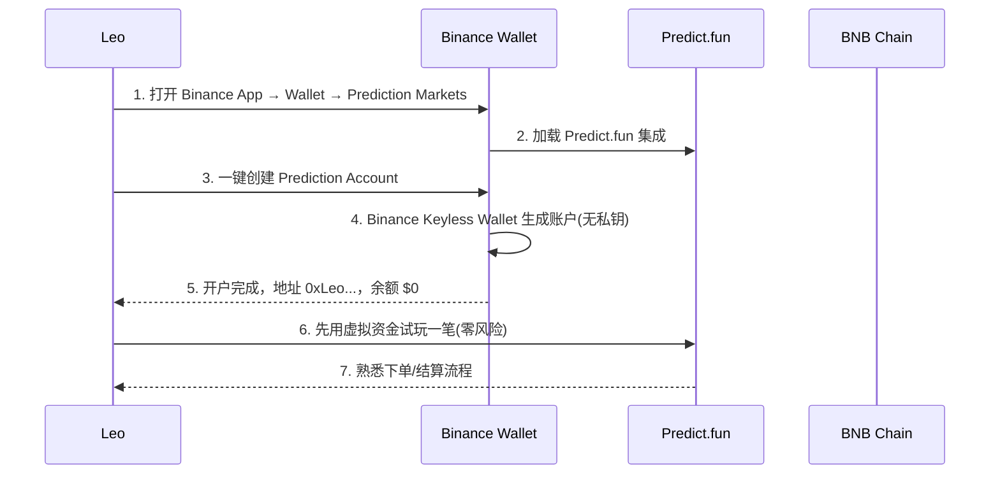
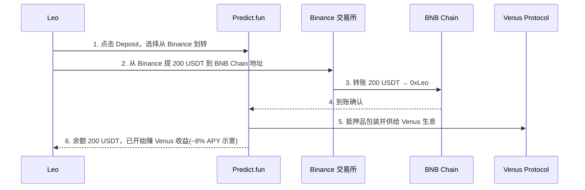
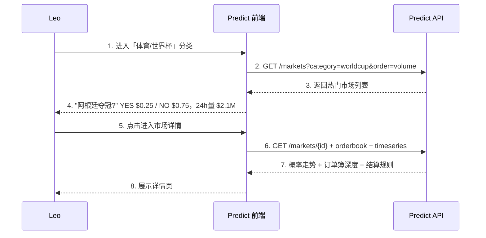
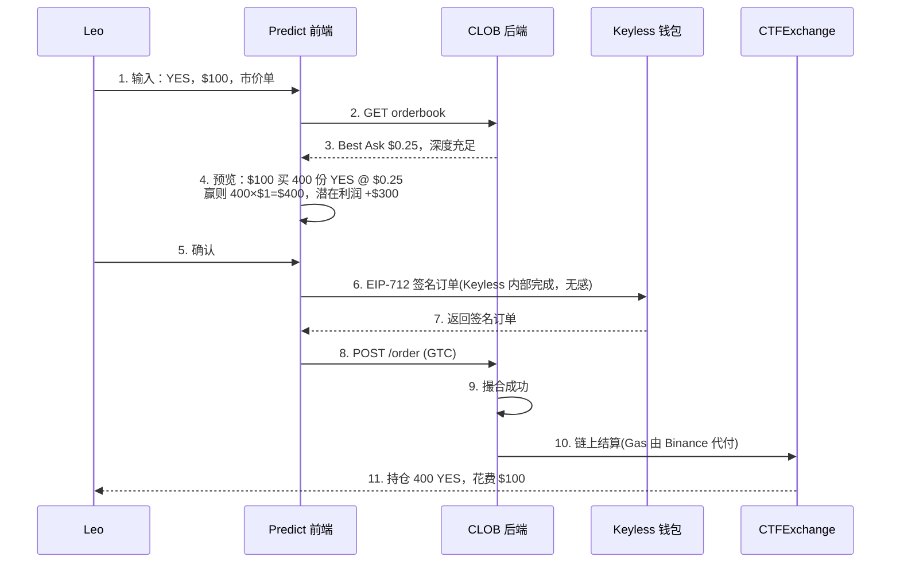
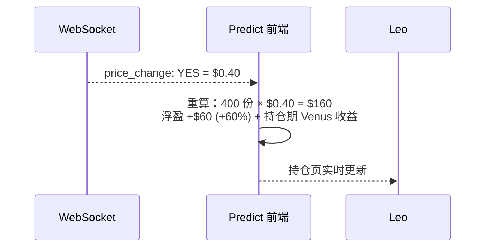
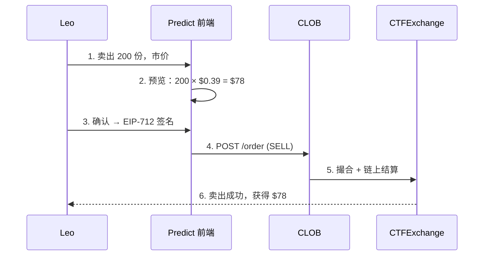
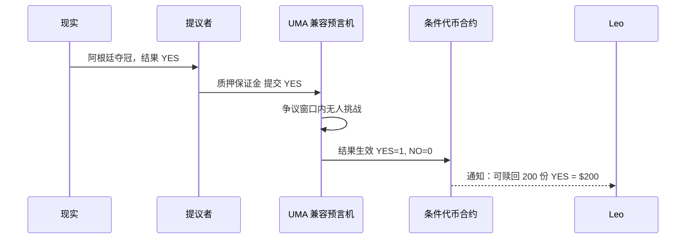
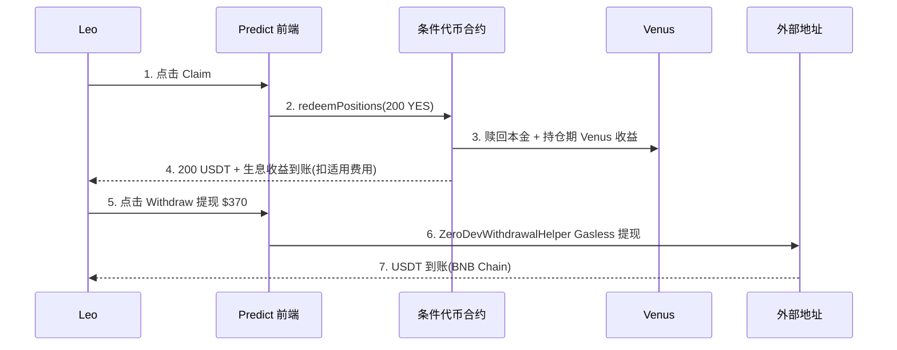
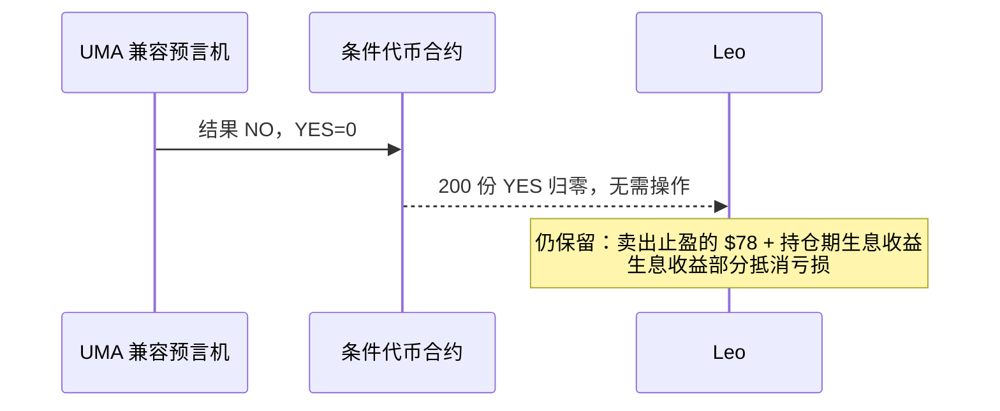

# Predict.fun 用户完整体验流程

> 以用户 Leo 的视角走完 Predict.fun 所有核心功能：开户 → 入金（生息）→ 交易 → 持仓 → 结算 → 赎回 → 提现。
> 每阶段配时序图与具体数字示例。

---

## 场景设定

Leo 是一个 Binance 用户，看好阿根廷在 2026 世界杯夺冠。他准备用 $200 在 Predict.fun 交易，并体验「押注期间资金还能生息」。

---

## 阶段一：开户（Binance Wallet 入口）

此时 Leo：有了 BNB Chain 账户（Keyless，无需管私钥），余额 $0，可浏览所有市场，并已用虚拟盘熟悉流程。

---

## 阶段二：入金（资金即生息）

| 项目 | 金额 |
|------|------|
| 入金 | 200 USDT |
| 到账 | 200 USDT |
| 状态 | 即便未下注，已在 Venus 生息 |

---

## 阶段三：浏览市场与研究

| 字段 | 值 | 含义 |
|------|------|------|
| YES 价格 | $0.25 | 市场认为阿根廷夺冠概率 25% |
| NO 价格 | $0.75 | 75% 概率不夺冠 |
| Best Ask (YES) | $0.26 | Leo 现在买 YES 的最低价 |
| Spread | $0.02 | 买卖价差 |

Leo 认为阿根廷被低估，决定买入 YES。

---

## 阶段四：买入 YES 份额（开仓）

| 资产 | 变化前 | 变化后 |
|------|--------|--------|
| USDT 余额 | $200 | $100（仍在生息） |
| YES 份额 | 0 | 400 份（市值 $100） |
| 总资产 | $200 | $200 |

> 注意：未下注的 $100 与抵押的 $100 都在 Venus 生息。

---

## 阶段五：持仓管理与实时盈亏

一个月后阿根廷小组赛全胜，YES 价格从 $0.25 涨到 $0.40。

| 选项 | 操作 | 结果 |
|------|------|------|
| 继续持有 | 不操作 | 等结算，赢则拿 $400；期间持续生息 |
| 提前止盈 | 卖 400 份 @ $0.39 | 立即拿 ~$156，锁定 $56 利润 |
| 部分卖出 | 卖 200 份 | 锁定部分利润，保留仓位 |

Leo 选择卖出一半（200 份）止盈。

---

## 阶段六：提前卖出（部分止盈）

| 资产 | 变化前 | 变化后 |
|------|--------|--------|
| USDT 余额 | $100 | $178 |
| YES 份额 | 400 | 200 |
| 已实现利润 | $0 | +$28（200 份成本 $50，卖得 $78） |

---

## 阶段七：事件结算（YES 获胜）

2026 年 7 月世界杯决赛，阿根廷夺冠。结果为 YES。

---

## 阶段八：赎回 + 提现

---

## 完整收益总结

| 阶段 | 操作 | 金额变化 |
|------|------|---------|
| 入金 | 从 Binance 划转 | +$200（即生息） |
| 买入 | 400 份 YES @ $0.25 | -$100 |
| 卖出 | 200 份 YES @ $0.39 | +$78 |
| 结算 | 200 份 YES 赎回 | +$200 + 生息收益 |
| 生息 | 持仓期 Venus 收益（示意） | +约 $1–$3 |
| Gas | 全程 Gasless | $0 |

**最终盈亏**：投入 $200 → 产出约 $378+ → 净利润约 **+$178+**（含生息），且全程零 Gas。

---

## 附录：如果 Leo 预测错误（NO 获胜）

失败场景：因提前卖出锁定了 $78，加上生息收益，总亏损被控制——这正是「提前止盈 + 生息缓冲」的价值。

---

> 本文档基于 Predict.fun 公开功能、开发者文档与媒体报道整理，截至 2026 年 6 月。所有数字为示例，实际结果取决于市场条件与官方收益/费率规则。
