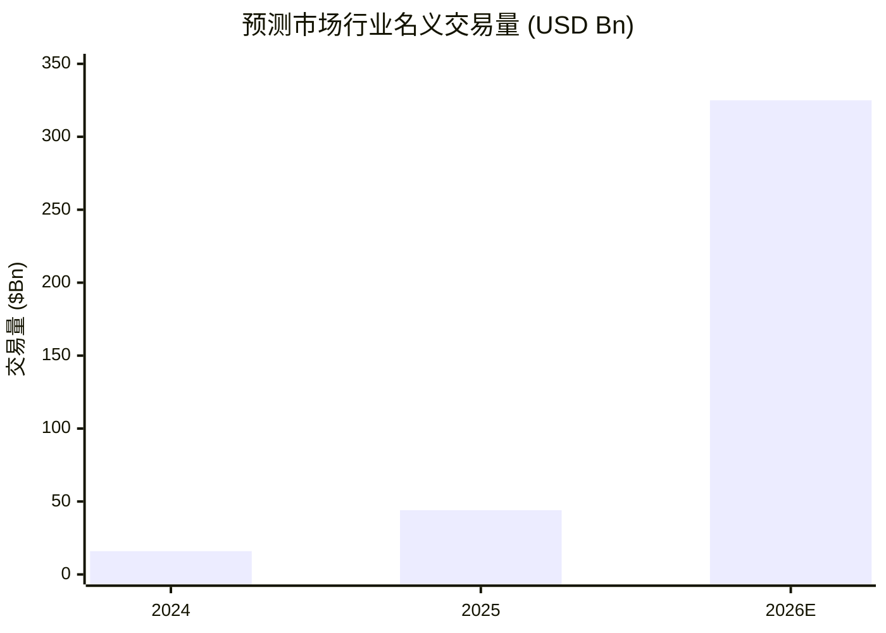
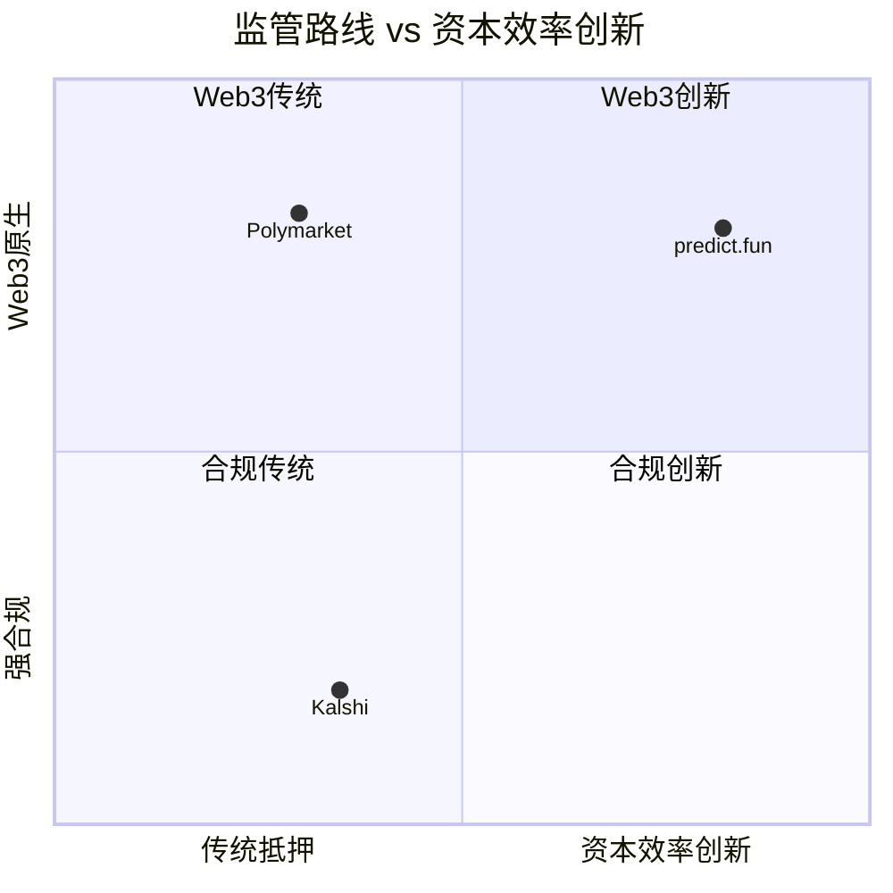
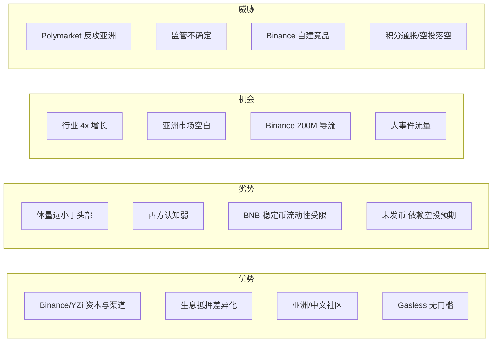

# 全球预测市场竞争格局对比

> Predict.fun / Polymarket / Kalshi 全维度对比，以及行业大盘

---

## 1. 行业大盘

- 2025 年行业名义交易量约 **$44B**（CMC 口径）；另有 YZi 引用约 $640 亿/4x 的更高口径。
- 2026 加速：1 月单月 **$26.75B** 创纪录；前 86 天 Kalshi $28.3B + Polymarket $24.3B = **$52.7B**，年化约 **$223B**（Artemis）。
- 集中度高：2025 年 **Kalshi + Polymarket 占约 87.6%**。
- 盈利现实：Polymarket 上仅约 **0.51% 钱包** 盈利超 $1,000——散户更需「降门槛 + 降成本」。

---

## 2. 三强全维度对比

| 维度 | Predict.fun | Polymarket | Kalshi |
|------|-------------|------------|--------|
| 形态 | 链上 Web3 | 链上 Web3 | 中心化合规交易所 |
| 链 | BNB Chain | Polygon | 无（中心化） |
| 监管 | Web3/离岸 | Web3/离岸 | CFTC 合规（美国） |
| 结算资产 | USDT | USDC.e | 法币 |
| 抵押品 | **生息（Venus）** | 闲置 | 受监管账户 |
| 结算 | UMA 兼容乐观预言机 | UMA 乐观预言机 | 内部裁决 |
| 钱包/开户 | Privy 智能钱包 / Binance Keyless | Magic/代理钱包 | KYC 账户 |
| Gas | Gasless（代付） | 用户承担（低） | 不适用 |
| 交易费 | 概率加权 ~2% 峰值 | 长期 $0 | 概率加权 |
| 重点市场 | 亚洲/中文 | 全球（偏西方） | 美国 |
| 渠道 | Binance Wallet 200M+ | 自有 + 生态 | 自有 App |
| 代币 | 未发币（Predict Points） | 未发币 | 股权融资 |
| 体量参照 | $1.8B+ 累计 / TVL ~$17M | 行业头部 | 高估值合规龙头 |

> 体量/估值为不同来源与时点口径，仅供量级参考。

---

## 3. 定位矩阵

Predict.fun 独占「资本效率创新（生息）× Web3 原生」象限，避开同质化竞争。

---

## 4. Predict.fun SWOT

---

## 5. 关键竞争变量

| 变量 | 说明 |
|------|------|
| **渠道** | Binance Wallet（200M+）是排他资源，也是最大依赖（双刃剑） |
| **市场** | 亚洲/中文是 Polymarket/Kalshi 薄弱区，Predict.fun 借 Probable 卡位 |
| **产品** | 生息叙事领先，技术可被模仿，但已部署 + 已积累 TVL 有先发优势 |

---

## 6. 小结

Predict.fun 是 **错位竞争的后发挑战者**：不拼全球体量、不拼合规，而用「BNB 链 + 生息抵押 + Binance 渠道 + 亚洲市场」切入空白。行业 4x 增长是顺风，能否把渠道流量与空投预期转化为真实留存与流动性深度，决定它能否成为第三极。

---

> 数据基于公开来源交叉验证，截至 2026 年 6 月。不构成投资建议。
