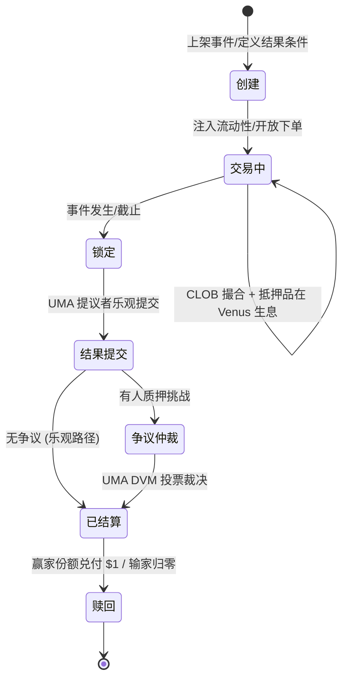
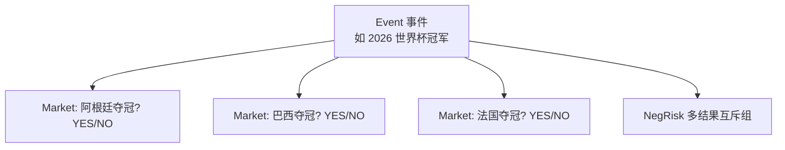
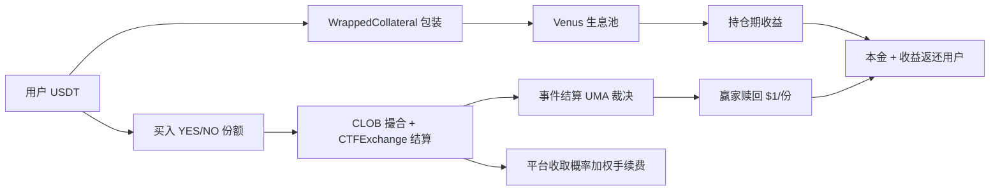

# 事件与市场完整生命周期

> 一个事件从创建到赎回的完整阶段，含资金流向与生息环节

---

## 1. 生命周期状态机

---

## 2. 各阶段详解

| 阶段 | 关键动作 | 涉及合约 | 资金/份额变化 |
|------|---------|---------|--------------|
| **创建** | 定义二元/多结果问题与结果条件 | ConditionalTokens / NegRisk | 市场上架，无资金 |
| **交易中** | 用户买卖 YES/NO，撮合上链；抵押品生息 | CTFExchange / YieldBearingWrappedCollateral / Venus | USDT 锁定为抵押并生息，份额在用户间转移 |
| **锁定** | 事件发生/截止，停止交易 | — | 持仓冻结 |
| **结果提交** | 提议者质押保证金乐观提交结果 | UmaCompatibleCtfAdapter / OptimisticOracle | 保证金质押 |
| **争议仲裁** | 如有挑战，升级 UMA DVM 投票 | UMA DVM | 错误方保证金罚没 |
| **已结算** | 结果上链，设定 YES/NO 兑付值 | ConditionalTokens | YES=1/NO=0（或反之） |
| **赎回** | 赢家赎回 $1/份 + 生息收益 | redeemPositions / Venus | 份额销毁，USDT（本金+收益）返还 |

---

## 3. Event vs Market 的关系

- **Event**：一个现实事件主题，可包含多个 Market。
- **Market**：具体可交易的二元问题。
- **NegRisk**：把「多选一」的多个 Market 组织为互斥组（多候选夺冠只有一个为真）。

---

## 4. 资金流向全景

---

## 5. 与生息结合的独特性

普通预测市场的生命周期在「交易中」阶段资金闲置；Predict.fun 在该阶段让抵押品持续在 Venus 生息，因此：

- 「交易中」越久 → 用户累积的生息收益越多。
- 长周期事件（如选举、世界杯冠军）对用户更友好——锁仓时间长，但收益也更多。
- 赎回时一并返还本金 + 收益（收益分配比例待确认）。

---

> 基于 Predict.fun 链上合约、UMA 机制与 Venus 集成整理，截至 2026 年 6 月。
