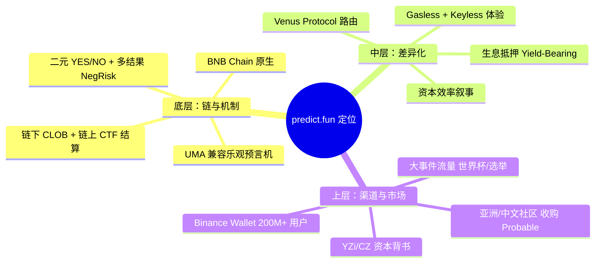
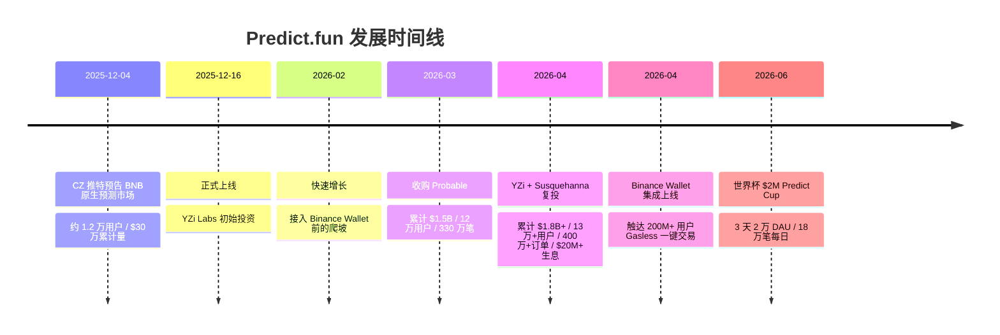
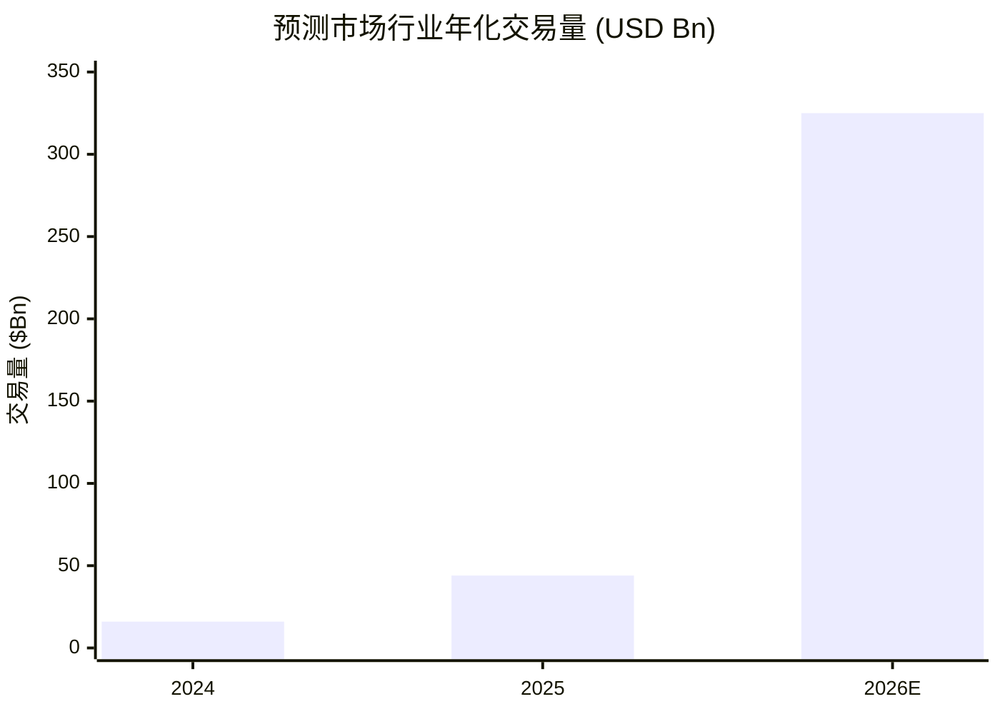
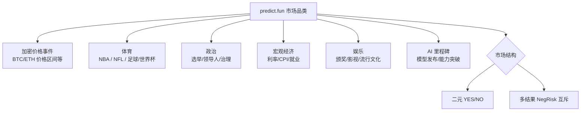
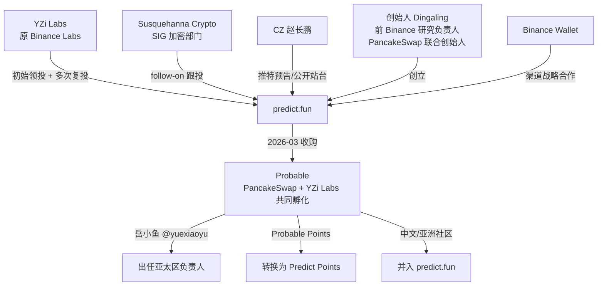
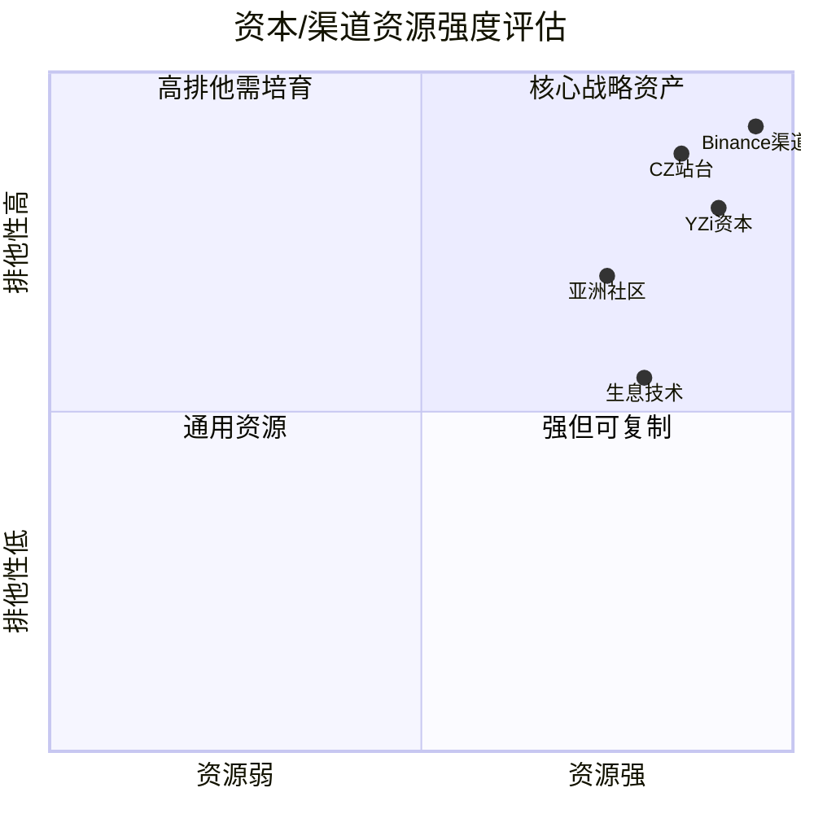
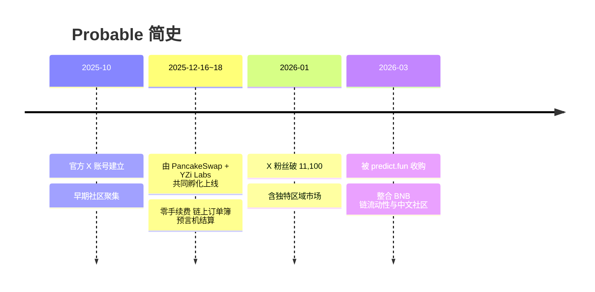
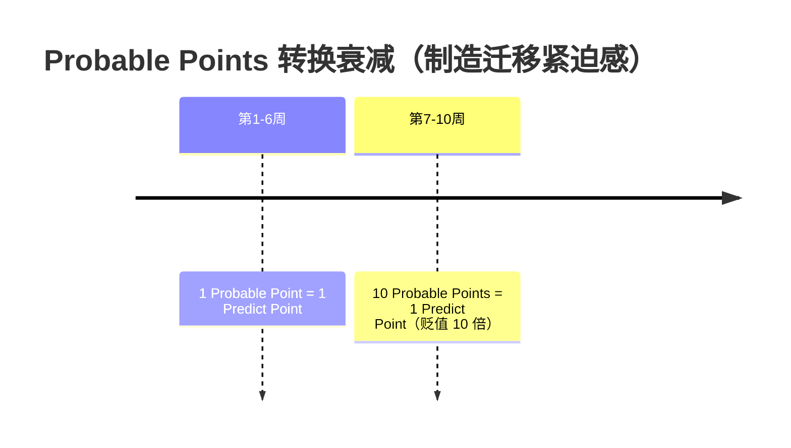
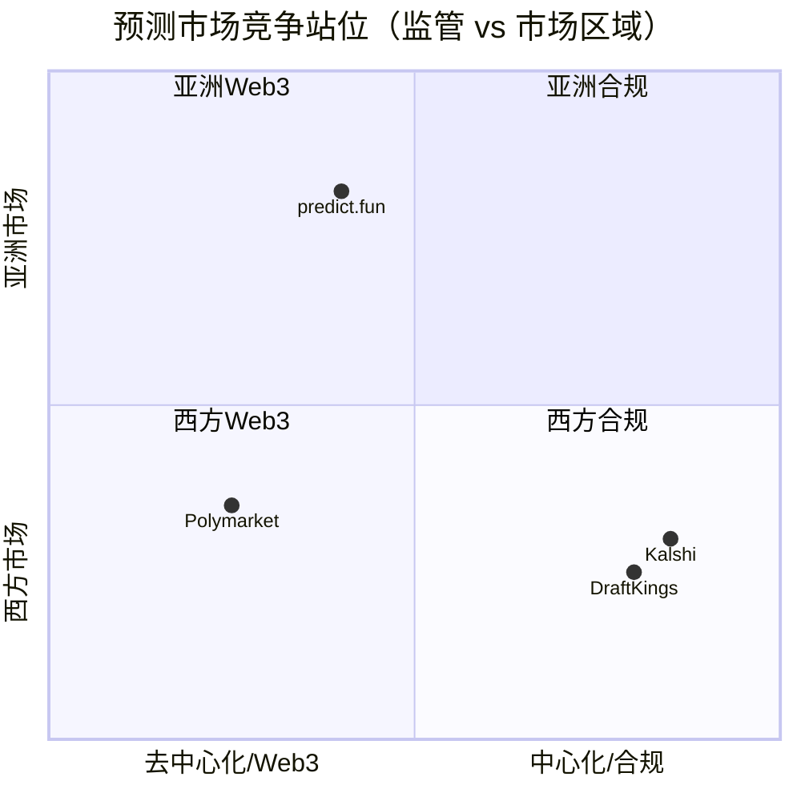

# Predict.fun — 市场情况深度分析

> 数据日期：2026-06-17
> 平台：predict.fun（BNB Chain 原生预测市场）
> 主要投资方：YZi Labs（原 Binance Labs）、Susquehanna Crypto
> 创始人：Dingaling（@dingalingts，前 Binance 研究负责人、PancakeSwap 联合创始人）
> 累计交易量：**$1.8B+** ｜ 用户：**130,000+** ｜ 撮合订单：**4M+** ｜ 生息资金：**$20M+**

---

## 1. 市场定位

predict.fun 定位为 **BNB Chain 原生的链上预测市场（On-chain Prediction Market）**，核心差异化是 **DeFi 原生的资本效率（Capital Efficiency）**——用户预测事件结果的同时，押注的抵押资金不闲置，而是通过 **Venus Protocol**（BNB Chain 最大借贷市场）持续赚取 DeFi 收益。

官网口号：*"The BNB-native information market where it pays to be right."*

### 1.1 定位三层拆解

### 1.2 一句话本质

> **predict.fun ≈ 「Polymarket 的成熟架构」+「BNB 链」+「生息抵押（Venus）」+「Binance 2 亿用户渠道」+「亚洲市场」。**
> 它不与 Polymarket 拼全球体量、不与 Kalshi 拼合规，而是用「资本效率 × Web3 × 亚洲 × Binance 渠道」做错位竞争。

---

## 2. 市场规模与发展轨迹

### 2.1 关键里程碑时间线

### 2.2 增长数据对照（不同时点快照）

| 时间点 | 累计交易量 | 用户数 | 交易/订单数 | 来源 |
|--------|-----------|--------|------------|------|
| 2025-12-04（预告） | ~$300k | ~12,000 | — | CoinDesk |
| 2026-03（收购 Probable） | $1.5B | 120,000+ | 3.3M 笔 | blockonomi |
| 2026-04（YZi 复投） | **$1.8B+** | **130,000+** | 4M+ 订单 | cryptorank |
| 当前 TVL | ~$16.9M | — | — | DefiLlama |
| 生息中资金 | $20M+ | — | — | cryptorank |

> 半年内累计交易量从 $30 万做到 $18 亿，增速由「Binance 渠道 + 积分激励 + 大事件」三重驱动。

### 2.3 行业大盘（水涨船高的赛道）

- **2025 年行业名义交易量约 $44B**（CMC 口径），另有 YZi 引用「约 $640 亿、同比 4 倍」的更高口径。
- **2026 年加速**：1 月单月创纪录 $26.75B，3 月约 $25B；2026 前 86 天 Kalshi（$28.3B）+ Polymarket（$24.3B）合计 $52.7B，年化约 $223B（Artemis）。
- **集中度高**：2025 年 Kalshi + Polymarket 占行业约 **87.6%** 交易量——predict.fun 是挑战寡头格局的后发者。

> ⚠️ 行业数字因统计口径（名义/notional vs 实际）差异较大，文中标注来源，仅供量级参考。

---

## 3. 市场覆盖（Markets 品类）

predict.fun 刻意做「宽品类」，让加密交易者、体育迷、政治分析者、科技爱好者都能在同一平台找到标的，形成天然分散的流动性。

| 品类 | 典型市场 | 流动性特征 |
|------|---------|-----------|
| 加密价格 | BTC/ETH 价格区间、币种事件 | 加密原生用户活跃，与行情联动 |
| 体育 | NBA、NFL、足球（世界杯重点） | 大事件爆发式流量 |
| 政治 | 选举、领导人、治理决策 | 长周期、高关注 |
| 宏观经济 | 利率、CPI、就业数据 | 专业交易者偏好 |
| 娱乐/文化 | 颁奖、影视、流行事件 | 拉新与破圈 |
| AI 里程碑 | 模型发布、能力突破 | 科技人群、叙事性强 |

> 宽品类 = 多元流量入口；世界杯类大事件是其规模化获客的核心杠杆（见第 5 节）。

---

## 4. 融资与资本背景

### 4.1 投资方
- **YZi Labs**（原 Binance Labs，从 Binance Labs 分拆的家族办公室）：inception 阶段领投，并于 2026 年做 follow-on（复投），表达对赛道与项目的强信心。
- **Susquehanna Crypto**：传统量化巨头 SIG 的加密部门跟投，意在扩大亚洲分发、强化 BNB 生态站位。

### 4.2 团队
- 创始人 **Dingaling（@dingalingts）**：**前 Binance 研究负责人 + PancakeSwap 联合创始人**，创始团队具备 Binance 基础设施经验。
- CZ 公开预告站台，相当于顶级流量与信任背书。

### 4.3 战略意义评估

---

## 5. 战略收购：Probable（吃下亚洲）

### 5.1 Probable 背景

- Probable 由 **PancakeSwap + YZi Labs 共同孵化**，2025-12 上线，主打 **零手续费、链上订单簿、预言机结算**，并提供「其他平台没有的区域性市场」。
- 与 predict.fun **同源资本（YZi）、同链（BNB）、同期上线**——收购本质是 **YZi 体系内部的资源整合**，消除内耗、集中 BNB 链预测市场流动性。

### 5.2 收购条款与用户迁移
- 对 Probable 老用户：**2x USDT 手续费返还** + **Probable Points → Predict Points 转换**：

- 增长负责人 **岳小鱼（@yuexiaoyu）** 出任 predict.fun **亚太区负责人**，把 Probable 的中文社区资源接入 predict.fun 的收入机制。

> ⚠️ KOL 观点：多数正面（资源集中、生态协同）；但部分担忧 **积分被稀释** 引发老用户不满（PANews）。

---

## 6. 竞争格局（概览）

| 平台 | 链/形态 | 核心定位 | 相对 predict.fun |
|------|---------|----------|------------------|
| **Polymarket** | Polygon，Web3 | 全球最大，事件覆盖最广 | 体量碾压，但抵押品闲置、亚洲渗透弱 |
| **Kalshi** | 中心化，CFTC 合规 | 美国合规交易所 | 合规护城河强，但仅美国、非 Web3 |
| **predict.fun** | BNB Chain，Web3 | 生息 + Binance 渠道 + 亚洲 | 体量小但增速快，差异化清晰 |

> 详见 [08_competitive_landscape/analysis.md](../08_competitive_landscape/analysis.md)。

---

## 7. 待确认问题

- [ ] YZi Labs 各轮投资的具体金额与估值？
- [ ] Probable 用户迁移完成率与留存？积分稀释争议是否影响留存？
- [ ] 当前真实月活/日活（公开数据多为累计量与峰值 DAU）？
- [ ] 与 Binance Wallet 合作的商业条款（分润/排他性/期限）？
- [ ] 实际地域限制（geo-block）范围？

---

## 8. 小结

predict.fun 是预测市场赛道 **资本与渠道最强的后发挑战者**：

1. **资本背书天花板级**：YZi Labs（多轮）+ Susquehanna + CZ 站台 + 前 Binance/PancakeSwap 创始团队，几乎等同 Binance 体系背书。
2. **差异化清晰**：生息抵押（Venus 路由）解决预测市场「资金闲置」的结构性痛点。
3. **渠道路径明确**：Binance Wallet 触达 200M+ 用户 + 收购 Probable 吃下亚洲，绕开与 Polymarket 在西方的正面消耗。
4. **顺风行业**：预测市场 2025→2026 高速增长，寡头集中度高但仍有错位空间。
5. **风险点**：体量仍远小于 Polymarket/Kalshi；高度依赖 Binance；BNB 链稳定币流动性受限；尚未发币、增长依赖积分预期；积分稀释引发的社区情绪。
