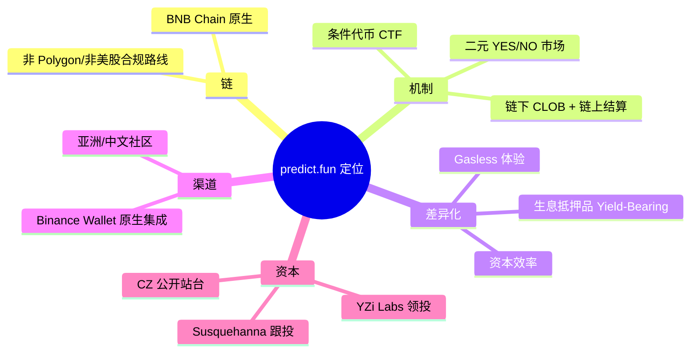
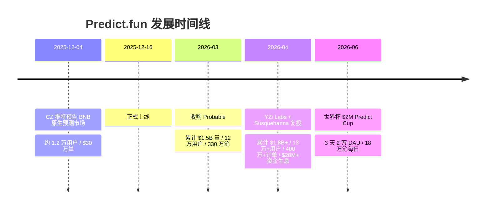
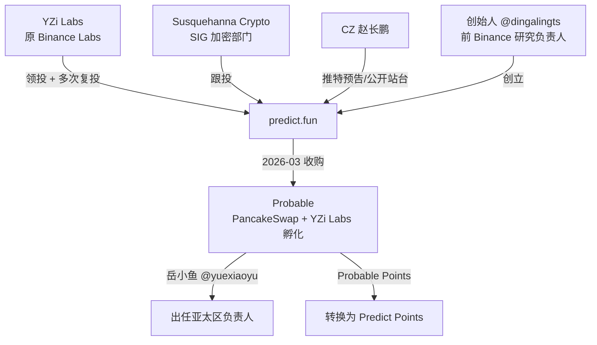

# Predict.fun — 市场情况分析

> 数据日期：2026-06-17
> 平台：predict.fun（BNB Chain 原生预测市场）
> 主要投资方：YZi Labs（原 Binance Labs）、Susquehanna Crypto

---

## 1. 市场定位

predict.fun 定位为 **BNB Chain 原生的链上预测市场（On-chain Prediction Market）**，核心差异化是 **DeFi 原生的资本效率**——用户在预测事件结果的同时，押注的抵押资金不闲置，而是持续赚取 DeFi 收益。

官网口号：*"The BNB-native information market where it pays to be right."*（凡事押对就有回报的 BNB 原生信息市场）

定位拆解：



---

## 2. 市场规模与发展轨迹

### 2.1 关键里程碑时间线



### 2.2 增长数据对照

| 时间点 | 累计交易量 | 用户数 | 交易/订单数 | 来源 |
|--------|-----------|--------|------------|------|
| 2025-12-04（预告） | ~$300k | ~12,000 | — | CoinDesk |
| 2026-03（收购 Probable） | $1.5B | 120,000+ | 3.3M 笔 | blockonomi |
| 2026-04（YZi 复投） | **$1.8B+** | **130,000+** | 4M+ 订单 | cryptorank |
| 当前 TVL | ~$16.9M | — | — | DefiLlama |

> 半年内从 $30 万做到 $18 亿累计交易量，增速极快，主要由 Binance 渠道 + 积分激励 + 大事件（如世界杯）驱动。

### 2.3 行业背景

- 据 YZi Labs 引用数据，**2025 年预测市场行业交易量约 $640 亿，同比增长约 4 倍**，预计 **2026 年超 $3,250 亿**。
- 预测市场正处于结构性增长期，CZ 在 BNB 链上的入局被视为「信号而非起点」。

---

## 3. 融资与资本背景



### 3.1 投资方
- **YZi Labs**（原 Binance Labs）：领投方，并在 2026 年做出 follow-on（跟投/复投），表达对预测市场赛道与 predict.fun 的强烈信心。
- **Susquehanna Crypto**：传统量化巨头 SIG 的加密部门跟投，意在扩大分发（尤其亚洲市场）并强化 BNB 生态站位。

### 3.2 团队
- 创始人 **@dingalingts**，据公开资料为 **前 Binance 研究负责人**，与 PancakeSwap 有渊源。
- CZ（Binance 创始人）在推特公开预告与站台，相当于顶级流量背书。

### 3.3 战略收购：Probable
- 2026-03，predict.fun 收购同样由 **PancakeSwap + YZi Labs 孵化** 的预测市场 Probable，整合 BNB 链流动性与亚洲（中文）社区。
- Probable 增长负责人 **岳小鱼（@yuexiaoyu）** 出任 predict.fun **亚太区负责人**。
- 对老用户提供 **2x USDT 手续费返还** + **Probable Points → Predict Points 转换**：
  - 第 1–6 周：1:1
  - 第 7–10 周：1:10

---

## 4. 竞争格局

```mermaid
quadrantChart
    title 预测市场竞争站位（链 vs 合规）
    x-axis 去中心化/Web3 --> 中心化/合规
    y-axis 西方市场 --> 亚洲市场
    quadrant-1 亚洲合规
    quadrant-2 亚洲Web3
    quadrant-3 西方Web3
    quadrant-4 西方合规
    Polymarket: [0.25, 0.35]
    Kalshi: [0.85, 0.30]
    predict.fun: [0.40, 0.80]
    Probable(已并入): [0.45, 0.85]
```

| 平台 | 链/形态 | 核心定位 | 相对 predict.fun |
|------|---------|----------|------------------|
| **Polymarket** | Polygon，Web3 | 全球最大，事件覆盖最广 | 体量碾压，但抵押品闲置、亚洲渗透弱 |
| **Kalshi** | 中心化，CFTC 合规 | 美国合规交易所，体育合约 | 合规护城河强，但仅美国、非 Web3 |
| **predict.fun** | BNB Chain，Web3 | 生息抵押 + Binance 渠道 + 亚洲 | 体量小但增速快，差异化清晰 |

详见 [08_competitive_landscape/analysis.md](../08_competitive_landscape/analysis.md)。

---

## 5. 小结

predict.fun 是预测市场赛道 2025 年底以来最具资本与渠道优势的「后发者」：

1. **资本背书天花板级**：YZi Labs + Susquehanna + CZ 站台，几乎等同 Binance 体系背书。
2. **差异化清晰**：生息抵押品解决了预测市场「资金闲置」的结构性痛点。
3. **渠道路径明确**：Binance Wallet 原生集成 + 亚洲社区，绕开与 Polymarket 在西方的正面消耗。
4. **风险点**：体量仍远小于 Polymarket/Kalshi；BNB 链稳定币流动性与发行受限；尚未发币，增长高度依赖积分预期。
