# Predict.fun — 深度分析报告

> 数据日期：2026-06-17
> 平台类型：**BNB Chain 原生预测市场**
> 累计交易量：**$1.8B+**
> 注册用户：**130,000+**
> 撮合订单：**4,000,000+**
> 生息中资金：**$20M+** ｜ TVL：**~$16.9M**
> 主要投资方：**YZi Labs（原 Binance Labs）、Susquehanna Crypto**
> 创始人：**Dingaling（@dingalingts，前 Binance 研究负责人、PancakeSwap 联合创始人）**
> 口号：*"The BNB-native information market where it pays to be right."*

---

## 1. 市场情况

### 1.1 市场定位

predict.fun 定位为 **BNB Chain 原生的链上预测市场（On-chain Prediction Market）**，核心差异化是 **DeFi 原生的资本效率（Capital Efficiency）**——用户预测事件结果的同时，押注的抵押资金不闲置，而是通过 **Venus Protocol**（BNB Chain 最大借贷市场）持续赚取 DeFi 收益。

> **一句话本质**：predict.fun ≈「Polymarket 的成熟架构」+「BNB 链」+「生息抵押（Venus）」+「Binance 2 亿用户渠道」+「亚洲市场」。它不与 Polymarket 拼全球体量、不与 Kalshi 拼合规，而是用「资本效率 × Web3 × 亚洲 × Binance 渠道」做错位竞争。

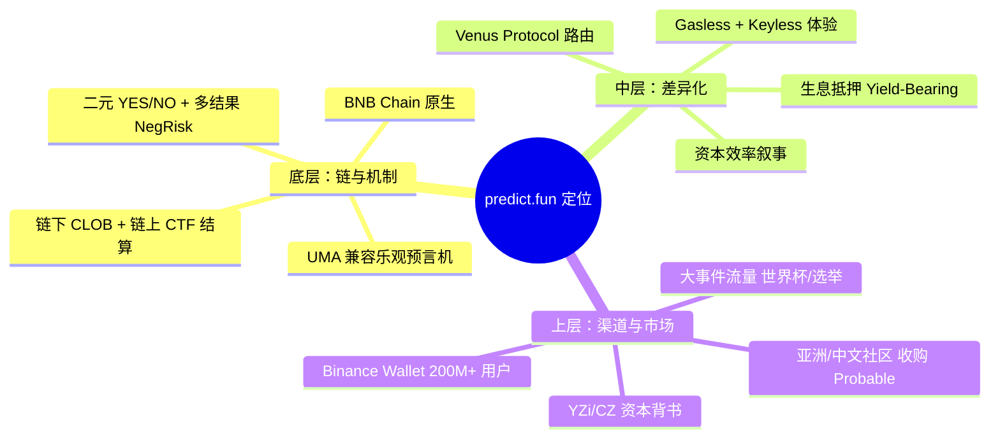

### 1.2 市场规模与发展轨迹

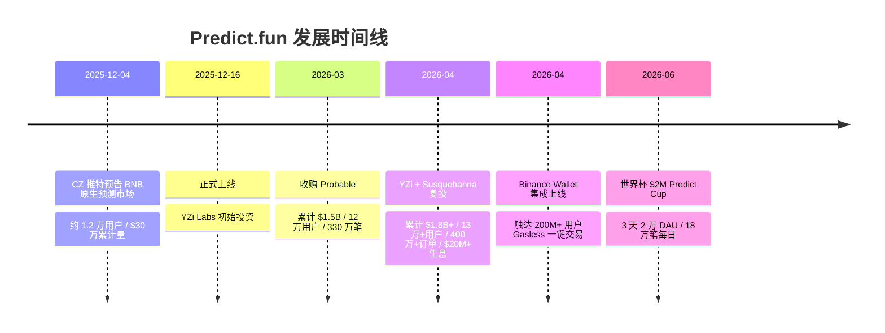

**增长数据对照（不同时点快照）**

| 时间点 | 累计交易量 | 用户数 | 交易/订单数 | 来源 |
|--------|-----------|--------|------------|------|
| 2025-12-04（预告） | ~$300k | ~12,000 | — | CoinDesk |
| 2026-03（收购 Probable） | $1.5B | 120,000+ | 3.3M 笔 | blockonomi |
| 2026-04（YZi 复投） | **$1.8B+** | **130,000+** | 4M+ 订单 | cryptorank |
| 当前 TVL | ~$16.9M | — | — | DefiLlama |

**行业大盘（水涨船高的赛道）**

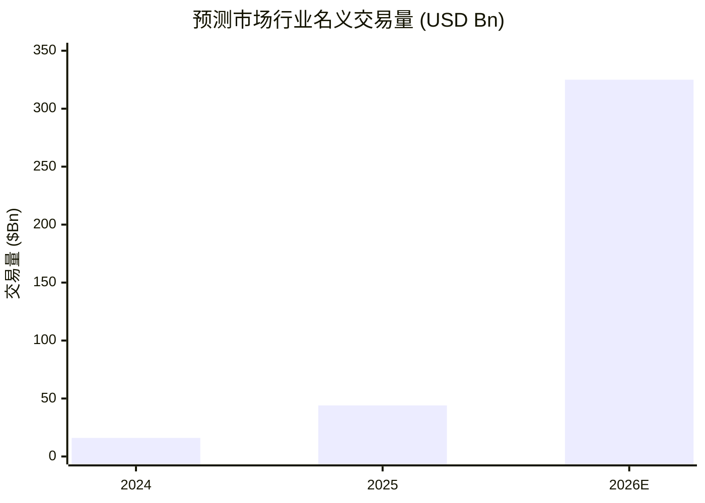

- 2025 年行业名义交易量约 **$44B**（CMC 口径；另有 YZi 引用约 $640 亿/4x 的更高口径）。
- 2026 加速：1 月单月 **$26.75B** 创纪录，3 月约 **$25B**；前 86 天 Kalshi $28.3B + Polymarket $24.3B = **$52.7B**，年化约 **$223B**（Artemis）。
- 集中度极高：2025 年 **Kalshi + Polymarket 占约 87.6%**——predict.fun 是挑战双寡头、开辟 BNB/亚洲第三极的后发者。

> ⚠️ 行业数字因统计口径（名义 notional vs 实际）差异较大，文中标注来源，仅供量级参考。

### 1.3 市场覆盖（Markets 品类）

predict.fun 刻意做「宽品类」，让加密交易者、体育迷、政治分析者、科技爱好者都能在同一平台找到标的，形成天然分散的流动性。

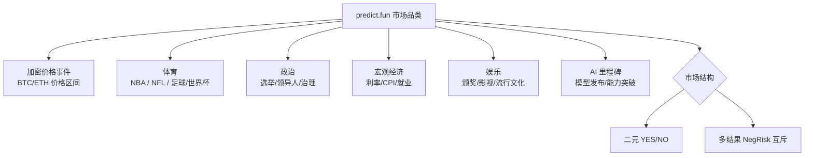

### 1.4 竞争格局

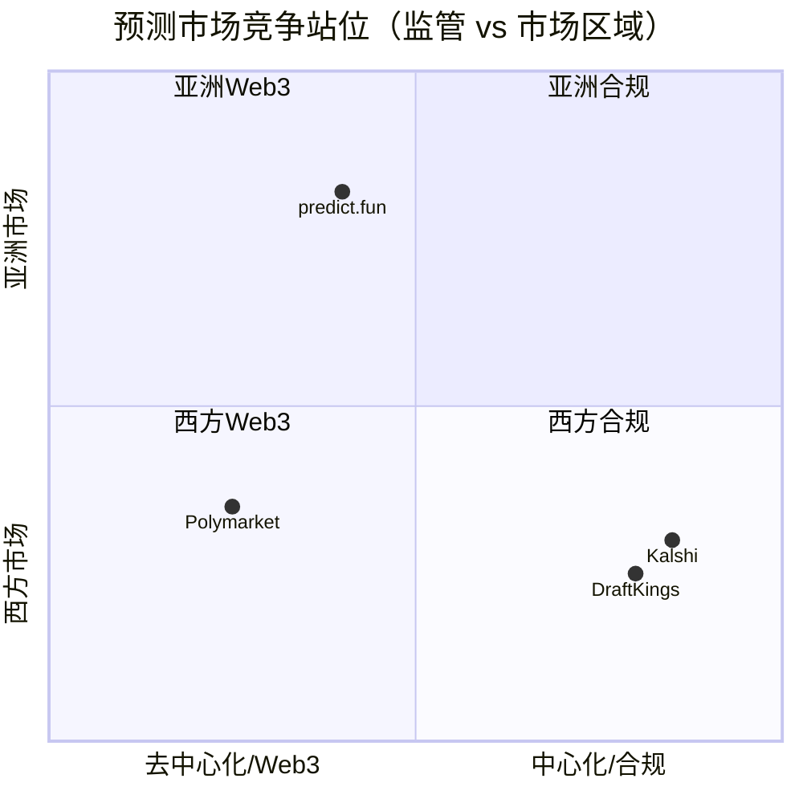

| 平台 | 链/形态 | 核心定位 | 相对 predict.fun |
|------|---------|----------|------------------|
| **Polymarket** | Polygon，Web3 | 全球最大，事件覆盖最广 | 体量碾压，但抵押品闲置、亚洲渗透弱 |
| **Kalshi** | 中心化，CFTC 合规 | 美国合规交易所 | 合规护城河强，但仅美国、非 Web3 |
| **predict.fun** | BNB Chain，Web3 | 生息 + Binance 渠道 + 亚洲 | 体量小但增速快，差异化清晰 |

- **渠道差异**：predict.fun 拥有 Binance Wallet（200M+ 用户）这一西方竞品无法复制的入口。
- **市场差异**：Polymarket/Kalshi 在亚洲（尤其中文区）渗透弱，predict.fun 通过收购 Probable 卡位「东方预测市场」。
- **产品差异**：生息抵押在叙事上领先，技术上可被模仿，但 predict.fun 已部署 + 已积累 TVL，有先发优势。

### 1.5 融资与资本背景

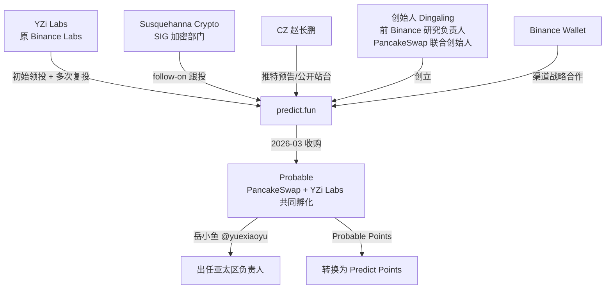

- **YZi Labs**（原 Binance Labs 分拆的家族办公室）：inception 领投并多次复投。
- **Susquehanna Crypto**（SIG 加密部门）：跟投，意在扩大亚洲分发、强化 BNB 生态站位。
- **团队**：创始人 Dingaling = 前 Binance 研究负责人 + PancakeSwap 联合创始人，团队具备 Binance 基础设施经验；CZ 公开站台。

### 1.6 战略收购：Probable（吃下亚洲）

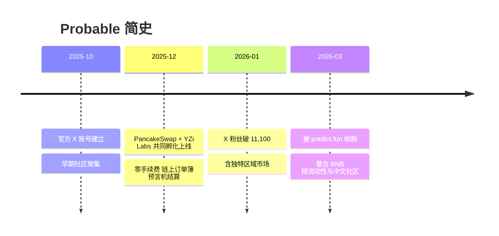

- Probable 由 **PancakeSwap + YZi Labs 共同孵化**，与 predict.fun **同源资本、同链、同期上线**——收购本质是 **YZi 体系内部的资源整合**。
- 用户迁移：**2x USDT 手续费返还** + **Probable Points → Predict Points 转换**（第 1–6 周 1:1，第 7–10 周 10:1，制造迁移紧迫感）。
- 增长负责人 **岳小鱼（@yuexiaoyu）** 出任 predict.fun **亚太区负责人**。

> ⚠️ KOL 观点：多数正面（资源集中、生态协同）；但部分担忧 **积分被稀释** 引发老用户不满（PANews）。

---

## 2. 业务架构

### 2.1 业务全景

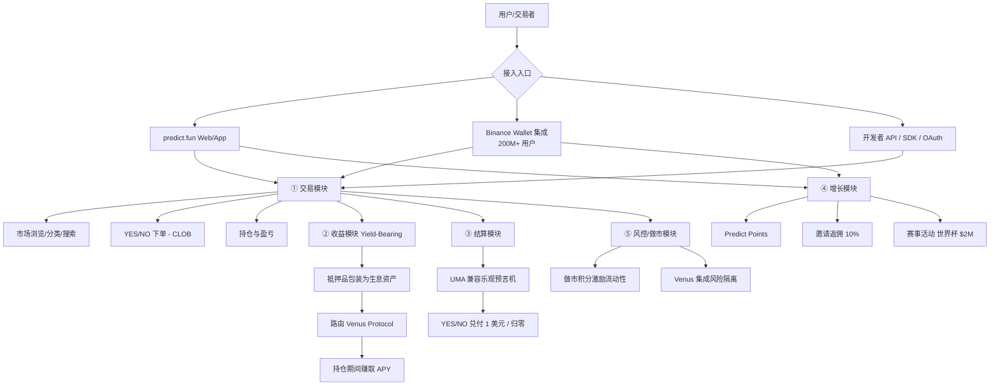

### 2.2 五大核心业务模块

| 模块 | 描述 | 战略价值 | 收入关联 |
|------|------|----------|----------|
| ① **交易模块** | 二元 YES/NO + 多结果，链下 CLOB 撮合 + 链上结算 | 平台核心 | 手续费主来源 |
| ② **收益模块** | 抵押资金经 Venus 生息 | 最大差异化护城河 | 潜在收益分成 |
| ③ **结算模块** | UMA 兼容乐观预言机裁决 | 去信任结果、公信力 | 间接（信任→留存） |
| ④ **增长模块** | Predict Points + 邀请 + 赛事 | 用户获取与留存飞轮 | 间接（规模→费用） |
| ⑤ **风控/做市模块** | 做市积分 + DeFi 风险隔离 | 流动性深度与安全 | 间接（深度→成交） |

### 2.3 市场生命周期

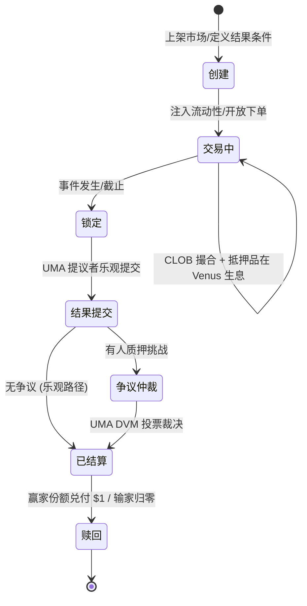

### 2.4 业务价值链与资金流

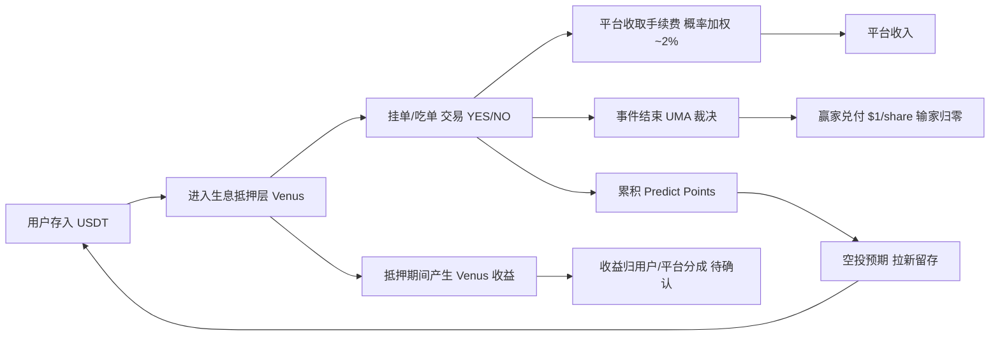

### 2.5 双边市场结构与利益相关者

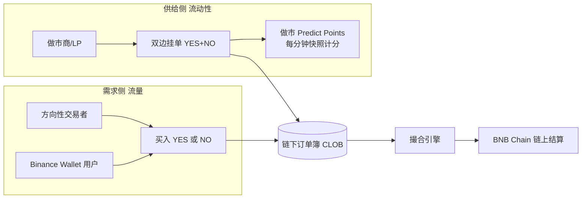

| 相关者 | 关系 | 价值 |
|--------|------|------|
| Binance Wallet | 渠道战略合作 | 200M+ 用户、Gas 代付、统一账户 |
| YZi Labs/Susquehanna | 投资人 | 资本、背书、生态资源 |
| Venus Protocol | DeFi 集成 | 生息收益来源 |
| UMA | 预言机 | 去信任结算 |
| 做市商/LP | 供给侧 | 流动性深度 |
| 亚洲社区（Probable） | 用户基础 | 错位竞争腹地 |

---

## 3. 用户体验路径

### 3.0 用户旅程总览

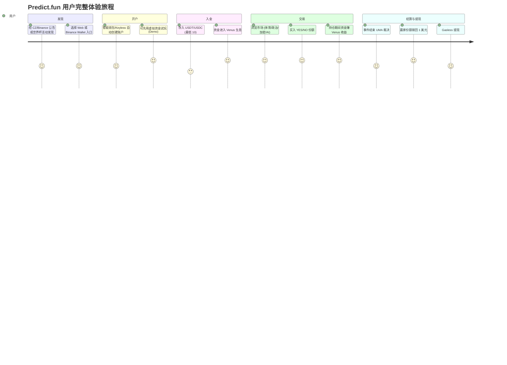

### 3.1 双入口体验对比（关键差异）

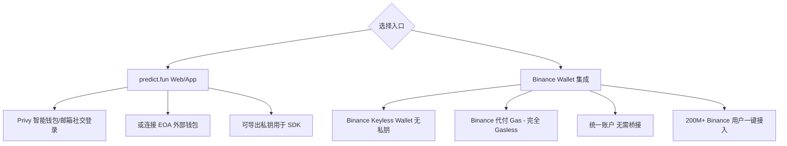

| 维度 | predict.fun Web/App | Binance Wallet 集成 |
|------|--------------------|--------------------|
| 钱包 | Privy 智能钱包 / EOA | Binance Keyless Wallet |
| 私钥 | 可导出（自托管倾向） | 无私钥（Keyless） |
| Gas | 账户抽象处理（是否全免待确认） | Binance 代付，完全 Gasless |
| 桥接 | 需自行入金/跨链（Rhino） | 无需桥接，统一账户 |
| 目标用户 | 加密原生/开发者 | 主流/Binance 存量用户 |

> Binance Wallet 集成是体验上的最大杀器：**无私钥、无 Gas、无桥接、可虚拟盘试玩**，把 2 亿 Binance 用户开户门槛降到接近零。

### 3.2 开户流程（Web 入口）

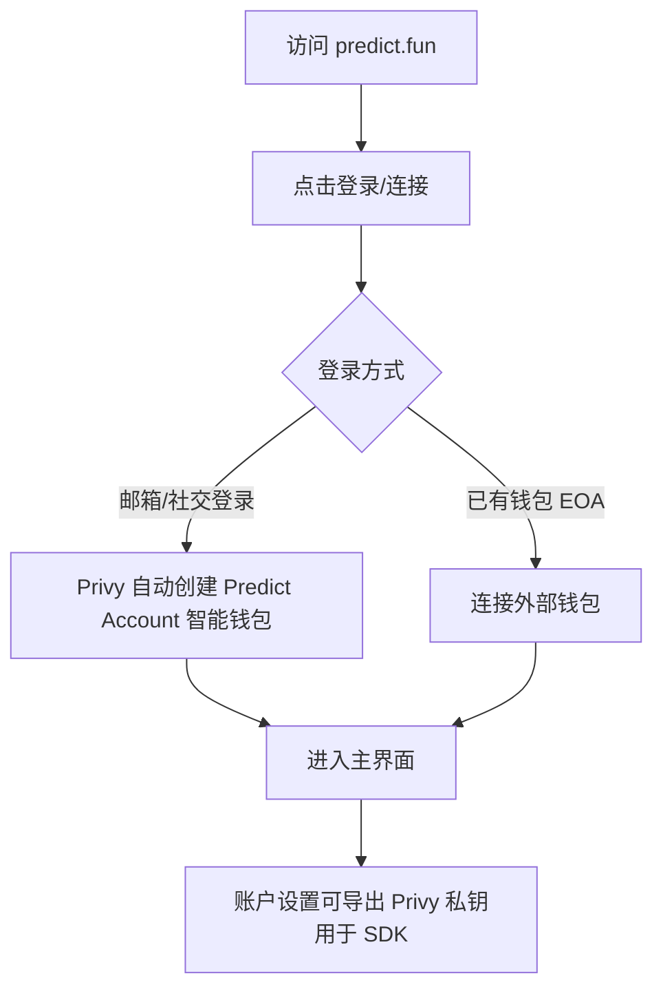

### 3.3 开户流程（Binance Wallet 入口，Keyless/Gasless）

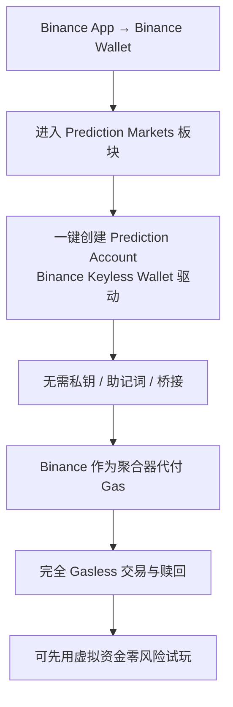

### 3.4 入金（充值）流程

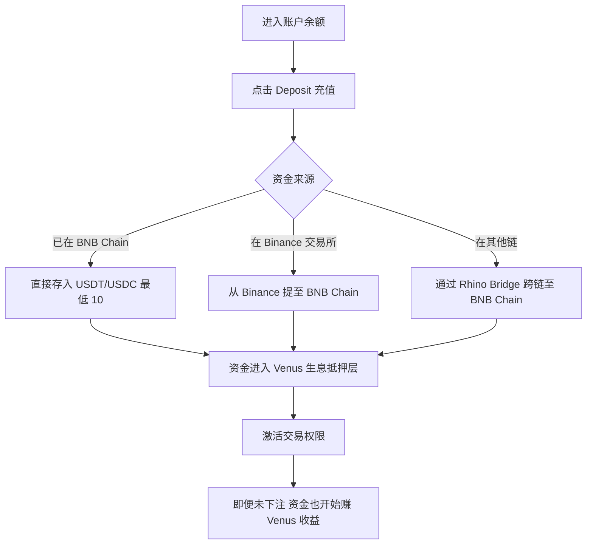

### 3.5 交易执行流程

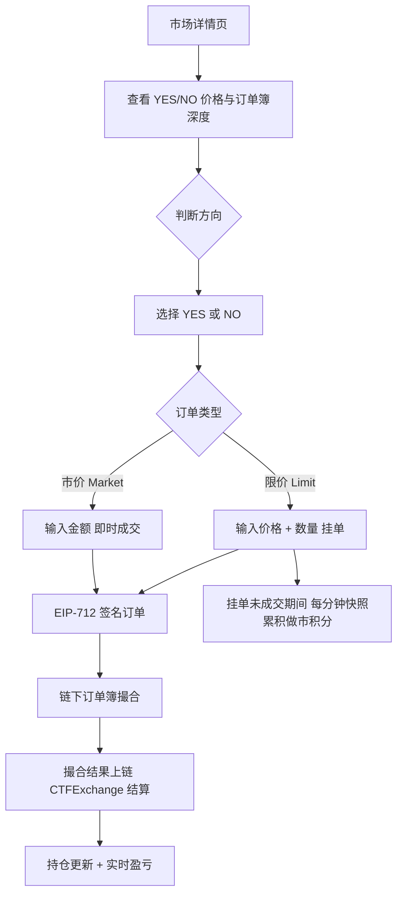

> 价格直觉：YES 份额价 = 隐含概率（$0.42 ≈ 42%）；YES + NO = $1.00；结算时赢家兑付 $1，输家归 $0。

### 3.6 持仓管理与赎回

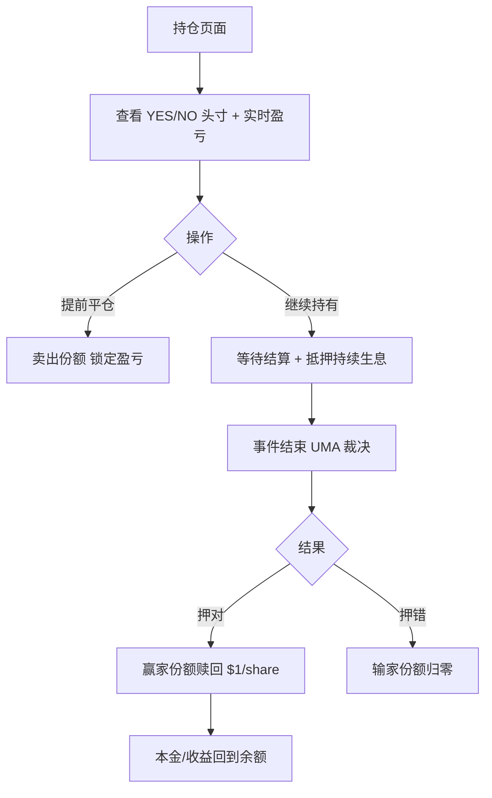

### 3.7 结算流程（UMA 兼容乐观预言机）

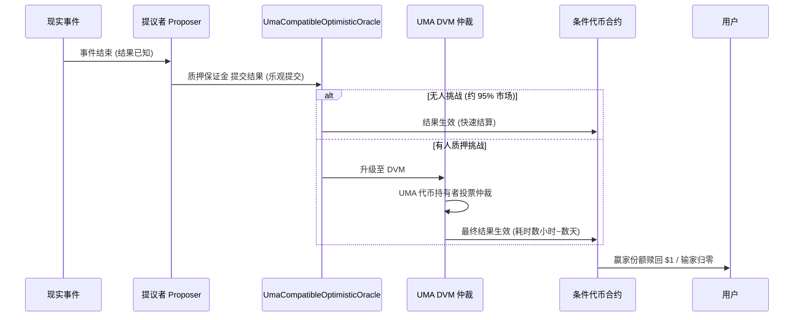

### 3.8 提现流程（Gasless）

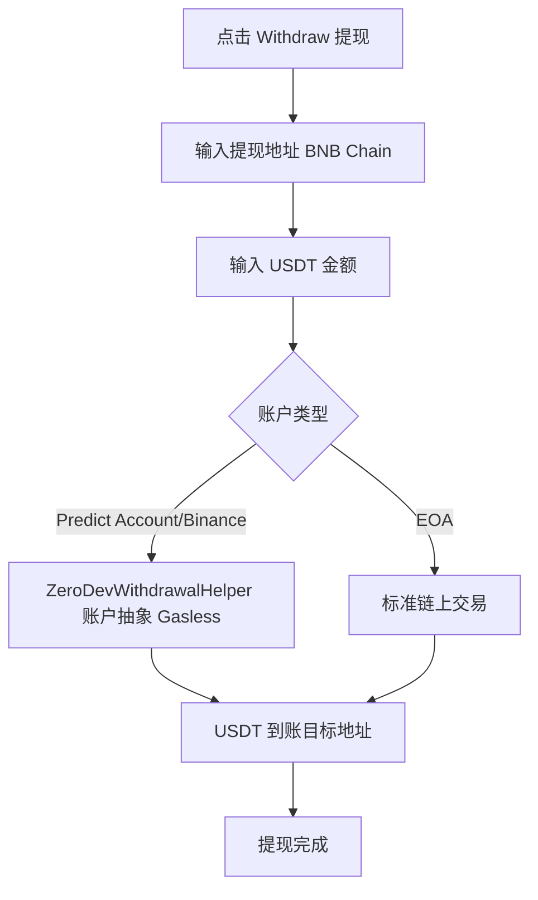

> ⚠️ **待实测**：Web 入口 Gas 是否同样全免、生息收益是否实时反映在余额、提现到账时延、争议市场实际等待时长、地域限制范围。以上流程基于官方文档与媒体描述绘制，未经亲手登录实测。

---

## 4. 技术架构

### 4.1 技术架构总览

```mermaid
graph TB
    subgraph 接入层
        WEB[Web/App]
        BWALLET[Binance Wallet]
        SDK[TS / Python SDK]
        REST[REST API + WebSocket]
    end
    subgraph 链下服务层
        CLOB[链下中央限价订单簿 CLOB]
        MATCH[撮合引擎]
        AUTH[JWT 鉴权 / EIP-712 签名]
    end
    subgraph 链上结算层 BNB Chain
        EXCH[CTFExchange]
        CTF[ConditionalTokens]
        YCTF[YieldBearingConditionalTokens]
        NEG[NegRisk 多结果适配器]
        FEE[FeeModuleV2]
        VAULT[Vault]
    end
    subgraph 预言机/结算
        UMA[UmaCompatibleOptimisticOracle]
        ADAPT[UmaCompatibleCtfAdapter]
    end
    subgraph 收益层
        WRAP[YieldBearingWrappedCollateral]
        DEFI[Venus Protocol 借贷收益]
    end
    subgraph 账户层
        PRIVY[Privy 智能钱包 Predict Account]
        ZERO[ZeroDev 账户抽象 / Gasless]
    end
    WEB --> CLOB
    BWALLET --> ZERO
    SDK --> REST --> CLOB --> MATCH --> EXCH
    EXCH --> CTF
    EXCH --> YCTF
    EXCH --> NEG
    EXCH --> FEE
    YCTF --> WRAP --> DEFI
    ADAPT --> UMA
    ADAPT --> CTF
    UMA --> EXCH
    PRIVY --> EXCH
    ZERO --> EXCH
```

### 4.2 核心机制：链下 CLOB + 链上结算

```mermaid
sequenceDiagram
    participant U as 用户
    participant API as Predict REST/WS
    participant OB as 链下订单簿
    participant EX as CTFExchange (链上)
    participant BNB as BNB Chain

    U->>API: GET 鉴权消息 → EIP-712 签名 → 换取 JWT
    U->>API: POST 创建订单 (签名订单)
    API->>OB: 订单进入链下订单簿
    OB->>OB: 撮合 (maker/taker)
    OB->>EX: 提交撮合结果上链
    EX->>BNB: 铸造/转移条件代币 + 收取费用
    BNB-->>U: 持仓更新 (链上可验证)
```

**订单簿计价机制（实测自官方文档）**：订单簿只存 `Yes` 侧，`bids/asks` 为 `[price, quantity]`；`YES + NO = 1`，NO 侧由 YES 取补数：

```text
getComplement(price, precision) = (10^precision - round(price*10^precision)) / 10^precision
NO 最优买价 = getComplement(asks[0][0])   # YES 最低卖价的补数
NO 最优卖价 = getComplement(bids[0][0])   # YES 最高买价的补数
```

### 4.3 链上合约族（BNB Mainnet 实测部署）

predict.fun 分为 **「生息」与「非生息」两套并行合约**，外加共享的预言机与金库。

```mermaid
graph TD
    subgraph 共享 Shared
        OO[UmaCompatibleOptimisticOracle]
        V[Vault]
        WH[ZeroDevWithdrawalHelper]
        RD[RewardDistributor]
    end
    subgraph 生息市场 Yield-Bearing
        YCT[YieldBearingConditionalTokens]
        YEX[CTFExchange]
        YWRAP[YieldBearingWrappedCollateral]
        YNEG[YieldBearingNegRiskAdapter]
    end
    subgraph 非生息市场 Non-Yield
        CT[ConditionalTokens]
        EX[CTFExchange]
        WRAP[WrappedCollateral]
        NADP[NegRiskAdapter]
    end
    OO --> YCT
    OO --> CT
    YWRAP --> YCT
    RD --> RW[Predict Points/奖励分发]
    WH --> WD[Gasless 提现]
```

| 合约 | 作用 | 地址（BNB Mainnet） |
|------|------|------|
| UmaCompatibleOptimisticOracle | 结果裁决 | `0x76F42e5520E62AD88f8fE583cBb4BfF27eeC2531` |
| Vault | 金库 | `0x09F683d8a144c4ac296D770F839098c3377410c5` |
| ZeroDevWithdrawalHelper | Gasless 提现 | `0xf4aa30b537882eca7e69defb68d6f631cda77b00` |
| RewardDistributor | 奖励/积分分发 | `0x14e3cB02F48818a8FeF6BC257059767cA9d436Ae` |
| YieldBearingConditionalTokens | 生息条件代币 | `0x9400F8Ad57e9e0F352345935d6D3175975eb1d9F` |
| YieldBearingWrappedCollateral | 生息包装抵押品 | `0xCfb9beF5F7B748aC72311F057f3a888BC73334D9` |
| CTFExchange（生息） | 交易所 | `0x6bEb5a40C032AFc305961162d8204CDA16DECFa5` |
| ConditionalTokens（非生息） | 标准条件代币 | `0x22DA1810B194ca018378464a58f6Ac2B10C9d244` |

> 两套合约的存在，直接验证了「生息 vs 非生息」双轨设计。完整清单见 dev.predict.fun → Deployed Contracts。

### 4.4 生息机制详解（Venus 路由）

```mermaid
sequenceDiagram
    participant U as 用户
    participant PF as Predict 协议
    participant WC as YieldBearingWrappedCollateral
    participant V as Venus Protocol (借贷)
    participant CTF as YieldBearingConditionalTokens

    U->>PF: 存入 USDT
    PF->>WC: 包装为生息抵押品
    WC->>V: 供给 USDT 到 Venus 借贷池
    V-->>WC: 持续累积借贷利息 (APY)
    U->>CTF: 用生息抵押下注 YES/NO
    Note over WC,V: 持仓期间本金在 Venus 持续生息
    U->>PF: 平仓/结算/提现
    PF->>V: 从 Venus 赎回本金 + 利息
    V-->>U: 返还 USDT (本金 + 收益)
```

```mermaid
graph LR
    subgraph Polymarket 闲置抵押
        A1[存入 USDC] --> A2[锁定为抵押] --> A3[持仓期 0 收益]
    end
    subgraph predict.fun 生息抵押
        B1[存入 USDT] --> B2[包装 WrappedCollateral] --> B3[供给 Venus] --> B4[持仓期 5-15% APY]
    end
```

### 4.5 账户体系：智能钱包 + 账户抽象

```mermaid
flowchart TD
    A{账户类型} --> B[EOA 外部账户]
    A --> C[Predict Account 智能钱包]
    C --> C1[基于 Privy 自动创建]
    C --> C3[可导出 Privy 私钥]
    A --> D[Binance Keyless Wallet]
    D --> D2[Binance 代付 Gas]
    C --> E[ZeroDev 账户抽象]
    D --> E
    E --> F[Gasless 交易/提现]
```

### 4.6 鉴权与订单生命周期

```mermaid
stateDiagram-v2
    [*] --> 已签名: EIP-712 签名订单
    已签名 --> 已挂单: POST 进入链下订单簿
    已挂单 --> 部分成交
    已挂单 --> 完全成交
    部分成交 --> 完全成交
    已挂单 --> 已取消
    部分成交 --> 已取消
    完全成交 --> 已上链结算: CTFExchange 结算
    已上链结算 --> [*]
```

### 4.7 开发者接口（API / SDK）

| 项目 | 详情 |
|------|------|
| 主网 API | `https://api.predict.fun/`（需 API Key） |
| 测试网 API | `https://api-testnet.predict.fun/`（无需 Key） |
| 主基础设施区域 | `ap-northeast-1`（东京）—— 印证亚洲优先 |
| 速率限制 | 默认 240 请求/分钟 |
| SDK | TypeScript `@predictdotfun/sdk`、Python `predict-sdk` |
| 开源仓库 | github.com/PredictDotFun |
| 鉴权 | auth message → EIP-712 签名 → JWT |
| 接口能力 | Categories / Markets / Orders / Positions / Search / OAuth / WebSocket |

### 4.8 技术栈推断

| 层 | 推断技术 | 依据 |
|----|---------|------|
| 链 | BNB Chain | 官方明确 |
| 智能合约 | Solidity，Gnosis CTF + UMA Adapter 分叉 | 链上合约命名 |
| 链下撮合 | 自建 CLOB | API/文档 |
| 账户抽象 | Privy（钱包）+ ZeroDev（AA/Gasless） | 文档 + 合约 |
| 结算 | UMA 兼容乐观预言机 | 链上合约 |
| 收益 | Venus Protocol（已确认） | CMC Research |
| 部署区域 | AWS ap-northeast-1 | 文档 |

---

## 5. 核心功能与交易技术壁垒

### 5.1 核心功能总览

```mermaid
graph TD
    P[predict.fun 核心功能] --> F1[生息抵押品 Yield-Bearing]
    P --> F2[链下 CLOB 高性能交易]
    P --> F3[Gasless + Keyless 体验]
    P --> F4[Predict Account 智能钱包]
    P --> F5[UMA 兼容去信任结算]
    P --> F6[NegRisk 多结果市场]
    P --> F7[做市积分激励]
    P --> F8[开放 API/SDK + OAuth]
```

### 5.2 功能详解

| # | 功能 | 说明 | 壁垒 |
|---|------|------|------|
| 1 | **生息抵押品** | USDT 经 `YieldBearingWrappedCollateral` 路由 Venus，理论 5–15% APY；唯一对闲置抵押提供收益的主要平台 | 需自研生息合约族 + Venus 集成 + 风险隔离，工程/风控门槛高 |
| 2 | **链下 CLOB** | 链下撮合 + 链上结算，订单簿只存 YES、NO 取补 | 撮合性能与做市深度，依赖流动性积累 |
| 3 | **Gasless + Keyless** | Binance 代付 Gas、无私钥钱包 | 与 Binance 渠道合作，排他性资源 |
| 4 | **Predict Account 智能钱包** | Privy 自动创建，可导出私钥 | 体验优化，技术可复制但绑定迁移成本 |
| 5 | **UMA 兼容去信任结算** | 乐观提交 + DVM 仲裁 | 行业标准方案，非独占 |
| 6 | **NegRisk 多结果市场** | 多选一互斥市场，生息/非生息各一套 | 复杂市场结构工程 |
| 7 | **做市积分激励** | 每分钟快照计分，激励流动性 | 激励设计决定流动性深度，冷启动关键 |
| 8 | **开放 API/SDK + OAuth** | REST/WS、TS/Python、第三方代下单 | 生态接口，先发积累开发者 |

### 5.3 交易技术壁垒评估

| 壁垒类型 | 评分(1-10) | 说明 |
|---------|-----------|------|
| **渠道壁垒** | 9.5 | Binance Wallet 原生集成（200M+ 用户）+ CZ/YZi 背书，排他性极强 |
| **资本效率（生息）** | 8.5 | 生息抵押是结构性创新，竞品需重构合约才能跟进 |
| **资本/融资** | 9 | YZi Labs + Susquehanna 多轮，弹药充足 |
| **流动性深度** | 6 | 体量仍小于 Polymarket，依赖积分补贴 |
| **技术架构** | 7 | 同源 Polymarket 可复制，但生息+AA 组合有工程量 |
| **品牌/社区** | 7.5 | 亚洲/中文社区强（Probable），西方认知弱 |
| **结算去信任** | 7 | UMA 兼容，行业标准，非独占 |
| **生态/开发者** | 6.5 | API/SDK/OAuth 齐备，但生态尚早期 |

### 5.4 与 Polymarket 功能差异

| 维度 | predict.fun | Polymarket |
|------|-------------|------------|
| 链 | BNB Chain | Polygon |
| 抵押品 | **生息（Venus）** | 闲置 |
| Gas | Binance 代付 / Gasless | 用户承担（低） |
| 钱包 | Privy 智能钱包 / Binance Keyless | Magic/代理钱包 |
| 结算 | UMA 兼容乐观预言机 | UMA 乐观预言机 |
| 订单簿 | 链下 CLOB | 链下 CLOB |
| 多结果市场 | NegRisk | NegRisk |
| 重点市场 | 亚洲/中文 | 全球（偏西方） |
| 代币 | 未发币（Predict Points） | 未发币 |

---

## 6. 商业模式

### 6.1 收入来源

```mermaid
pie title Predict.fun 收入来源推测
    "交易手续费 (概率加权 ~2%)" : 60
    "生息收益分成 (Venus, 待确认)" : 25
    "做市/价差相关" : 8
    "生态/API/渠道合作" : 7
```

| 收入来源 | 说明 | 确定性 |
|---------|------|--------|
| **交易手续费** | 约 2% 基础费，随价格偏离 50% 递减（概率加权） | 高 |
| **生息收益分成** | 抵押品 Venus 收益，平台可能抽取部分 | 中（待确认） |
| **做市/价差** | 撮合相关 | 低 |
| **生态/合作** | API、Binance 渠道分润 | 低 |

### 6.2 费率机制与数学直觉

```mermaid
xychart-beta
    title "概率加权费率随价格变化 (示意)"
    x-axis ["0.05", "0.2", "0.35", "0.5", "0.65", "0.8", "0.95"]
    y-axis "相对费率" 0 --> 100
    bar [19, 64, 91, 100, 91, 64, 19]
```

```text
fee ≈ baseRate × c × p × (1 − p) × 4
其中 c = 交易名义金额, p = 成交价格(隐含概率), baseRate ≈ 2% 为 p=0.5 时峰值
```

- 在 50/50（不确定性最高）处费率最高（~2%），价格越极端费率越低。
- 设计意图：在最难判断的交易上多收费，同时不惩罚接近确定的低风险交易。

**与竞品费率对比**

| 平台 | 交易费 | 备注 |
|------|--------|------|
| **predict.fun** | ~2% 峰值（概率加权递减） | 另有生息收益分成想象空间 |
| Polymarket | 0%（长期免交易费） | 费用极低是其规模优势 |
| Kalshi | 概率加权（类似 0.07×c×p×(1−p)） | 合规交易所 |
| DraftKings | $0.01/合约固定 | 量大但营收受限 |
| PredictIt | 利润 10% + 提现 5% | 传统模式 |

> ⚠️ 具体费率表、maker/taker 是否差异化、生息分成比例，官方未逐项公开。

### 6.3 收入测算（估算）

| 口径 | 交易量 | 假设有效费率 | 估算手续费 |
|------|--------|------------|-----------|
| 累计 | $1.8B | 1%（保守） | **~$18M** |
| 累计 | $1.8B | 0.5%（更保守） | ~$9M |

**单位经济性（每 $1M 交易量）**

| 情景 | 有效费率 | 收入/$1M |
|------|---------|---------|
| 乐观（多在中点） | 1.2% | $12,000 |
| 中性 | 0.8% | $8,000 |
| 保守（多在极端价格） | 0.4% | $4,000 |

> 生息侧：$20M+ 资金 × 5–15% APY = **$1M–$3M/年** 收益规模（平台分成比例待确认）。

### 6.4 商业模式画布

| 要素 | 内容 |
|------|------|
| 价值主张 | 凡事押对就有回报；押注期间资金还能生息；Binance 级别无门槛体验 |
| 客户细分 | 亚洲/中文加密用户、做市商/LP、开发者/Bot、Binance Wallet 存量用户 |
| 渠道 | Web/App、Binance Wallet 集成、API/SDK、大事件活动 |
| 客户关系 | 积分激励、邀请返佣、排行榜、Discord、亚太本地化运营 |
| 收入流 | 交易手续费（概率加权）、生息收益分成、生态合作 |
| 核心资源 | YZi/Binance 资本与渠道、生息合约族、CLOB 撮合、亚洲社区 |
| 核心活动 | 撮合与结算、Venus 收益管理、积分/活动运营、市场上架结算 |
| 关键合作 | Binance Wallet、YZi Labs、UMA、Venus、BNB Chain、Rhino Bridge |
| 成本结构 | DeFi 风险/对冲、Gas 代付补贴、积分/空投激励、撮合与服务器、团队 |

### 6.5 增长飞轮

```mermaid
flowchart TD
    A[Binance 渠道 + 大事件] --> B[低成本获客]
    B --> C[交易量增长]
    C --> D[手续费 + 生息 TVL 增长]
    C --> E[Predict Points 发放]
    E --> F[空投预期]
    F --> G[做市/拉新激励]
    G --> H[流动性深度提升]
    H --> C
    D --> I[资本/收入增强] --> A
```

### 6.6 代币 / Predict Points / 空投

> 截至调研时 predict.fun **尚未发币**，以下围绕 Predict Points（PP）与空投预期，代币经济为推断。

```mermaid
graph TD
    PP[Predict Points - PP] --> S1[交易量]
    PP --> S2[做市/提供流动性]
    PP --> S3[持仓时长]
    PP --> S4[邀请]
    PP --> S5[赛事活动 Fan Points]
    S1 --> LB[排行榜]
    S2 --> LB
    S3 --> LB
    S4 --> REF[邀请人 10% 永久返佣]
    S5 --> LB
    LB --> AIR[空投预期]
    REF --> AIR
```

**做市积分机制（最具特色）**：每分钟对订单簿快照，活跃挂单按三因子计分——① 距中点距离（越近指数级越多分但成交风险越高）；② 订单规模；③ 双边挂单（YES+NO）加成；Boosted 市场显著更多积分。

**大型活动**：2026 世界杯「$2M Predict Cup」经 Binance Wallet 入口，瓜分 **200 万 USDT + 300 万 Predict Points**，3 天 2 万 DAU、18 万笔/日。

**与竞品激励对比**

| 平台 | 积分计划 | 拉新激励 |
|------|---------|---------|
| **predict.fun** | ✅（被称唯一在跑积分的预测市场） | 积分 + 邀请 10% + 赛事奖池 |
| Polymarket | 历史季度活动 | 邀请返佣（$10k 门槛后分 30% 手续费） |
| Kalshi | 无 | 现金 welcome 促销 |

> ⚠️ 空投不保证发生；积分→代币的映射比例、TGE 时间均不确定；积分通胀可能稀释早期用户预期。

---

## 7. 待确认问题

**收益机制（Yield-Bearing）**
- [x] 抵押品路由协议：**已确认为 Venus Protocol**（CMC Research）
- [ ] 除 Venus 外是否还有其他收益策略？5–15% APY 实际波动区间？
- [ ] 生息收益归属：全部归用户，还是平台抽取分成？比例？
- [ ] 「生息」与「非生息」两套合约对用户默认哪套？能否选择？
- [ ] Venus 借贷池的清算与脱锚风险隔离机制？

**费率与收入**
- [ ] 官方费率精确公式？是否「2% 基础、随价格偏离 50% 递减」？
- [ ] maker / taker 是否差异化费率？做市是否零费或返佣？
- [ ] 有效平均费率实测值？

**代币与积分**
- [ ] 是否有明确 TGE 时间表？
- [ ] Predict Points → 代币的映射比例与规则？
- [ ] 积分总量/增发节奏（活动大量增发是否稀释）？

**账户与体验**
- [ ] Web 入口（非 Binance Wallet）Gas 是否同样代付？
- [ ] 提现到账时延、争议市场实际等待时长？
- [ ] KYC/地区限制范围（文档暗示有 geo-restriction）？

**市场与运营**
- [ ] 当前真实日活/月活、留存率？
- [ ] Probable 用户迁移完成率与留存？积分稀释争议影响？
- [ ] 与 Binance Wallet 合作的商业条款（分润/排他性）？

---

## 8. 总结

predict.fun 是预测市场赛道 **资本与渠道最强的后发挑战者**，核心判断如下：

1. **差异化清晰**：生息抵押（Venus 路由）+ Binance Gasless + 亚洲市场，三位一体错位竞争，避开与 Polymarket/Kalshi 的同质化消耗。
2. **资本渠道天花板级**：YZi Labs（多轮）+ Susquehanna + CZ 站台 + 前 Binance/PancakeSwap 创始团队 + Binance Wallet 触达 200M+ 用户。
3. **技术稳健**：复用被验证的 Polymarket 架构（CLOB + CTF + UMA 兼容预言机），叠加生息与账户抽象创新，工程风险低。
4. **增长靠积分飞轮**：Predict Points + 空投预期 + 大事件（世界杯），在发币前换规模。
5. **核心看点与风险**：能否把「渠道流量 + 空投预期」转化为「真实留存 + 流动性深度 + 可持续代币经济」，决定它能否从挑战者升格为预测市场第三极。最大风险在于高度依赖 Binance、TGE 能否兑现积分预期、BNB 链稳定币流动性受限。
