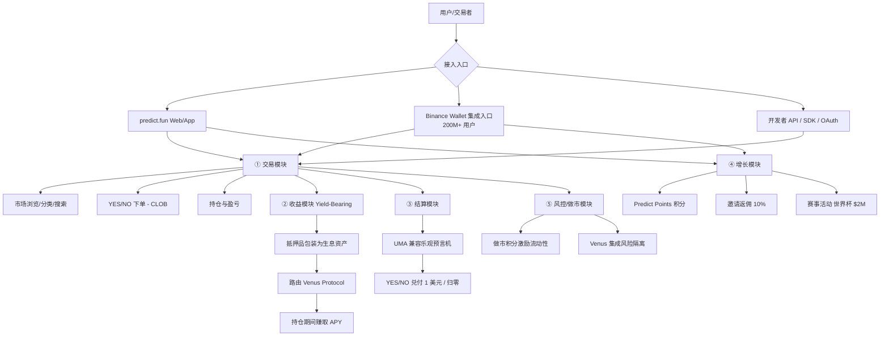
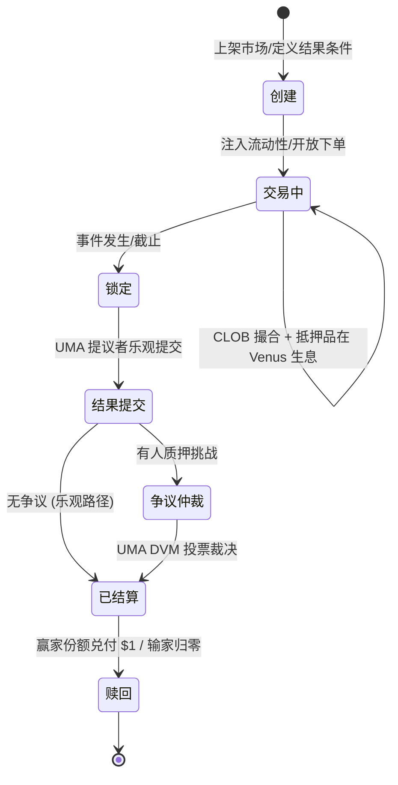
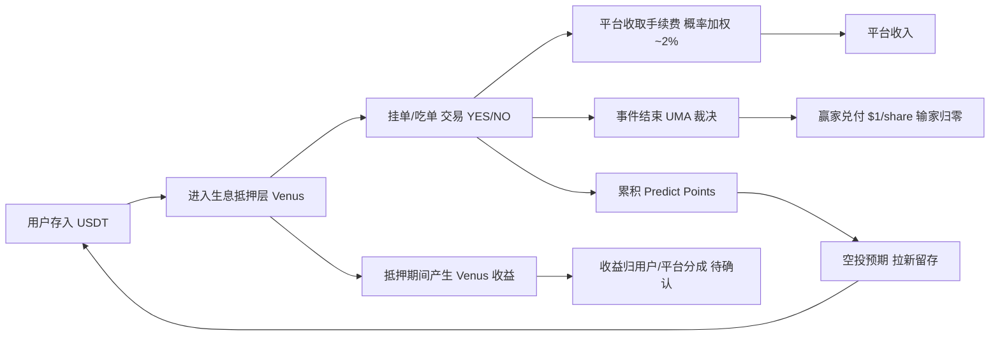
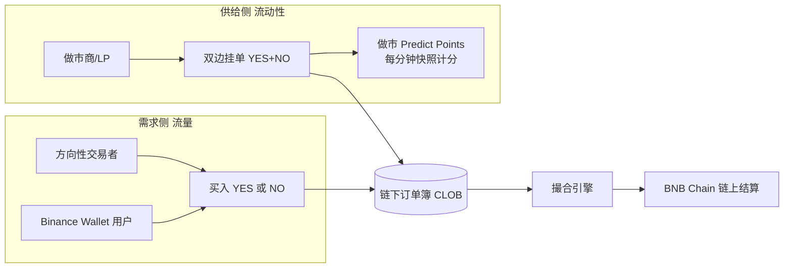
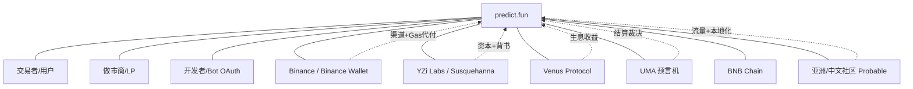
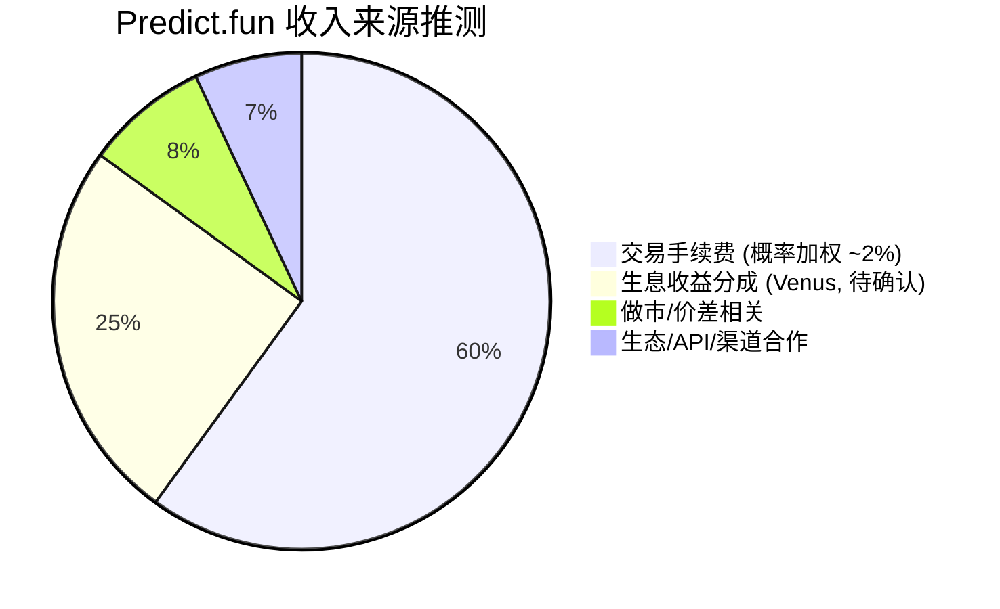

# Predict.fun — 业务架构深度分析

> 数据日期：2026-06-17
> 平台：predict.fun
> 核心逻辑：用「生息」降低持仓成本聚资金，用「积分空投预期」激励做市与拉新，用「Binance 渠道 + 大事件」规模化获客。

---

## 1. 业务全景架构

---

## 2. 五大核心业务模块

| 模块 | 描述 | 战略价值 | 收入关联 |
|------|------|----------|----------|
| ① **交易模块** | 二元 YES/NO + 多结果，链下 CLOB 撮合 + 链上结算 | 平台核心 | 手续费主来源 |
| ② **收益模块（Yield-Bearing）** | 抵押资金经 Venus 生息 | 最大差异化护城河 | 潜在收益分成 |
| ③ **结算模块** | UMA 兼容乐观预言机裁决 | 去信任结果、公信力 | 间接（信任→留存） |
| ④ **增长模块** | Predict Points + 邀请 + 赛事 | 用户获取与留存飞轮 | 间接（规模→费用） |
| ⑤ **风控/做市模块** | 做市积分 + DeFi 风险隔离 | 流动性深度与安全 | 间接（深度→成交） |

---

## 3. 市场生命周期（Market Lifecycle）

predict.fun 单个市场从「创建」到「赎回」的完整生命周期：

| 阶段 | 关键动作 | 涉及合约 |
|------|---------|---------|
| 创建 | 定义事件与结果条件 | ConditionalTokens / NegRisk |
| 交易中 | 撮合 + 抵押品生息 | CTFExchange / YieldBearingWrappedCollateral |
| 锁定/结果提交 | 乐观预言机提交 | UmaCompatibleCtfAdapter / OptimisticOracle |
| 争议仲裁 | DVM 投票（如有） | UMA DVM |
| 赎回 | 份额兑付 | ConditionalTokens |

---

## 4. 业务价值链与资金流

### 资金流闭环关键点
1. **入金即生息**：资金存入后即进入 Venus 借贷市场，即便未下注/挂单也产生 APY（与 Polymarket「闲置抵押」的本质差异）。
2. **交易产生手续费**：链下撮合，平台按概率加权费率抽成（中点最高约 2%，偏离递减）。
3. **结算去信任化**：UMA 兼容乐观预言机裁决，赢家份额兑付 $1。
4. **积分预埋增长**：全程累积 Predict Points，绑定空投预期形成飞轮。

---

## 5. 双边市场结构

- **供给侧（做市商/LP）**：靠做市积分（每分钟订单簿快照计分）激励，解决冷启动流动性。
- **需求侧（交易者）**：方向性押注，Binance Wallet 是最大流量来源。
- **平台角色**：用积分补贴供给侧（最难的一端），用渠道导流需求侧。

---

## 6. 利益相关者地图

| 相关者 | 关系 | 对 predict.fun 的价值 |
|--------|------|----------------------|
| Binance Wallet | 渠道战略合作 | 200M+ 用户、Gas 代付、统一账户 |
| YZi Labs/Susquehanna | 投资人 | 资本、背书、生态资源 |
| Venus Protocol | DeFi 集成 | 生息收益来源（核心差异化基础） |
| UMA | 预言机 | 去信任结算 |
| 做市商/LP | 供给侧 | 流动性深度 |
| 开发者/Bot | 生态 | API/OAuth 扩展交易量 |
| 亚洲社区 | 用户基础 | 错位竞争的市场腹地 |

---

## 7. 收入来源结构

> 详见 [06_business_model/analysis.md](../06_business_model/analysis.md)。

---

## 8. 小结

predict.fun 的业务架构在标准预测市场（交易 + 结算）之上，叠加了 **收益引擎（Venus 生息，差异化护城河）** 与 **增长引擎（积分飞轮）**，并通过 **Binance Wallet 渠道** 打通最大流量入口：

1. **五模块协同**：交易（核心）、收益（差异化）、结算（信任）、增长（规模）、风控/做市（深度）。
2. **市场生命周期标准化**：创建→交易→锁定→结算→赎回，复用成熟预测市场范式。
3. **资金闭环高效**：入金即生息、交易即计分、结算即兑付。
4. **双边市场策略**：积分补贴供给侧、渠道导流需求侧，针对性解决「流动性 vs 流量」两难。
