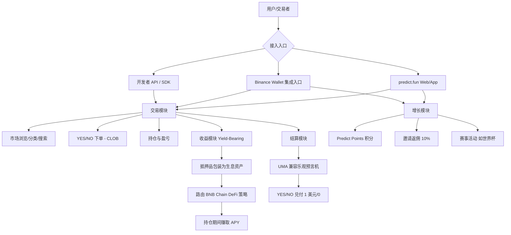
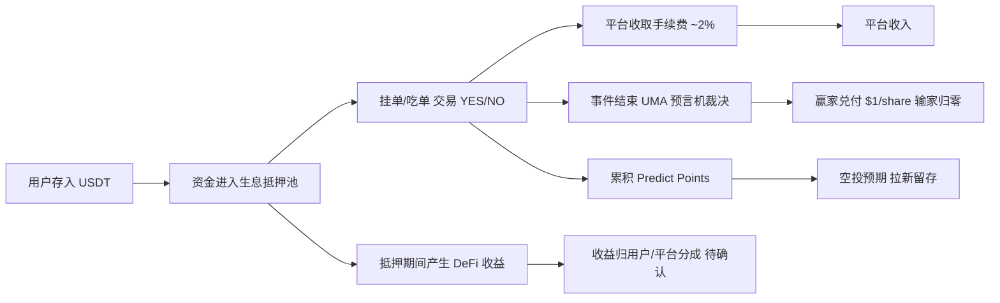
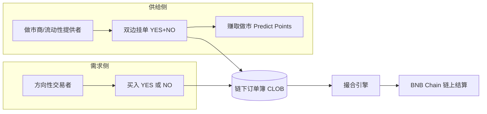

# Predict.fun — 业务架构分析

> 数据日期：2026-06-17
> 平台：predict.fun

---

## 1. 业务全景架构

---

## 2. 核心业务模块

| 模块 | 描述 | 战略价值 |
|------|------|----------|
| **交易模块** | 二元 YES/NO 市场，链下 CLOB 撮合 + 链上结算 | 平台核心，手续费来源 |
| **收益模块（Yield-Bearing）** | 抵押资金包装为生息资产，路由 DeFi 赚取收益 | 最大差异化护城河 |
| **结算模块** | UMA 兼容乐观预言机裁决事件结果 | 去信任化结果，平台公信力 |
| **增长模块** | Predict Points 积分 + 邀请 + 赛事活动 | 用户获取与留存飞轮 |
| **渠道集成模块** | Binance Wallet Gasless 集成、API/SDK 开放 | 流量入口 + 生态扩张 |

---

## 3. 业务价值链

### 业务闭环说明

1. **入金即生息**：用户存入 USDT 后，即便尚未下注或挂单，资金也可进入生息抵押层（这是与 Polymarket「闲置抵押」的关键差异）。
2. **交易产生手续费**：链下订单簿撮合，平台按概率加权费率（约 2% 基础、随价格偏离 50% 递减）抽成。
3. **结算去信任化**：事件结束后由 UMA 兼容乐观预言机提交并裁决结果，赢家份额兑付 $1，输家归零。
4. **积分预埋增长**：交易/做市/持仓/邀请全程累积 Predict Points，绑定空投预期形成拉新留存飞轮。

---

## 4. 双边市场结构

predict.fun 是典型的双边市场：
- **供给侧（做市商/LP）**：提供流动性、收窄价差，靠做市积分（每分钟订单簿快照计分）获得激励。
- **需求侧（交易者）**：方向性押注，贡献手续费与交易量。
- 平台通过 **积分激励供给侧** 来解决冷启动的流动性问题——这是预测市场最难的部分。

---

## 5. 小结

predict.fun 的业务架构在标准预测市场（交易 + 结算）之上，叠加了 **收益模块（差异化护城河）** 与 **增长模块（积分飞轮）** 两个引擎，并通过 **Binance Wallet 集成** 打通最大流量入口。其业务设计的核心逻辑是：用「生息抵押」降低持仓成本吸引资金、用「积分空投预期」激励做市与拉新、用「Binance 渠道 + 大事件」做规模化获客。
