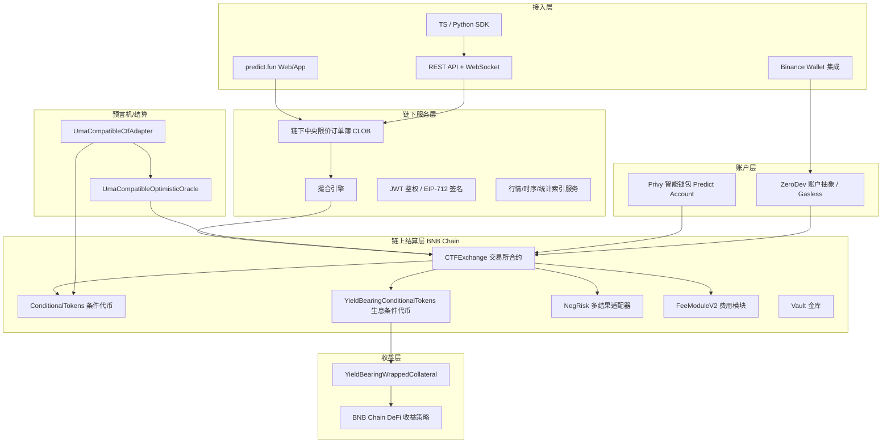
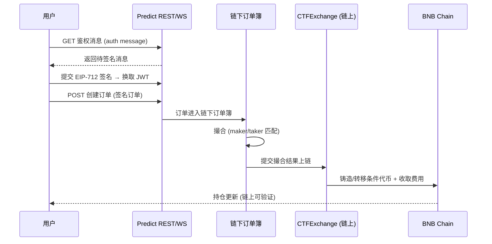
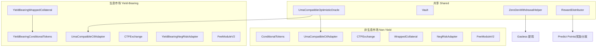
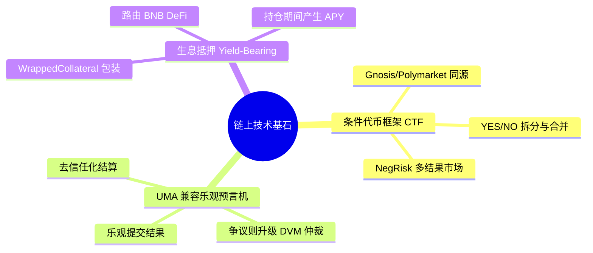
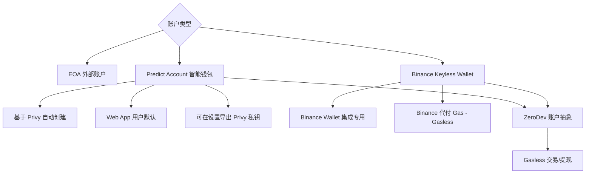
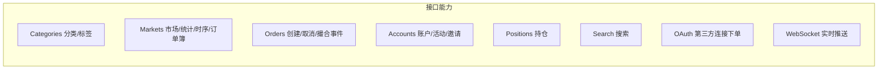

# Predict.fun — 技术架构分析

> 数据日期：2026-06-17
> 平台：predict.fun
> 数据来源：开发者文档 dev.predict.fun、BNB Chain 链上合约部署清单

---

## 1. 技术架构总览



---

## 2. 核心机制：链下 CLOB + 链上结算

predict.fun 采用与 Polymarket 同源的 **「链下中央限价订单簿（CLOB）+ 链上结算」混合架构**：



### 2.1 订单簿计价机制（实测自官方文档）

- 订单簿 **只存储 YES 侧价格**，`bids`（买单）与 `asks`（卖单）均为 `[price, quantity]`，best 价在前。
- **YES + NO = 1**（在市场约定的小数精度下取补）。NO 侧价格由 YES 侧取补数计算：

```text
getComplement(price, precision) = (10^precision - round(price * 10^precision)) / 10^precision

NO 最优买价 = getComplement(asks[0][0])   # YES 最低卖价的补数
NO 最优卖价 = getComplement(bids[0][0])   # YES 最高买价的补数
```

- 价格区间恒在 `[0, 1]`，反映事件发生的隐含概率（如 YES = $0.42 ≈ 42% 概率）。

---

## 3. 链上合约族（BNB Mainnet 实测部署）

predict.fun 链上分为 **「生息」与「非生息」两套并行的预测市场合约**，外加共享的预言机与金库。



### 3.1 关键合约清单（BNB Mainnet）

| 合约 | 作用 | 地址 |
|------|------|------|
| **UmaCompatibleOptimisticOracle** | UMA 兼容乐观预言机，事件结果裁决 | `0x76F42e5520E62AD88f8fE583cBb4BfF27eeC2531` |
| **Vault** | 金库 | `0x09F683d8a144c4ac296D770F839098c3377410c5` |
| **ZeroDevWithdrawalHelper** | 账户抽象提现助手（Gasless） | `0xf4aa30b537882eca7e69defb68d6f631cda77b00` |
| **RewardDistributor** | 奖励/积分分发 | `0x14e3cB02F48818a8FeF6BC257059767cA9d436Ae` |
| **YieldBearingConditionalTokens** | 生息条件代币 | `0x9400F8Ad57e9e0F352345935d6D3175975eb1d9F` |
| **YieldBearingWrappedCollateral** | 生息包装抵押品 | `0xCfb9beF5F7B748aC72311F057f3a888BC73334D9` |
| **YieldBearingNegRiskAdapter** | 生息多结果适配器 | `0x41dCe1A4B8FB5e6327701750aF6231B7CD0B2A40` |
| **CTFExchange（生息）** | 条件代币交易所 | `0x6bEb5a40C032AFc305961162d8204CDA16DECFa5` |
| **FeeModuleV2（生息）** | 费用模块 | `0xFbC2259aBB3F01c019ECE1d0200Ee673BB7BA34F` |
| **ConditionalTokens（非生息）** | 标准条件代币 | `0x22DA1810B194ca018378464a58f6Ac2B10C9d244` |
| **WrappedCollateral（非生息）** | 标准包装抵押品 | `0x66239b70133773A72A0D589E5564E88a50Cd39e7` |

> 完整清单见 dev.predict.fun → Deployed Contracts。两套合约的存在，直接验证了「生息 vs 非生息」双轨设计。

### 3.2 三大技术基石



1. **条件代币框架（CTF）**：与 Gnosis/Polymarket 同源，将一个事件拆分为 YES/NO（或多结果）的 ERC-1155 头寸；`NegRisk` 适配器处理「多选一」互斥市场（如多候选人选举）。
2. **UMA 兼容乐观预言机**：事件结束后，提议者乐观提交结果；若无人质押挑战，结果即生效；若有争议，升级到 UMA 的 DVM（数据验证机制）由代币持有者投票仲裁。
3. **生息抵押（Yield-Bearing）**：通过 `YieldBearingWrappedCollateral` 将 USDT 抵押品包装为生息资产，路由进 BNB Chain DeFi 策略（如借贷协议，理论 5–15% APY），实现「押注期间资金不闲置」。

---

## 4. 账户体系：智能钱包 + 账户抽象



- **Predict Account（智能钱包）**：Web App 用户登录即自动创建，基于 **Privy**；可在账户设置导出 Privy 私钥用于 SDK 编程交互。
- **EOA**：高级用户/开发者可直接用外部账户对接协议。
- **Binance Keyless Wallet**：Binance Wallet 集成场景下，用户用无私钥钱包一键开「Prediction Account」，**Binance 代付 BNB Chain Gas，实现完全 Gasless（免费）交易与兑付**。
- **ZeroDev 账户抽象**：支撑 Gasless 体验与提现（`ZeroDevWithdrawalHelper`）。

---

## 5. 开发者接口（API / SDK）



| 项目 | 详情 |
|------|------|
| 主网 API | `https://api.predict.fun/`（需 API Key） |
| 测试网 API | `https://api-testnet.predict.fun/`（无需 Key） |
| 主基础设施区域 | `ap-northeast-1`（东京）—— 印证亚洲优先战略 |
| 速率限制 | 默认 240 请求/分钟 |
| SDK（TypeScript） | `@predictdotfun/sdk`（npm） |
| SDK（Python） | `predict-sdk`（PyPI） |
| 开源仓库 | github.com/PredictDotFun |
| 鉴权 | 获取 auth message → EIP-712 签名 → 换取 JWT |
| 社区/支持 | discord.gg/predictdotfun（API Key 申请通过开工单） |

### 关键 API 端点（节选）

- `GET /markets`、`GET /markets/{id}`、`GET market statistics`、`GET market timeseries`
- `GET orderbook`（YES 侧深度，NO 侧取补）
- `POST create order`、`POST remove orders`、`GET order match events`
- `GET positions`、`GET positions by address`
- `OAuth`：支持第三方应用代用户下单/查持仓（生态扩张接口）

---

## 6. 技术栈推断

| 层 | 推断技术 | 依据 |
|----|---------|------|
| 链 | BNB Chain（BSC） | 官方明确 |
| 智能合约 | Solidity，Gnosis CTF + UMA Adapter 分叉 | 链上合约命名 |
| 链下撮合 | 自建 CLOB 撮合服务 | API/文档 |
| 账户抽象 | Privy（钱包）+ ZeroDev（AA/Gasless） | 文档 + 合约命名 |
| 结算预言机 | UMA 兼容乐观预言机 | 链上合约 |
| 收益 | BNB Chain DeFi 借贷（Venus/Lista 等，待确认） | 媒体 + 合约命名 |
| 前端 | React/Next.js（推断） | 行业惯例 |
| 部署区域 | AWS ap-northeast-1 | 文档 |

---

## 7. 小结

predict.fun 的技术架构可概括为 **「Polymarket 的 BNB 改良分叉 + 生息抵押 + 账户抽象」**：

1. **同源底座**：链下 CLOB + 链上 CTF + UMA 兼容预言机，复用了被验证过的预测市场架构，工程风险低。
2. **结构性创新**：独立部署的 `YieldBearing*` 合约族，把抵押品变成生息资产，是真正的差异化技术资产。
3. **体验优化**：Privy 智能钱包 + ZeroDev 账户抽象 + Binance 代付 Gas，把 Web3 交易门槛降到「无感」。
4. **生态友好**：开放 REST/WS API、TS/Python SDK、OAuth 第三方下单，为外部工具/Bot 接入预留接口。
