# Predict.fun — 用户体验路径深度分析（产品）

> 数据日期：2026-06-17
> 平台：predict.fun
> 双入口：**predict.fun Web/App（Privy 智能钱包）** 与 **Binance Wallet 集成（Keyless + Gasless，触达 200M+ 用户）**

---

## 1. 用户旅程总览

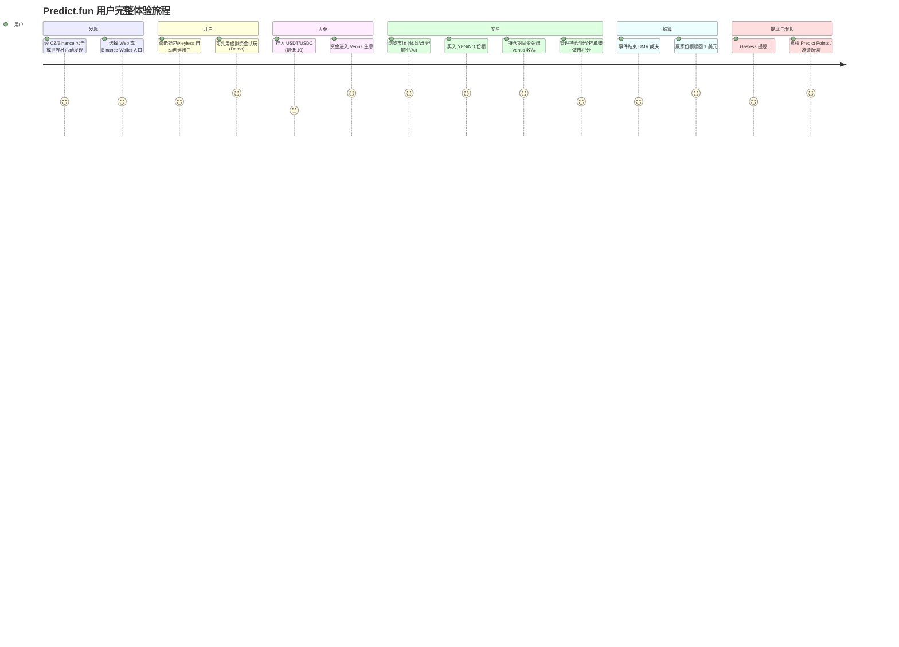

---

## 2. 双入口体验对比（关键差异）

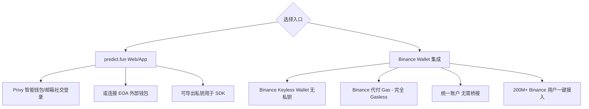

| 维度 | predict.fun Web/App | Binance Wallet 集成 |
|------|--------------------|--------------------|
| 钱包 | Privy 智能钱包 / EOA | Binance Keyless Wallet |
| 私钥 | 可导出（自托管倾向） | 无私钥（Keyless） |
| Gas | 由账户抽象处理（待确认是否全免） | Binance 代付，完全 Gasless |
| 桥接 | 需自行入金/跨链（Rhino） | 无需桥接，统一账户 |
| 目标用户 | 加密原生/开发者 | 主流/Binance 存量用户 |
| 门槛 | 低 | 极低（接近零） |

> Binance Wallet 集成是 predict.fun 体验上的最大杀器：**无私钥、无 Gas、无桥接、可虚拟盘试玩**，把 2 亿 Binance 用户的开户门槛降到接近零。

---

## 3. 开户流程

### 3.1 Web/App 入口（Privy 智能钱包）

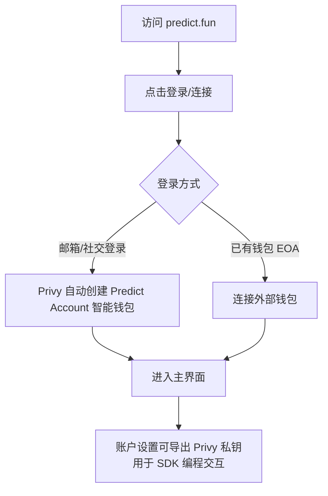

### 3.2 Binance Wallet 入口（Keyless，Gasless）

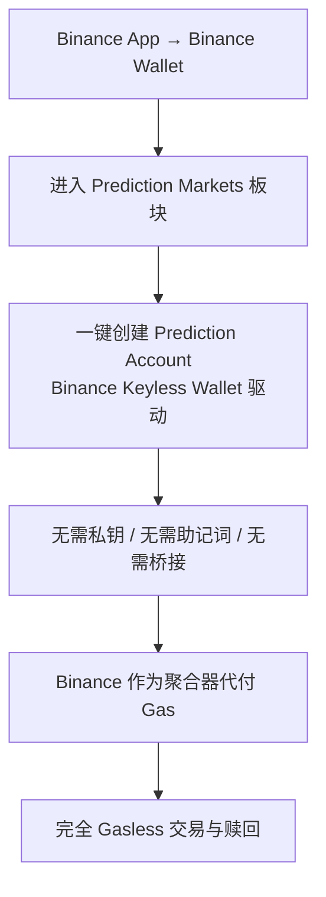

### 3.3 Demo / 虚拟盘试玩（降低首单门槛）

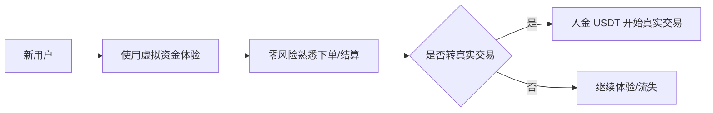

> Binance Wallet 集成支持「虚拟资金、零风险体验真实交易场景」，是典型的「先试玩后入金」转化漏斗。

---

## 4. 入金（充值）流程

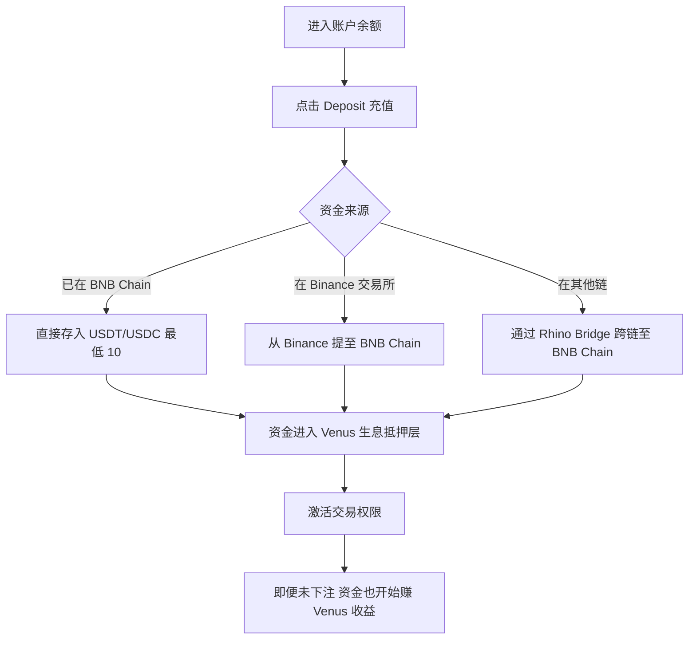

- **最低入金**：约 10 USDT/USDC 激活交易。
- **跨链**：官方建议用 **Rhino Bridge** 把其他网络资金桥接到 BNB Chain。
- **结算资产**：交易与赎回以 **USDT** 计价。
- **差异点**：入金后资金即进入 Venus 生息层——这是与 Polymarket 体验的本质区别。

---

## 5. 市场发现与交易执行

### 5.1 市场发现

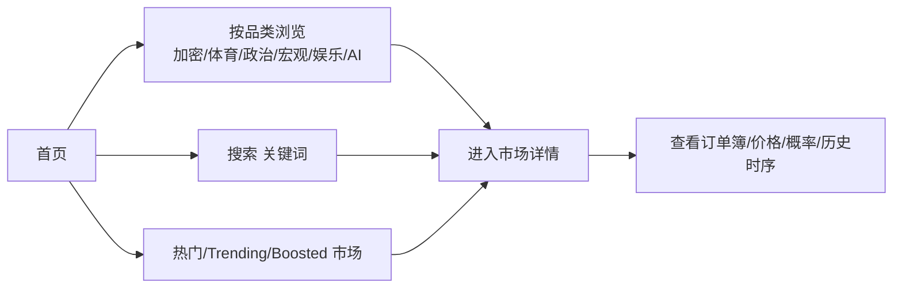

### 5.2 交易执行

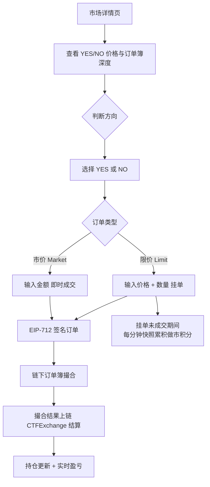

### 5.3 价格直觉
- YES 份额价格 = 事件发生隐含概率（$0.42 ≈ 42%）。
- **YES + NO = $1.00**；订单簿只存 YES 侧，NO 侧取补数。
- 结算时赢家份额兑付 **$1**，输家份额归 **$0**。

---

## 6. 持仓管理与赎回

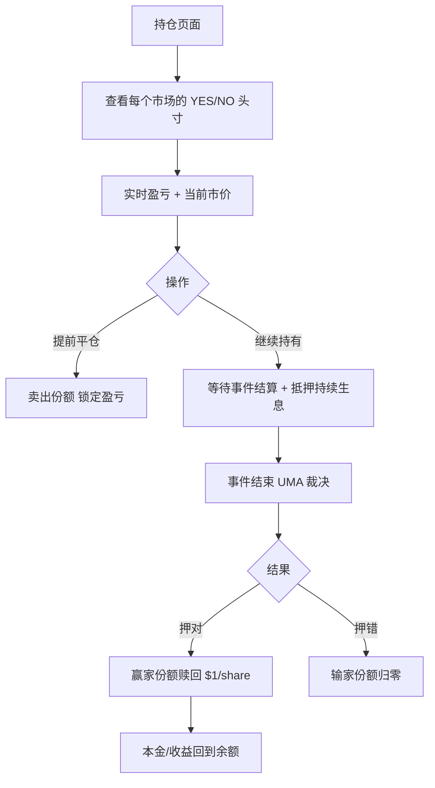

---

## 7. 结算流程（UMA 兼容乐观预言机）

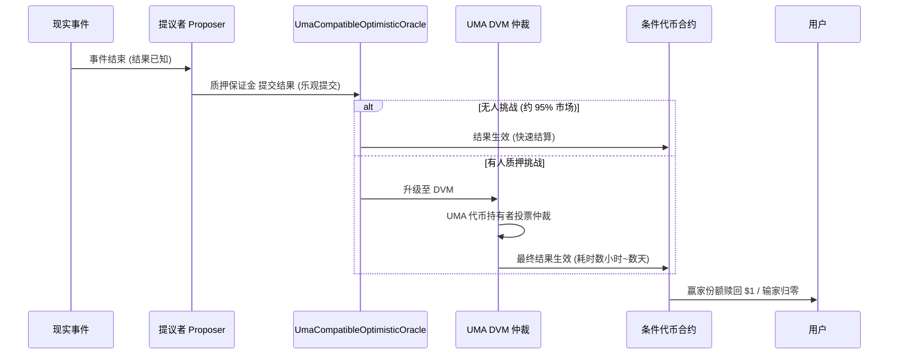

---

## 8. 提现流程（Gasless）

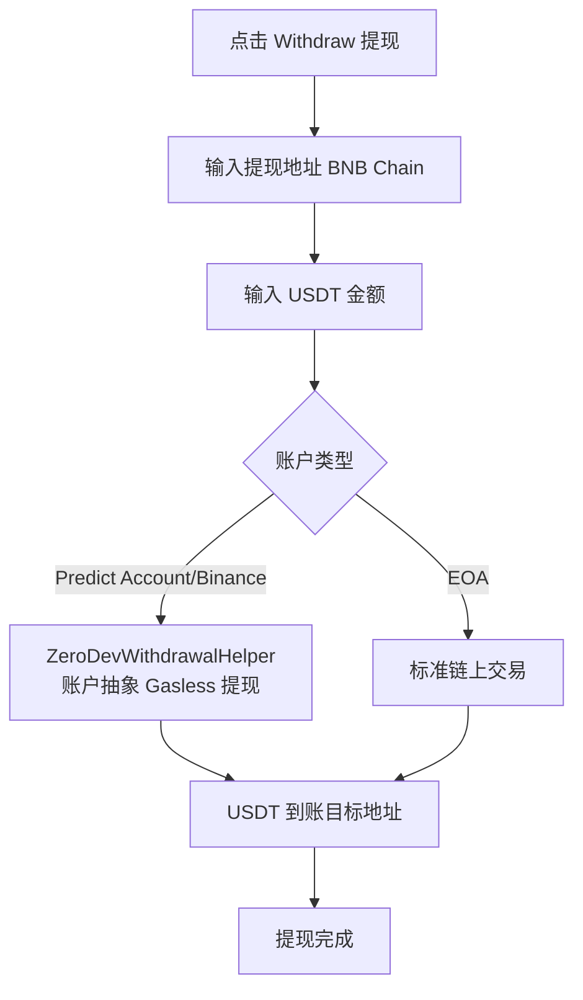

---

## 9. 增长行为路径（积分与邀请）

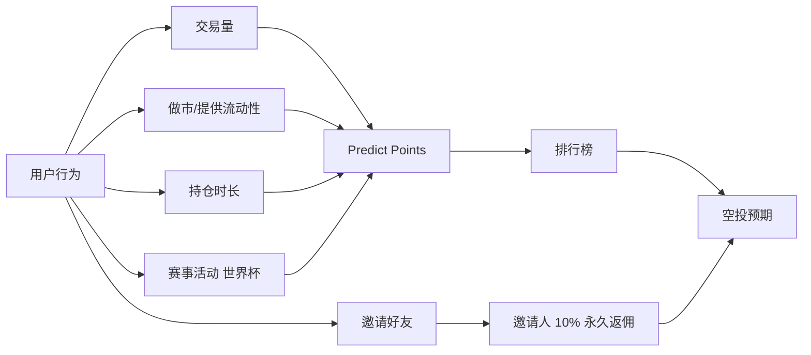

> 详见 [07_token_points_airdrop/analysis.md](../07_token_points_airdrop/analysis.md)。

---

## 10. 体验边界与待实测

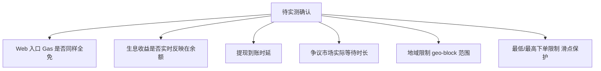

⚠️ 以上流程基于官方文档与媒体描述绘制，**未经亲手登录实测**；建议登录 Web 与 Binance Wallet 两条路径核验。

---

## 11. 小结

predict.fun 的产品/体验设计围绕 **「降门槛 + 资金高效 + 强激励」** 三条主线：

1. **降门槛到极致**：Binance Keyless（无私钥）+ Gasless（无 Gas）+ 无桥接 + 虚拟盘试玩，几乎消灭 Web3 所有摩擦点，把 2 亿 Binance 用户变成潜在池。
2. **资金高效**：入金即经 Venus 生息，让闲置资金产生回报，降低持仓机会成本。
3. **去信任结算**：UMA 兼容乐观预言机保证结果公正，多数市场快速兑付。
4. **强激励飞轮**：Predict Points + 邀请 10% 返佣 + 大事件活动，持续拉新留存。
5. **双入口策略**：Web/App 服务加密原生与开发者，Binance Wallet 服务主流大众，覆盖全谱系用户。
