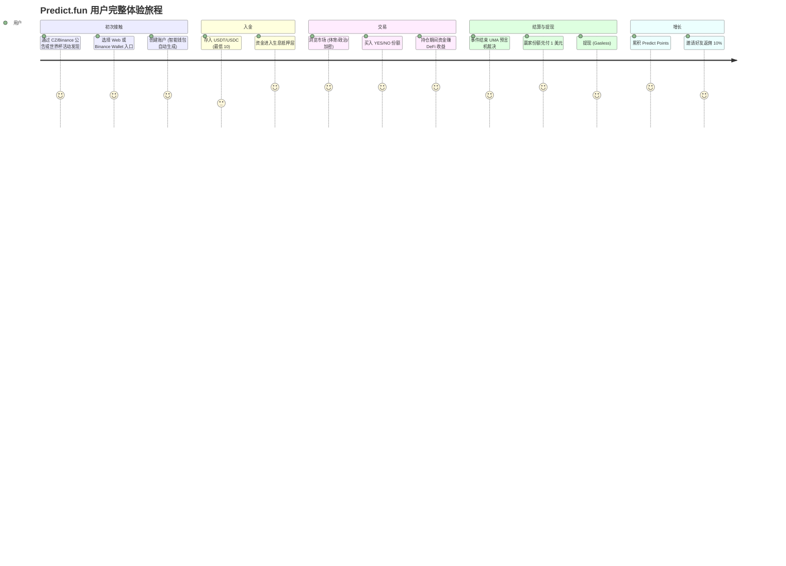
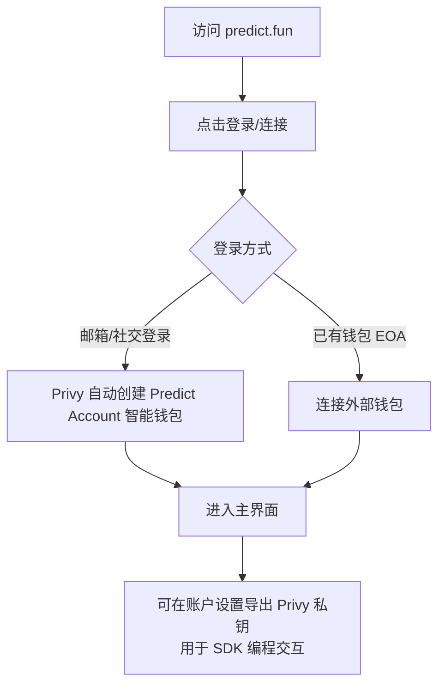
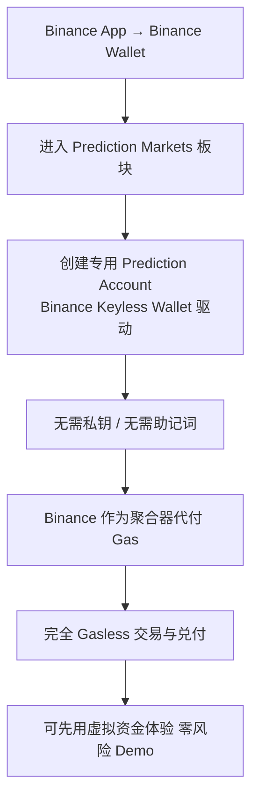
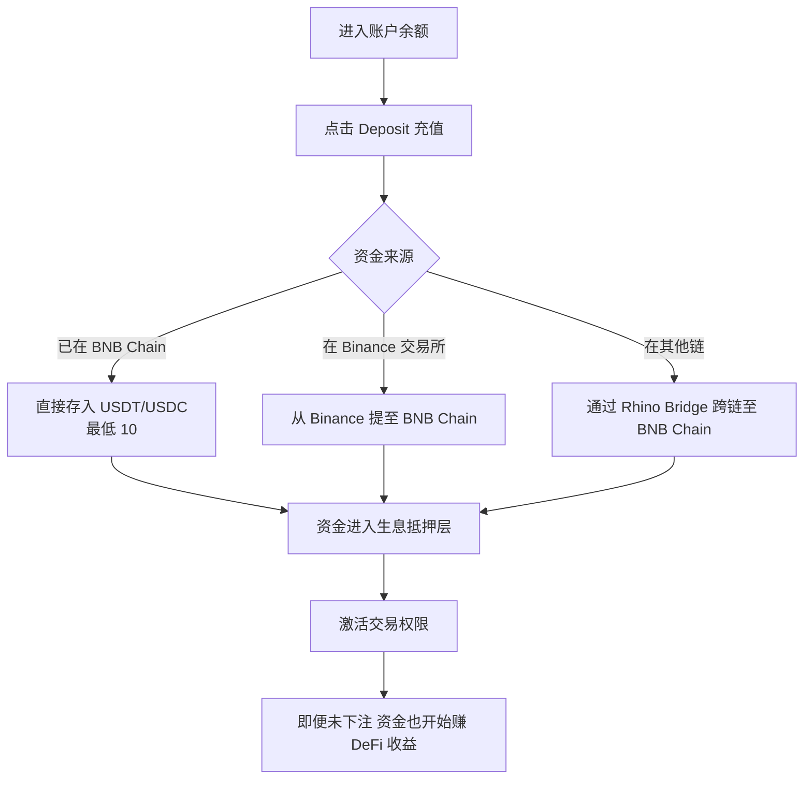
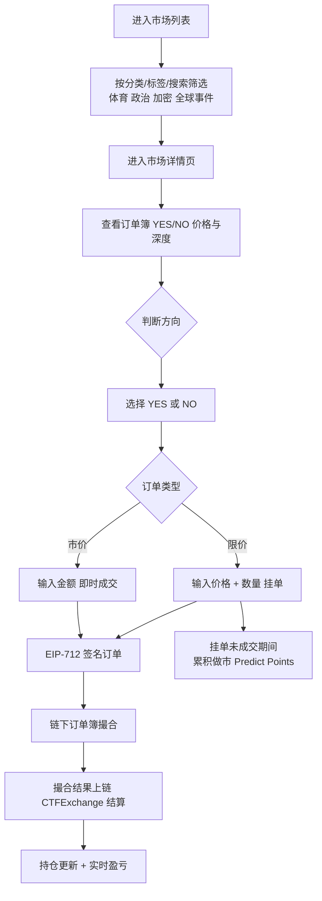
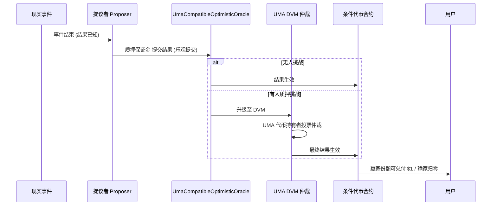
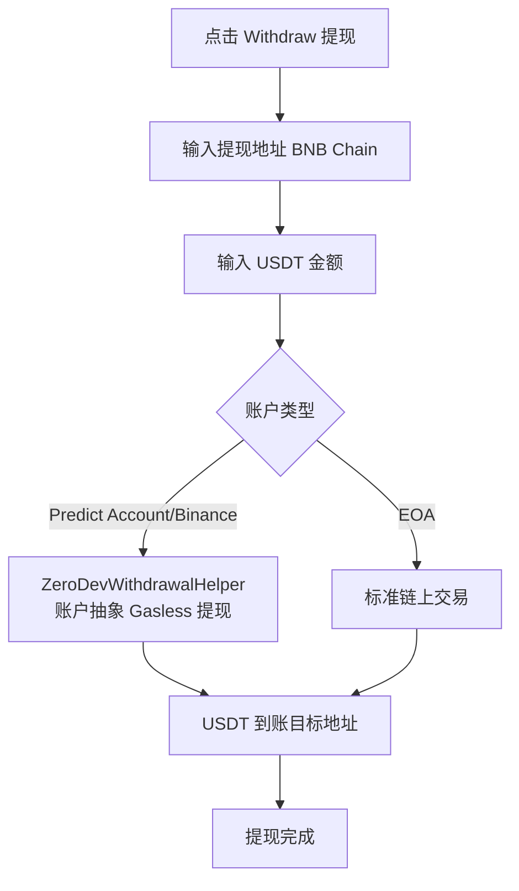
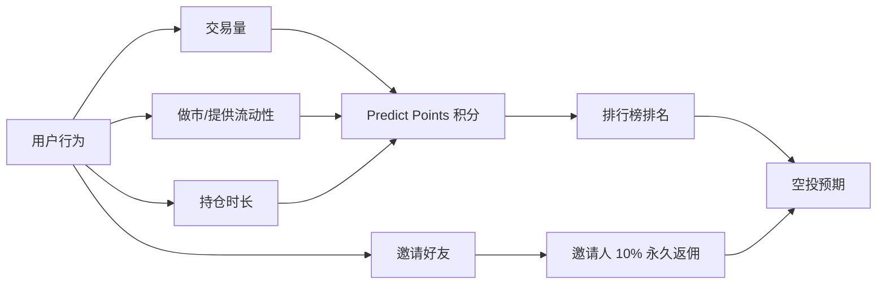

# Predict.fun — 用户体验路径分析

> 数据日期：2026-06-17
> 平台：predict.fun
> 说明：predict.fun 提供 **Web/App 直连** 与 **Binance Wallet 集成** 两条主要入口，体验差异显著。

---

## 1. 用户旅程总览

---

## 2. 注册 / 开户流程

### 2.1 Web/App 入口（Privy 智能钱包）

### 2.2 Binance Wallet 入口（Keyless Wallet，Gasless）

> Binance Wallet 集成是 predict.fun 体验上的最大杀器：**无私钥、无 Gas、可虚拟盘试玩**，把数千万 Binance 用户的开户门槛降到接近零。

---

## 3. 入金（充值）流程

- **最低入金**：约 10 USDT/USDC 激活交易。
- **跨链**：官方建议用 **Rhino Bridge** 把其他网络资金桥接到 BNB Chain。
- **结算资产**：交易与兑付以 **USDT** 计价。
- **差异点**：入金后资金即进入生息层（Yield-Bearing），这是与 Polymarket 体验的本质区别。

---

## 4. 交易执行流程

### 价格直觉
- YES 份额价格 = 事件发生的隐含概率（$0.42 ≈ 42%）。
- YES + NO = $1.00；买入成本越低、赔率越高。
- 结算时赢家份额兑付 **$1**，输家份额归 **$0**。

---

## 5. 结算流程（UMA 兼容乐观预言机）

- 多数市场（行业经验约 95%）无争议，走「乐观路径」快速结算。
- 有争议时升级 UMA DVM，由代币持有者投票，耗时可能数天。

---

## 6. 提现流程（Gasless）

---

## 7. 增长行为路径（积分与邀请）

详见 [07_token_points_airdrop/analysis.md](../07_token_points_airdrop/analysis.md)。

---

## 8. 小结

predict.fun 的用户体验设计围绕 **「降门槛 + 强激励」** 两条主线：

1. **降门槛**：Binance Keyless Wallet（无私钥）+ Gasless（无 Gas）+ 虚拟盘试玩，几乎消灭了 Web3 的所有摩擦点。
2. **资金高效**：入金即生息，让「放着不动的钱」也产生回报，降低持仓机会成本。
3. **去信任结算**：UMA 兼容乐观预言机保证结果公正，多数市场快速兑付。
4. **强激励飞轮**：Predict Points + 邀请返佣 + 大事件活动，持续拉新与留存。

⚠️ **待实测确认**：Web 入口的 Gas 是否同样免除、生息收益是否实时反映在余额、提现到账时延、争议市场的实际等待时长等，需登录后实操验证。
