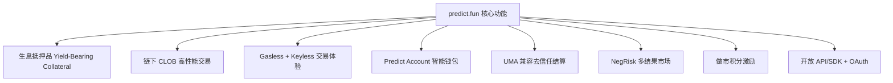
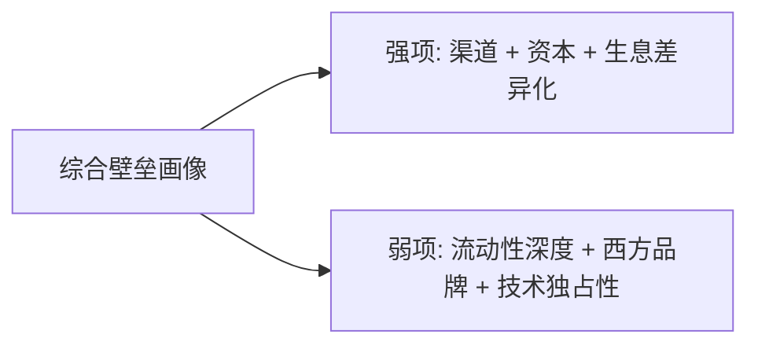

# Predict.fun — 核心功能与交易技术壁垒

> 数据日期：2026-06-17
> 平台：predict.fun

---

## 1. 核心功能总览

---

## 2. 功能详解

### 2.1 功能一：生息抵押品（核心差异化）
- 用户存入的 USDT 在持仓期间被 `YieldBearingWrappedCollateral` 包装为生息资产，路由进 BNB Chain DeFi 策略（理论 5–15% APY）。
- 解决了传统预测市场（Augur/Polymarket）抵押品 **闲置** 的资本效率痛点。
- **壁垒**：需自研一套并行的生息合约族 + DeFi 集成 + 风险隔离，工程与风控门槛高，且需要可信的 DeFi 收益来源（BNB 生态）。

### 2.2 功能二：链下 CLOB 高性能交易
- 中央限价订单簿链下撮合，链上仅结算，兼顾速度与去信任。
- 订单簿只存 YES 侧、NO 取补，结构简洁。
- **壁垒**：撮合性能与做市深度，依赖流动性积累，早期靠积分补贴。

### 2.3 功能三：Gasless + Keyless 体验
- Binance Wallet 集成下，Binance 代付 Gas、无私钥钱包；ZeroDev 账户抽象支撑 Gasless 提现。
- **壁垒**：与 Binance 的渠道合作是排他性资源，竞品难以复制。

### 2.4 功能四：Predict Account 智能钱包
- 基于 Privy 自动创建，邮箱/社交登录即用，可导出私钥编程交互。
- **壁垒**：体验优化，技术可复制，但与积分/账户体系绑定形成迁移成本。

### 2.5 功能五：UMA 兼容去信任结算
- 乐观预言机提交 + DVM 仲裁，结果去信任化。
- **壁垒**：UMA 集成有一定门槛，但属行业标准方案，非独占。

### 2.6 功能六：NegRisk 多结果市场
- 支持「多选一」互斥市场（如多候选人选举），生息与非生息各有一套 NegRisk 适配器。
- **壁垒**：复杂市场结构的工程实现。

### 2.7 功能七：做市积分激励
- 每分钟对订单簿快照计分，按「距中点距离、订单规模、是否双边挂单」给分，激励流动性供给。
- **壁垒**：精巧的激励设计直接决定流动性深度，是冷启动关键。

### 2.8 功能八：开放 API/SDK + OAuth
- REST/WebSocket、TS/Python SDK、OAuth 第三方代下单，鼓励外部工具/Bot 生态。
- **壁垒**：生态接口，先发可积累开发者。

---

## 3. 交易技术壁垒评估

| 壁垒类型 | 评分(1-10) | 说明 |
|---------|-----------|------|
| **渠道壁垒** | 9.5 | Binance Wallet 原生集成 + CZ/YZi 背书，排他性极强 |
| **资本效率（生息）** | 8.5 | 生息抵押是结构性创新，竞品需重构合约才能跟进 |
| **资本/融资** | 9 | YZi Labs + Susquehanna 多轮，弹药充足 |
| **流动性深度** | 6 | 体量仍小于 Polymarket，依赖积分补贴维持 |
| **技术架构** | 7 | 同源 Polymarket 可复制，但生息+AA 组合有工程量 |
| **品牌/社区** | 7.5 | 亚洲/中文社区强（收购 Probable），西方认知弱 |
| **结算去信任** | 7 | UMA 兼容，行业标准，非独占 |
| **生态/开发者** | 6.5 | API/SDK/OAuth 齐备，但生态尚早期 |

---

## 4. 与 Polymarket 的功能差异（速览）

| 维度 | predict.fun | Polymarket |
|------|-------------|------------|
| 链 | BNB Chain | Polygon |
| 抵押品 | **生息（Yield-Bearing）** | 闲置 |
| Gas | Binance 代付 / Gasless | 用户承担（低） |
| 钱包 | Privy 智能钱包 / Binance Keyless | Magic/代理钱包 |
| 结算 | UMA 兼容乐观预言机 | UMA 乐观预言机 |
| 订单簿 | 链下 CLOB | 链下 CLOB |
| 多结果市场 | NegRisk | NegRisk |
| 重点市场 | 亚洲/中文 | 全球（偏西方） |
| 代币 | 未发币（Predict Points） | 未发币（积分/季） |

> 结论：predict.fun ≈「Polymarket 架构 + BNB 链 + 生息抵押 + Binance 渠道 + 亚洲市场」。

---

## 5. 小结

predict.fun 的护城河 **不在技术独占性，而在「渠道 + 资本 + 资本效率创新」的组合**：

1. **最强壁垒是 Binance 渠道**：原生 Gasless 集成是排他性资源，直接决定获客成本。
2. **最具产品力的创新是生息抵押**：把资金机会成本变成收益，是真正的差异化卖点。
3. **最大短板是流动性深度与西方品牌**：体量仍被 Polymarket/Kalshi 碾压，需持续靠积分与大事件补贴维持。
