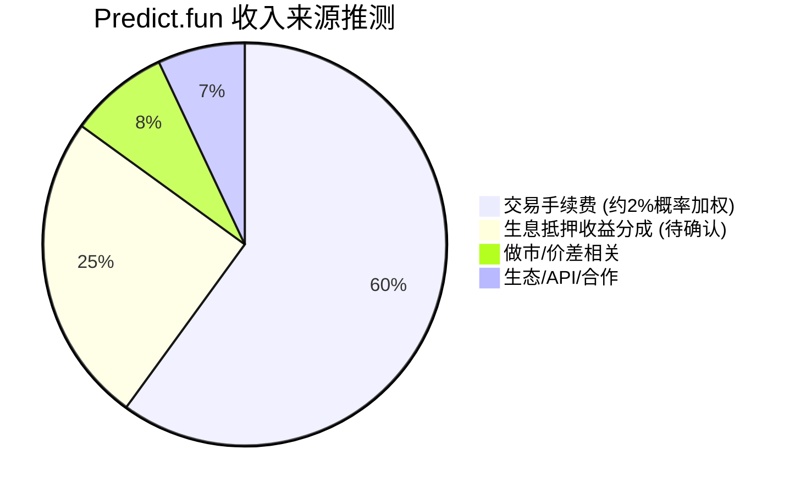
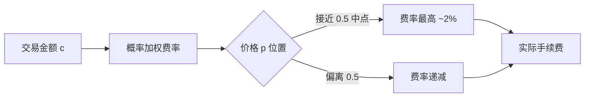
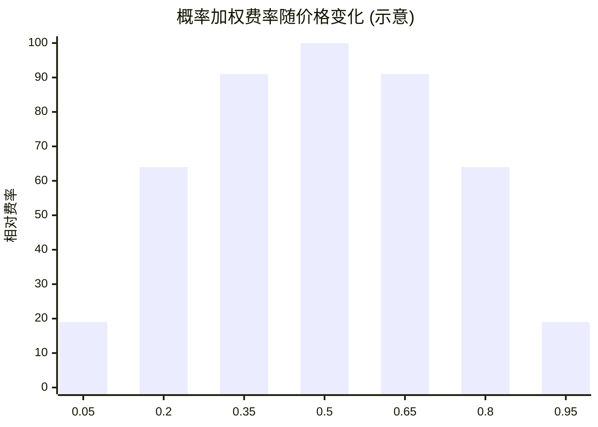
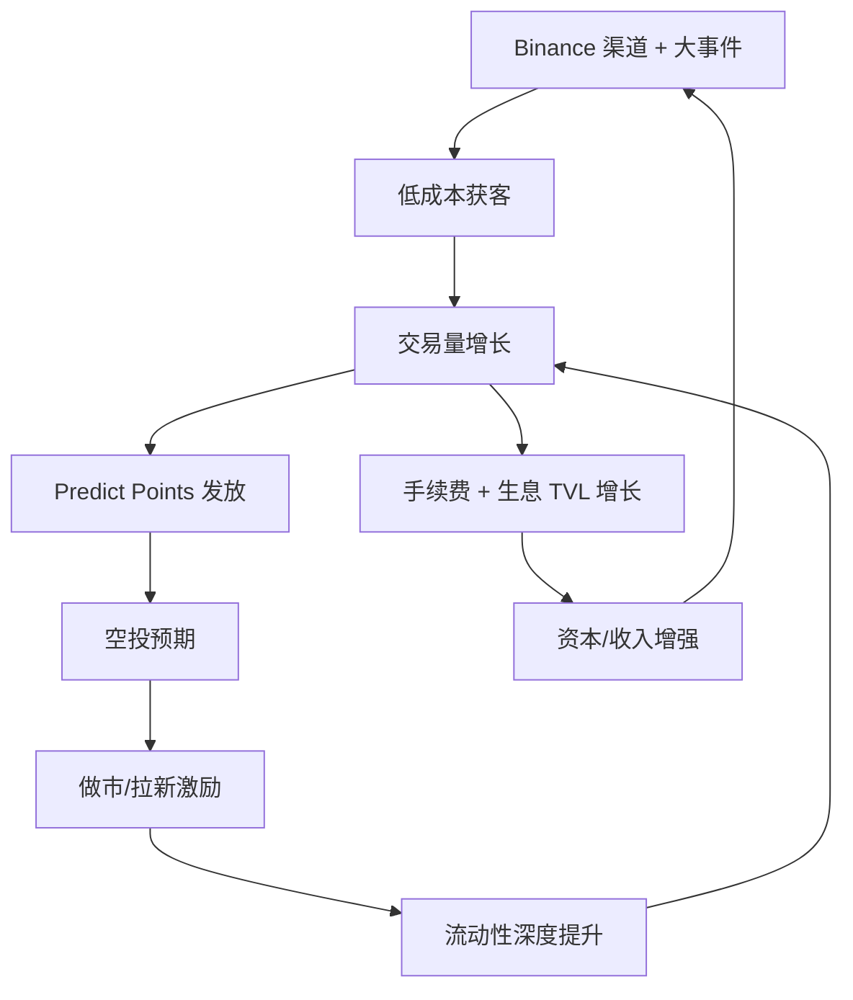
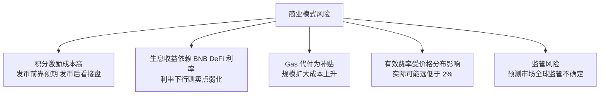

# Predict.fun — 商业模式分析

> 数据日期：2026-06-17
> 平台：predict.fun
> ⚠️ 收入数字均为基于公开口径的估算，实际协议条款未完全公开。

---

## 1. 收入来源



| 收入来源 | 说明 | 确定性 |
|---------|------|--------|
| **交易手续费** | 约 2% 基础费，随价格偏离 50% 递减（概率加权） | 高 |
| **生息收益分成** | 抵押品 DeFi 收益，平台可能抽取部分 | 中（待确认） |
| **做市/价差** | 撮合相关收入 | 低 |
| **生态/合作** | API、Binance 渠道分润等 | 低 |

---

## 2. 费率机制



- 据第三方媒体（PANews 等）口径：**predict.fun 采用约 2% 基础费率，随价格偏离 50% 而递减**——即越接近 50/50（信息量最大、最难判断）的交易费率越高，极端价格（如 0.95）费率越低。
- 概率加权费率是预测市场的常见设计：手续费 ∝ `p × (1 − p)`，在 p=0.5 时最大、p→0 或 p→1 时趋近 0。

### 2.1 费率数学直觉



通用形式（示意，非官方精确公式）：

```text
fee ≈ baseRate × c × p × (1 − p) × 4
其中 c = 交易名义金额, p = 成交价格(隐含概率), baseRate ≈ 2% 为 p=0.5 时峰值
```

- 在 50/50（信息量最大、最难判断）处费率最高（~2%）；价格越极端（如 0.95），费率越低。
- 设计意图：在「不确定性最高」的交易上多收费，同时不惩罚「接近确定」的低风险交易，鼓励极端价格区间的流动性。

### 2.2 与竞品费率结构对比

| 平台 | 交易费 | 结构 | 备注 |
|------|--------|------|------|
| **predict.fun** | ~2% 峰值（概率加权递减） | 按 p×(1−p) | 另有生息收益分成想象空间 |
| Polymarket | 0%（历史长期免交易费） | 主要靠其他变现 | 费用极低是其规模优势 |
| Kalshi | 按合约收费 | 概率加权（类似 0.07×c×p×(1−p)） | 合规交易所 |
| DraftKings | $0.01/合约固定 | 固定费 | 量大但费率低，营收受限 |
| PredictIt | 利润 10% + 提现 5% | 后端抽成 | 传统模式 |
| Probable（被并入） | 上线期零费 | 拉新策略 | 已并入 predict.fun |

> 观察：predict.fun 的名义费率（~2% 峰值）显著高于 Polymarket（0%），这是「用生息收益换取交易费空间」的取舍——即便收费，用户仍因抵押生息而降低综合持仓成本。

### 2.3 与价格机制

---

## 3. 收入测算（估算）

以累计交易量与单位时间交易量做粗略测算：

| 口径 | 交易量 | 假设费率 | 估算手续费收入 |
|------|--------|---------|---------------|
| 累计（至 YZi 复投） | $1.8B | 1%（加权后有效费率，保守） | **~$18M 累计** |
| 累计（至 YZi 复投） | $1.8B | 0.5%（更保守） | ~$9M 累计 |

> 注：2% 是「中点最高费率」，考虑到大量交易发生在非中点价格，**有效平均费率会显著低于 2%**，故用 0.5%–1% 区间做保守估算。

### 生息抵押的额外想象空间

- $20M+ 用户资金正在生息，若按 5–15% APY、平台抽取部分分成：
  - $20M × 10% APY = **$2M/年 收益规模**（其中平台分成比例待确认）。
- 随 TVL 增长，生息收益分成可能成为区别于纯手续费模式的「第二增长曲线」。

> ⚠️ 具体费率表、maker/taker 是否差异化、生息收益分成比例，官方未逐项公开，需以官方文档为准。

### 3.1 单位经济性（每 $1M 交易量，估算）

| 情景 | 有效费率 | 手续费收入/$1M | 说明 |
|------|---------|---------------|------|
| 乐观（多在中点附近） | 1.2% | $12,000 | 高不确定性市场占比高 |
| 中性 | 0.8% | $8,000 | 价格分布较均匀 |
| 保守（多在极端价格） | 0.4% | $4,000 | 大量接近确定的交易 |

> 以累计 $1.8B 交易量、0.4%–1.2% 有效费率估算，累计手续费收入约 **$7M–$22M** 区间。生息侧：$20M+ 资金 × 5–15% APY = **$1M–$3M/年** 收益规模（平台分成比例待确认）。

### 3.2 「量大但变现难」的行业悖论
- DraftKings 案例：$3.1B 年化交易量、$0.01/合约固定费 → 营收仅约 $310M，凸显「交易量 ≠ 营收」。
- predict.fun 的概率加权费率在变现效率上优于固定费/零费模式，但有效费率仍受价格分布制约。

---

## 4. 商业模式画布

| 要素 | 内容 |
|------|------|
| **价值主张** | 凡事押对就有回报；押注期间资金还能生息；Binance 级别的无门槛体验 |
| **客户细分** | 亚洲/中文加密用户（C 端）、做市商/LP（供给侧）、开发者/Bot（生态）、Binance Wallet 存量用户 |
| **渠道** | predict.fun Web/App、Binance Wallet 集成、API/SDK、大事件活动（世界杯） |
| **客户关系** | 积分激励、邀请返佣、排行榜、社区（Discord）、亚太本地化运营 |
| **收入流** | 交易手续费（概率加权）、生息收益分成、生态合作 |
| **核心资源** | YZi/Binance 资本与渠道、生息合约族、CLOB 撮合、亚洲社区（Probable） |
| **核心活动** | 撮合与结算、DeFi 收益策略管理、积分/活动运营、市场上架与结算 |
| **关键合作** | Binance/Binance Wallet、YZi Labs、UMA、BNB Chain DeFi 协议、Rhino Bridge |
| **成本结构** | DeFi 风险与对冲、Gas 代付补贴、积分/空投激励、服务器与撮合、团队 |

---

## 5. 增长飞轮



增长飞轮的核心驱动：
1. **Binance 渠道 + 大事件**（如世界杯 $2M 奖池）→ 低成本规模化获客。
2. **生息抵押**降低持仓成本 → 留住资金、做大 TVL。
3. **Predict Points + 空投预期**→ 激励做市与拉新 → 流动性深度 → 更好交易体验 → 更多交易量。

---

## 6. 风险与可持续性



---

## 7. 小结

predict.fun 的商业模式是 **「手续费 + 生息分成」双引擎**，叠加 **「积分换增长」** 的加密典型打法：

1. **主收入是概率加权手续费**，有效费率料显著低于名义 2%。
2. **生息收益分成是潜在第二曲线**，与 TVL 正相关，是区别于 Polymarket 的商业看点。
3. **当前阶段以增长优先**：靠 Binance 渠道、生息卖点、积分空投预期换规模，盈利让位于市占。
4. **可持续性取决于**：发币后的代币经济能否承接积分预期、生息收益能否持续、Gas 补贴能否随规模收敛。
